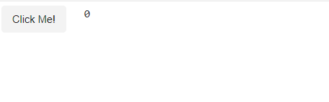

# WASM

This guide will help you get started contributing to *Panel in the browser* including `panel convert`.

## Build pyodide wheels

You can build the smaller wheels for Pyodide using

```bash
python scripts/build_pyodide_wheels.py
```

The wheels are saved to `panel/dist/wheels` You can confirm they have been build using `ls`.

```bash
$ ls panel/dist/wheels
bokeh-3.3.0-py3-none-any.whl  panel-1.3.1.post2+g2327be04-py3-none-any.whl
```

You can add an output path like `.` and the flag `--no-deps` after the first build to speed up
the process when iterating.

```bash
python scripts/build_pyodide_wheels.py . --no-deps
```

## Manual Testing

You can convert and test Panel apps manually using the `convert_apps` function. You will have to use the arguments `panel_version='local'` and `inline=True`.

Create the files `app.py` and `convert.py` in the root of the project.

`app.py`

```python
import panel as pn
button = pn.widgets.Button(name="Click Me!")
pn.Row(button, pn.bind(lambda c: c, button.param.clicks)).servable();
```

`convert.py`

```python
from pathlib import Path
from panel.io.convert import convert_apps

app_path = Path("app.py")

if __name__=="__main__":
    convert_apps(
        apps=[app_path],
        dest_path=app_path.parent,
        runtime="pyodide",
        build_pwa=False,
        prerender=True,
        build_index=False,
        panel_version="local", # required for manual testing
        inline=True, # required for manual testing
        compiled=False,
    )
```

To convert the `app.py` to `app.html` run

```bash
python convert.py
```

To test in the browser you will have to copy (or build) the `.whl` files to `.`

```bash
cp /home/jovyan/repos/private/panel/panel/dist/wheels/* .
```

Now you can run the `http.server`

```bash
python -m http.server
```

Finally you can open [http://localhost:8000/app.html](http://localhost:8000/app.html).



When you are done testing remember to delete your temporary files.

## Automated tests

You can add or update the pytests for `panel convert` in the
[`panel/tests/ui/io/test_convert.py`](https://github.com/holoviz/panel/blob/main/panel/tests/ui/io/test_convert.py)
file.
