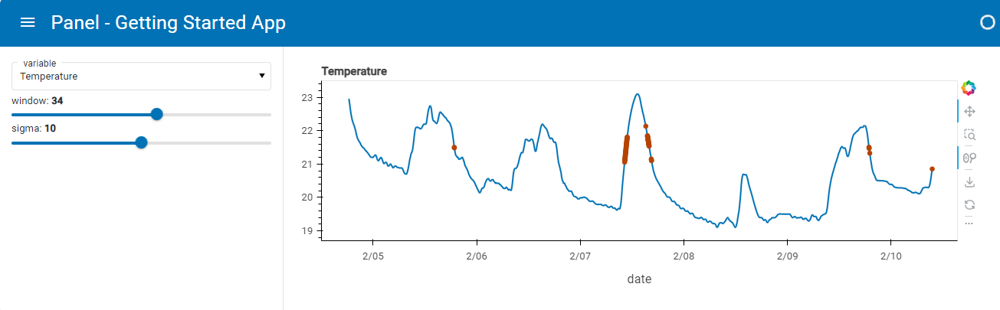

# Declarative API with Class-Based Approach

This section introduces a more advanced and powerful method of creating Panel apps using a declarative, class-based approach. It builds upon the simple app demonstrated in the [Getting Started > Build an app](../../../getting_started/build_app.md) tutorial, which utilized the reactive, function-based API.



While the reactive API approach is flexible, it intertwines domain-specific code with widget display code. This works well for small projects or those heavily focused on visualization. However, for larger, long-term projects used across various contexts like batch runs, command-line usage, notebooks, and deployed dashboards, it becomes crucial to separate domain logic from display technologies.

For such scenarios, Panel supports the use of objects declared with the separate [Param](http://param.holoviz.org) library. Param provides a GUI-independent way to capture and declare object parameters and dependencies, irrespective of any specific application or dashboard technology. This allows for modularization, making it easier to manage and reuse code across different environments.

In this approach, the app's logic is encapsulated within a class, separating concerns and promoting code organization.

Let's begin by reusing most of the code from the [Getting Started > Build an app](../../../getting_started/build_app.md) tutorial:

```{pyodide}
import hvplot.pandas
import numpy as np
import pandas as pd
import panel as pn
import param

PRIMARY_COLOR = "#0072B5"
SECONDARY_COLOR = "#B54300"
CSV_FILE = (
    "https://raw.githubusercontent.com/holoviz/panel/main/examples/assets/occupancy.csv"
)

pn.extension(design="material")
```

```{pyodide}
@pn.cache
def get_data():
    return pd.read_csv(CSV_FILE, parse_dates=["date"], index_col="date")

data = get_data()

data.tail()
```

```{pyodide}
def transform_data(variable, window, sigma):
    """Calculates the rolling average and identifies outliers"""
    avg = data[variable].rolling(window=window).mean()
    residual = data[variable] - avg
    std = residual.rolling(window=window).std()
    outliers = np.abs(residual) > std * sigma
    return avg, avg[outliers]


def get_plot(variable="Temperature", window=30, sigma=10):
    """Plots the rolling average and the outliers"""
    avg, highlight = transform_data(variable, window, sigma)
    return avg.hvplot(
        height=300, width=800, legend=False, color=PRIMARY_COLOR
    ) * highlight.hvplot.scatter(color=SECONDARY_COLOR, padding=0.1, legend=False)
```

```{pyodide}
get_plot(variable='Temperature', window=20, sigma=10)
```

Now, let's implement the declarative API approach using a `Parameterized` class:

```{pyodide}
class RoomOccupancy(param.Parameterized):
    variable = param.Selector(default="Temperature", objects=list(data.columns))
    window = param.Integer(default=30, bounds=(1, 60))
    sigma = param.Number(default=10, bounds=(0, 20))

    def view(self):
        return get_plot(self.variable, self.window, self.sigma)

obj = RoomOccupancy()
obj
```

The `RoomOccupancy` class and the `obj` instance have no direct dependency on Panel, Jupyter, or any other GUI toolkit. They solely declare facts about a specific domain, such as the parameters required for smoothing. This information is sufficient for Panel to create an interactive representation without needing domain-specific details encapsulated in `obj`:

```{pyodide}
pn.Column(obj.param, obj.view)
```

To support various domains, you can create hierarchies of classes encapsulating parameters and functionality across different object families. Parameters and code can inherit across classes as needed, without depending on any specific GUI library. This approach facilitates the maintenance of large codebases, all displayable and editable with Panel, adaptable over time. For a more complex illustration, refer to the [Attractors Panel app](https://examples.holoviz.org/gallery/attractors/attractors_panel.html) ([source](https://github.com/holoviz-topics/examples/tree/main/attractors)), and explore the Panel codebase itself for extensive usage of Param throughout the codebase.

## Serving the Notebook

Lets finalize our app by organizing our components in a nicely styled template (`MaterialTemplate`) and mark it `.servable()` to add it to our served app:

```python
pn.template.MaterialTemplate(
    site="Panel",
    title="Getting Started App",
    sidebar=[obj.param],
    main=[obj.view],
).servable(); # The ; is needed in the notebook to not display the template. Its not needed in a script
```

Save the notebook with the name `app.ipynb`.

Finally, we'll serve the app by running the command below in a terminal:

```bash
panel serve app.ipynb --dev
```

Now, open the app in your browser at [http://localhost:5006/app](http://localhost:5006/app).

It should look like this:


:::{tip}

If you prefer developing in a Python Script using an editor, you can copy the code into a file `app.py` and serve it.

```bash
panel serve app.py --dev
```

:::
