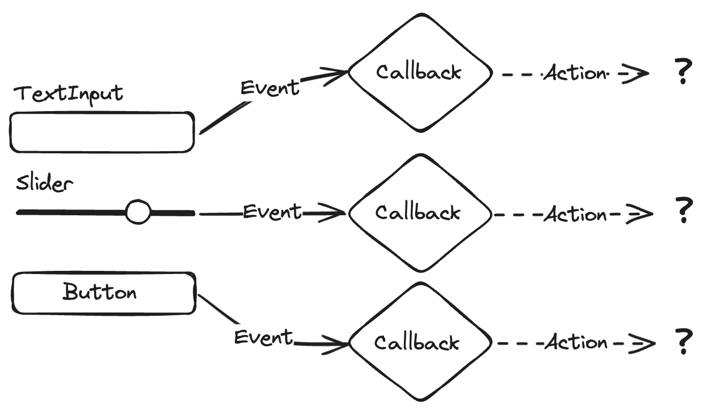
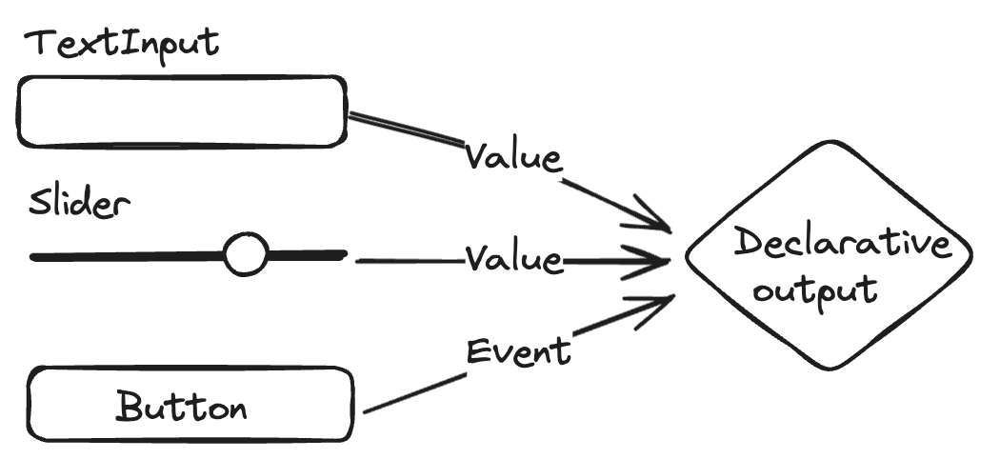

# Reactivity in Panel

Panel's approach to expressing interactivity and managing state differs from many other frameworks and offers multiple APIs with different affordances. In this overview section we will try to convey the thinking that led to the different APIs in Panel, providing you with context on when to use which and why. In the process we will try to unpack a number of concepts that are central to most UI frameworks and how these concepts translate into Panel's unique approach.

## Concepts: Reactive vs. Event-Driven

The core concept a large part of the discussion will focus on is the difference between reactive and event-driven approaches for writing UIs. Panel has placed strong emphasis on innovating to provide powerful and novel **reactive** approaches to writing applications. Popular reactive frameworks include spreadsheets like Excel and frontend UI frameworks like React. Existing tools have different approaches to reactivity, but two core principles are conserved:

1. They are **data-driven**, i.e. the UI updates automatically in response to changes in the data model. In Excel the data model is represented by value of a cell, while React uses state hooks. In Panel the data model is defined by "Parameters". Each component and user class defines some parameters, and changes in the parameter values drive changes in the UI. In all these frameworks, automatic updates are achieved by what we will call **data binding**, how precisely this works will be the primary focus of this section.

2. They are **declarative**, which means that the user defines what should be rendered, while the reactive framework figures out how to efficiently make the required updates. In Excel this process is relatively simple; Excel simply has to re-evaluate any formulas that depend on the changed inputs, and then update those cells' output. In React this involves something called the virtual DOM and involves "diffing" of the document model and then figuring out the most efficient updates to reflect the latest changes. In Panel the update process works either by defining a function whose output is diffed, or by binding references to a declarative component (if you don't know what that means yet, don't worry, that's what this guide is for!).

The alternative to the reactive approach is an **event-driven** approach, involving callbacks that are triggered by user interactions or other events. This approach usually relies on **imperative** rather than **declarative** programming, i.e. you define step-by-step what should happen when a particular action is triggered. This is usually significantly more cumbersome, especially as an application grows in size and complexity. Even in a relatively simple application where we gather user inputs from multiple widgets and then perform some update we quickly run into problems.

Let us take a simple example of an application that has three widgets that gather user input. In a callback based approach we have to register a callback with each of the three widgets and then perform some action as a result:

::::{tab-set}

:::{tab-item} Diagram

:::

:::{tab-item} Code Example
Let's take the example of a form that allows us to register a new user and their age:

```{pyodide}
user   = pn.widgets.TextInput(name='User')
age    = pn.widgets.IntSlider(name='Age', start=0, end=100)
submit = pn.widgets.Button(name='Submit')

widgets = pn.Column(user, age, submit)
md = pn.pane.Markdown()

def update_preview(event):
    if not user.value:
        md.object = 'Please add a user'
        return
    md.object = f'Hit submit to add user {user.value!r} who is {age.value} years old.'

def submit_form(event):
    # db.insert({'user': user.value, 'age': age.value})
    user.value = ''
    age.value = 0

user.param.watch(update_preview)
age.param.watch(update_preview)
submit.onclick(submit_form)


pn.Row(widgets, md)
```

Note the complexity of defining at least two separate callbacks and accessing the widget values from the global namespace.
:::

::::

The problem we immediately run into if some action we want to take requires more than one of the inputs is how we coordinate these changes. This is why many older callback-based frameworks rely on what is called the Model-View-Controller (MVC) pattern, where the **view** that the user interacts with gathers the inputs, which are fed to a **controller** that is able to coordinate the various events and manipulate the underlying model. This approach requires significant state handling, which in practice is only really feasible by implement a class based controller, where a shared object can be manipulated by imperative code associated with each of the three different controls.

In the reactive approach things are much simpler; the three inputs are bound to a single declarative function or component, which then immediately reflects the required changes in the rendered view when one or more of the inputs change:

::::{tab-set}

:::{tab-item} Diagram

:::

:::{tab-item} Code Example
```{pyodide}
user   = pn.widgets.TextInput(name='User')
age    = pn.widgets.IntSlider(name='Age', start=0, end=100)
submit = pn.widgets.Button(name='Submit')

widgets = pn.Column(user, age, submit)

def preview(user, age, submit):
    if not user:
        return 'Please add a user'
    elif submit:
        # db.insert({'user': user, 'age': age})
        pass
    return f'Hit submit to add user {user!r} who is {age} years old.'

md = pn.pane.Markdown(pn.bind(preview, user, age, submit))

pn.Row(widgets, md)
```

Note the simplicity of binding all three parameters to one function which generates the preview AND performs the database insertion.
:::

::::

## Reactivity in Panel

Now that we have introduced some of the concepts behind the reactive approaches, let's dive into the nitty gritty and try to understand how Panel actually implements the abstract concepts of reactivity in practice. As we discussed previously, reactive approaches rely on **data binding**, and we also mentioned that Parameters are the native way for Panel to express the data model. At the implementation level, data binding therefore happens by binding parameter state to some component or function. The important thing to understand is that for binding to be expressed in code, we have to make a distinction between the parameter **value** and the abstract parameter **reference**. To make this concrete, to perform binding we have to use the parameter **object**, which acts as a proxy or reference for its value. Let's say we have a `TextInput` widget:

```python
text = pn.widgets.TextInput(value='Hello world!')
```

The widget's value parameter value can be accessed as `text.value`, but executing that code would resolve to the single value at that point in time. To perform binding we need an indirect reference to the object that contains the current value, so that we can get notified about any future new value. For a TextInput, the underlying Parameter object is named "value", and the way to access that Parameter object `text.param.value`. (Yes, it's confusing that the Parameter we need is named "value", such that here we are choosing between getting a "value" of the "value" object (a text string) or the object itself (a Parameter instance)! In Panel there are two main ways of binding to a reference. The first option is to directly bind a parameter object as input to some other component:

```python
pn.pane.Markdown(object=text.param.value)
```

Where supported, this syntax performs data binding between the `value` parameter of the widget and the `object` parameter of the `Markdown` pane and provides a declarative specification of this reactive component, making its `object` update automatically whenever the text changes. We will refer to this approach as **component-level binding**. Component-level bindings are the simplest and most explicit form of data binding in Panel, and can be distinguished from **function-level binding** where we use `pn.bind` to bind a parameter reference to a function:

```python
a_slider = pn.widgets.FloatSlider(start=0, end=10)
b_slider = pn.widgets.FloatSlider(start=0, end=10)

def add(a, b):
    return pn.pane.Str(f'{a} + {b} = {a+b}')

pn.Column(a_slider, b_slider, pn.bind(add, a_slider.param.value, b_slider.param.value))
```

In this example, we have bound two inputs to the function and return an output, the `Str` pane. Internally a few things will happen to make this work:

1. Panel wraps the bound function in a so called `ParamFunction` pane.
2. The `ParamFunction` pane watches the inputs to the bound function for changes.
3. When a slider is dragged and the input changes, the `ParamFunction` will re-evaluate the function with the new inputs and then figure out the appropriate update.

:::{important}
Note that since we have created a `Str` pane inside the function the `ParamFunction` pane has to figure out how best to update the displayed output. The problem it runs into is that you (the user) may have kept a separate handle on the `Str` object you created and may want to reuse it later, e.g. to manually update the object. Therefore Panel has to make the assumption that it cannot safely modify this object inplace, i.e. update the `object` on the existing `Str` the next time `add` is called. This means that in this simple setup with function-level binding, Panel has to re-render the corresponding model every time the inputs change instead of simply update the pane `object` parameter and sending the updated string. For complex panes and output this approach can lead to undesirable flicker. To avoid flickering, you can tell Panel that the output can be safely updated `inplace`:

```python
pn.param.ParamFunction(pn.bind(add, a_slider.param.value, b_slider.param.value), inplace=True)
```

By declaring that the `Str` object can be updated `inplace` you are indicating to Panel that it can safely update the `Str` object that was rendered on the first call with the parameter values of the `Str` object returned by subsequent calls. This ensures that only the changes that are actually required are sent to the frontend instead of re-creating a whole new model and view on the frontend.
:::

Function-level binding provides significantly flexibility, e.g. we can write reactive components that change type depending on the input. We could even return a different component depending on the value of some widgets, and Panel would re-render the output appropriately. However this flexibility also means that compared to component-level binding, function-level binding is significantly less efficient, so (where possible) component-level binding should be preferred.

In any case, if we think back to the diagram above, we can hopefully immediately see the benefit of this reactive approach, whether component or function. In a callback-based approach it is immediately unclear how we would combine the state of `a_slider` and `b_slider` into a single update. Either we have to resort to accessing values directly (introducing unseen entanglement of our UI code and logic, quickly resulting in spaghetti code!), or we have introduce a class that acts as a controller to track the updates and hold the state.

## Reactive References

So far we have explored the difference between reactive and callback-based code and gone over component-level and function-level binding to achieve reactivity in Panel. To really understand the power of binding we have to dive a little deeper into what it references are and how they can be bound. In particular we have, so far, focused primarily on Parameters as references. This makes sense since pretty much all reactivity in Panel is ultimately driven by a Parameter. However, binding parameters on their own is usually not that useful. Thinking back to our simple component-level binding example:

```python
text = pn.widgets.TextInput(value='Hello world!')

pn.pane.Markdown(object=text.param.value)
```

You might have wondered: "why is this useful?". It's rare that you would want to bind the output of a widget directly to some other output or parameter. In practice, an output or parameter value will usually be the result of transforming one or more inputs. For this reason Panel (and Param, which it builds on) allows a number of different types to be used as a reference:

::::{tab-set}

:::{tab-item} 1. Parameters
A `Parameter` object is the simplest reference.

```python
text = pn.widgets.TextInput(value='Hello world!')

pn.pane.Markdown(object=text.param.value)
```
:::

:::{tab-item} 2. Widgets
A Panel `Widget` acts as a proxy for its `value` parameter, i.e. passing `text` and `text.param.value` are equivalent:

```python
text = pn.widgets.TextInput(value='Hello world!')

pn.pane.Markdown(object=text)
```
:::

:::{tab-item} 3. Bound functions
A function which has other references bound to it using the `pn.bind` helper may also be used as a reference.

```python
text = pn.widgets.TextInput(value='world')

def format(text):
    return f'Hello {text}!'

pn.pane.Markdown(object=pn.bind(format, text))
```
:::

:::{tab-item} 4. Reactive Expressions
Param offers "reactive expressions", which act as proxies for their underlying objects and can be chained together into arbitrary expressions.

```python
text = pn.widgets.TextInput(value='world')

template = pn.rx('Hello {text}!')

pn.pane.Markdown(object=template.format(text=text))
```
:::

:::{tab-item} (Async) Generators
(Asynchronous) generators functions can be used as a reference, to drive streaming outputs.

```python
import time

def gen():
    """
    Endless cycles through a few phrases such as 'Hello there!'
    """
    i = 0
    options = ['world', 'you', 'there', 'human']
    while True:
        yield f'Hello {options[i]}!'
        i = (i+1) % len(options)
        time.sleep(1)

pn.pane.Markdown(object=gen)
```
:::


::::

To unpack these options a little bit, let's go back to our earlier example, which used function-level binding to add two values and render the output using a `Str` pane:

```python
a_slider = pn.widgets.FloatSlider(start=0, end=10)
b_slider = pn.widgets.FloatSlider(start=0, end=10)

def add(a, b):
    return pn.pane.Str(f'{a} + {b} = {a+b}')

pn.Column(a_slider, b_slider, pn.bind(add, a_slider.param.value, b_slider.param.value))
```

As we emphasized earlier, function-level binding is often inefficient, but using a bound function as a reference we can rewrite this to use component-level binding instead:

```python
a_slider = pn.widgets.FloatSlider(start=0, end=10)
b_slider = pn.widgets.FloatSlider(start=0, end=10)

def add(a, b):
    return f'{a} + {b} = {a+b}'

pn.Column(a_slider, b_slider, pn.pane.Str(object=pn.bind(add, a_slider, b_slider))
```

## So when _should_ you use callbacks?

So far we have expounded at length about the benefits of reactive approaches, so you might wonder: "why allow callbacks at all?" One pragmatic reason for having callbacks is that reactivity is built on top of the callback-based `.param.watch` API in Param. `.watch` is the lowest-level API offered and lets users build higher-level APIs on top. Also, in practice there are a few reasons one might use callbacks even in a scenario where reactivity drives the majority of your application.

### Performance

One major reason for using explicit callbacks is again related to the fact that they are the lowest level available API. They thus have the least amount of overhead and provide the ability to perform very fine-grained updates, e.g. updating a single specific parameter value.

### Side Effects

Another common use case for a callback is as a side-effect, perhaps to trigger some external action or log a user interaction. In this case, callbacks provide a natural way to express this imperative action.

### Transient Events

Certain user interactions are, by their very nature more amenable to an event-driven approach because they are transient, i.e. they reflect some event in time rather than a permanent update to some value. One very common such example are button clicks, which happen but do not have some inherent change in state associated with them unlike, for example, a change in a slider value. Since they are transient, it's not immediately obvious how to structure code to handle the event.

Let us, for example, extend our simple addition app with a button that triggers the calculation:

```python
a = pn.widgets.FloatSlider()
b = pn.widgets.FloatSlider()
button = pn.widgets.Button(name='Calculate')

str_pane = pn.pane.Str(f'{a} + {b} = {a+b}')

def update(_=None):
    str_pane.object = f'{a.value} + {b.value} = {a.value+b.value}'

button.on_click(update)

pn.Column(a_slider, b_slider, button, str_pane)
```

Defining a click handler using the `on_click` method to trigger the computation feels natural, but we again struggle with the fact that we have to access the state from multiple widgets. The reactive approaches therefore do provide alternatives here, e.g. when using function level binding we can determine if the button has been clicked and raise `Skip` error if it hasn't, causing the update event to be skipped:

```python
a_slider = pn.widgets.FloatSlider()
b_slider = pn.widgets.FloatSlider()
button = pn.widgets.Button(name='Calculate')

def add(a, b, compute):
    if not compute:
        raise pn.param.Skip
    return f'{a} + {b} = {a+b}'

pn.Column(a_slider, b_slider, button, pn.bind(add, a_slider, b_slider, button))
```

Reactive expressions also have a mechanism to condition an event being emitted on a transient event, using the `.rx.when` method:

```python
a_slider = pn.widgets.FloatSlider()
b_slider = pn.widgets.FloatSlider()
button = pn.widgets.Button(name='Calculate')

out = pn.rx('{a} + {b} = {c}').format(a=a_slider, b=b_slider, c=a_slider.rx()+b_slider.rx()).rx.when(button)

pn.Column(a_slider, b_slider, button, pn.pane.Str(out))
```

As we can see, at least for this simple case there are still approaches that allow us to stay in a reactive world, and keeping a single approach in a given codebase can reduce the burden on a reader or maintainer of the code.

## Next steps

Hopefully this section has given you a better appreciation of some of the key concepts behind some of the core APIs of Panel, why they were designed the way they are, and why reactive approaches are preferable to writing callbacks in most cases. In the next section we will apply this understanding of callbacks and reactive APIs in the context of both function and class based approaches. Specifically, we will look at how event or callback-based approaches can be used in combination with reactive approaches in a class-based application, without some of the drawbacks we discovered here.
