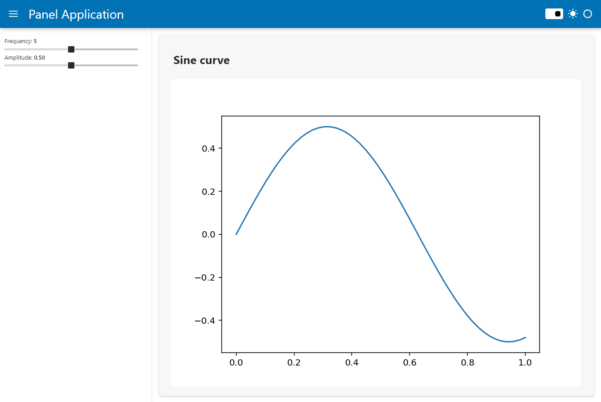

# Core Concepts

In the previous section, we delved into [building a simple app](build_app.md). A Panel app like this makes exploration of various visualizations very easy, supporting types such as Matplotlib, Bokeh, Plotly, Altair, DataFrame, and various text and image types.

Now, let's explain the core concepts of Panel.

## Development Flow

As you gear up to develop your Panel application, you'll encounter a couple of initial decisions to make regarding **API** and **environment**:

1. **Programming Approach:** Will you opt for a Python *function-based* approach or a *class-based* approach?
   - The function-based approach is recommended for new and basic users. It utilizes `pn.bind`, as you've already experienced while [building a simple app](build_app.md).
   - The class-based approach is recommended for intermediate Panel users who aim to construct larger and more maintainable apps, as well as reusable components.

   :::{dropdown} Interested in a class-based approach instead?
   :margin: 4
   :color: muted
   Explore the same ['outlier' app built using a class-based declarative API](../explanation/api/examples/outliers_declarative.md). Study the [Explanation > APIs](../explanation/apis/index.md) section for a detailed discussion on each of the API options.
   :::

2. **Development Environment:** Will you develop in a [notebook](https://jupyter.org/) or in an editor environment?
   - If you're unsure, starting in a notebook is recommended as you familiarize yourself with Panel. However, you can switch between them at any time.

### Notebook

In a notebook, you can swiftly iterate on individual components of your application because Panel components render inline. To get started in a notebook, simply `import panel` and initialize the extension with `pn.extension()`.

```python
import panel as pn
pn.extension()
```

By placing a Panel component at the end of a notebook cell, it renders as part of the output. You can then modify the code and re-run the cell to iterate and build the individual units of your final application. This iterative approach offers many benefits, enabling you to work on each component independently without re-running your entire application each time.

</img>

To add Panel components to your app, mark them as `.servable()` and serve the app with:

```bash
panel serve app.ipynb --autoreload
```

You've already experimented with this while [building a simple app](build_app.md).

### Editor

If you're working in an editor, declare the Panel components you want to display as `.servable()`, then serve the script with:

```bash
panel serve app.py --autoreload --show
```

Upon running that command, Panel launches a server that serves your app, opens a tab in your default browser (`--show`), and updates the application whenever you modify the code (`--autoreload`).

</img>

```{note}
We recommend installing `watchfiles` to get the best user experience when using `--autoreload`.
```

> Explore [How-to > Prepare to Develop](../how_to/prepare_to_develop.md) for more guidance on each development environment option.

## Control Flow

Panel operates on a powerful framework called [Param](https://param.holoviz.org/), which governs how information flows within your app. When a change occurs, such as the value of a slider or a manual update in your code, events are triggered for your app to respond to. Panel provides various methods for setting up this interactivity. Understanding the basics of Param is crucial to mastering Panel. However, it's not necessary to get started as a new, basic user.

So, what exactly is Param? It's a framework that enables Python classes to have attributes with defaults, type/value validation, and callbacks when values change. You can liken it to other frameworks like Python dataclasses, pydantic, and traitlets.

Reactivity is a key concept in both Param and Panel. This means changes in one part of your app can automatically update other parts. Think of it like Excel, where altering one cell can prompt updates in cells that reference it. Param objects operate similarly.

In Panel, understanding the distinction between a Parameter's value and the Parameter object itself is important. The value represents the current value at a specific moment, while the object contains information about the Parameter and serves as a reference to its value over time. In many cases, you can utilize a Parameter object, and Panel will handle updating the value reactively as it changes. For instance, consider a widget:

```python
text = pn.widgets.TextInput()

text.value  # 👈 The current value of the widget
text.param.value  # 👈 A reference to the "value" Parameter, used in Panel to *bind* to the "value"
```

We'll delve deeper into this later. For now, remember that parameter objects (whether associated with widgets or not) enable you to pass around a reference to a value that automatically updates if the original value changes.

## Display and Rendering

Panel aims to seamlessly integrate with all your favorite Python libraries and automatically infer how to render a particular object, whether it's a `DataFrame`, a plotting `Figure`, or any other Python object. This means you can effortlessly place any object you want to render into a layout (such as a `Row` or `Column`), and Panel will automatically determine the appropriate `Pane` type to wrap it. Different `Pane` types know how to render different objects but also provide ways to update the object or even listen to events such as selection of Vega/Altair charts or Plotly plots.

Hence, it's often advantageous to understand the Pane type. For instance, to wrap your `DataFrame` into a pane, you can call the `panel` function, which will automatically convert it (this is precisely what a layout does internally when given an object to render):

```python
import pandas as pd

df = pd.DataFrame({
  'A': [1, 2, 3, 4],
  'B': [10, 20, 30, 40]
})

df_pane = pn.panel(df)
```

:::{tip}
:class: success

To inspect the type of an object, simply `print` it:

```python
>>> print(pn.Row(df))
Row
    [0] DataFrame(DataFrame)
```

:::

At times, an object may have multiple possible representations to choose from. In such cases, you can explicitly construct the desired `Pane` type. For example, here are a few representations of a `DataFrame`:

::::{tab-set}

:::{tab-item} DataFrame Pane

```python
pn.pane.DataFrame(df)
```

<table border="0" class="dataframe panel-df">
  <thead>
    <tr style="text-align: right;">
      <th></th>
      <th>A</th>
      <th>B</th>
    </tr>
  </thead>
  <tbody>
    <tr>
      <th>0</th>
      <td>1</td>
      <td>10</td>
    </tr>
    <tr>
      <th>1</th>
      <td>2</td>
      <td>20</td>
    </tr>
    <tr>
      <th>2</th>
      <td>3</td>
      <td>30</td>
    </tr>
    <tr>
      <th>3</th>
      <td>4</td>
      <td>40</td>
    </tr>
  </tbody>
</table>

:::

:::{tab-item} HTML Pane

```python
pn.pane.HTML(df)
```

<div>
<style scoped>
    .dataframe tbody tr th:only-of-type {
        vertical-align: middle;
    }

    .dataframe tbody tr th {
        vertical-align: top;
    }

    .dataframe thead th {
        text-align: right;
    }
</style>
<table border="1" class="dataframe">
  <thead>
    <tr style="text-align: right;">
      <th></th>
      <th>A</th>
      <th>B</th>
    </tr>
  </thead>
  <tbody>
    <tr>
      <th>0</th>
      <td>1</td>
      <td>10</td>
    </tr>
    <tr>
      <th>1</th>
      <td>2</td>
      <td>20</td>
    </tr>
    <tr>
      <th>2</th>
      <td>3</td>
      <td>30</td>
    </tr>
    <tr>
      <th>3</th>
      <td>4</td>
      <td>40</td>
    </tr>
  </tbody>
</table>
</div>

:::

:::{tab-item} Str Pane

```python
pn.pane.Str(df)
```

<pre>
   A   B
0  1  10
1  2  20
2  3  30
3  4  40
</pre>
:::

::::

:::{admonition} Learn More
:class: info

Discover more about Panes in the [Component Overview - Panes](https://panel.holoviz.org/explanation/components/components_overview.html#panes) section.
:::

So far, we've learned how to display data. However, to actually incorporate it into your served application, you also need to mark it as `.servable()`. Marking an object as servable adds it to the current template, something we'll delve into later. You can either mark multiple objects as servable, which adds them to the page sequentially, or you can use layouts to arrange objects explicitly.

```python
df_pane.servable()
```

:::{info}

In the notebook, the `.servable()` method effectively does nothing. This allows you to add the components you want to include in the rendered app while simultaneously viewing them inline. Thus, you can sequentially build components in a notebook while simultaneously constructing an application to be served. If you want to mark something as servable but do _not_ want it rendered inline, simply append a semicolon (';') after it to instruct Jupyter not to render it, even if it's the last item in the cell.
:::

## Widgets

To craft an interactive application, you'll typically add widget components (such as `TextInput`, `FloatSlider`, or `Checkbox`) to your application and then bind them to an interactive function. For example, let's create a slider:

```{pyodide}
import panel as pn

x = pn.widgets.IntSlider(name='x', start=0, end=100)

def square(x):
    return f'{x} squared is {x**2}'

pn.Row(x, pn.bind(square, x))
```

The `pn.bind` function allows us to bind a widget or a *Parameter* **object** to a function that returns an item to be displayed. Once bound, the function can be added to a layout or rendered directly using `pn.panel` and `.servable()`. This enables you to express reactivity between widgets and output very easily.

:::{admonition} Reminder
:class: info

Recall our discussion on the difference between a *Parameter* **value** and a *Parameter* **object**. In the previous example, the widget itself effectively serves as an alias for the *Parameter* object, i.e., the binding operation is exactly equivalent to `pn.bind(square, x.param.value)`. This holds true for all widgets: the widget object is treated as an alias for the widget's `value` *Parameter* object. Thus, you can generally pass either the widget (as a convenient shorthand) or the underlying *Parameter* object.
:::

While the binding approach above works, it can be somewhat heavy-handed. Whenever the slider value changes, Panel will recreate a whole new Pane and re-render the output. For finer control, we can instead explicitly instantiate a `Markdown` pane and pass it bound functions and *Parameters* by reference:

```{pyodide}
import panel as pn

x = pn.widgets.IntSlider(name='x', start=0, end=100)
background = pn.widgets.ColorPicker(name='Background', value='lightgray')

def square(x):
    return f'{x} squared is {x**2}'

def styles(background):
    return {'background-color': background, 'padding': '0 10px'}

pn.Column(
    x,
    background,
    pn.pane.Markdown(pn.bind(square, x), styles=pn.bind(styles, background))
)
```

## Templates

Once you've begun building an application, you'll likely want to enhance its appearance, which is where templates come into play. When you mark an object as `.servable()`, you're inserting it into a template. By default, Panel employs a completely blank template, but selecting another template is straightforward by setting `pn.config.template`. You'll have several options based on different frameworks, including `'bootstrap'`, `'material'`, and `'fast'`.

```python
pn.config.template = 'fast'
```

:::{note}
:class: info

The `pn.config` object offers a range of options to configure your application. As a shortcut, you may provide options for the `config` object as keywords to the `pn.extension` call. In other words, `pn.extension(template='fast')` is equivalent to `pn.config.template = 'fast'`, providing a clean way to set multiple config options at once.
:::

Once you've configured a template, you can control where to render your components using the `target` argument of the `.servable()` method. Most templates feature multiple target areas including 'main', 'sidebar', 'header', and 'modal'. For example, you might want to render your widgets into the sidebar and your plots into the main area:

```python
import numpy as np
import matplotlib.pyplot as plt
import panel as pn

pn.extension(template='fast')

freq = pn.widgets.FloatSlider(
    name='Frequency', start=0, end=10, value=5
).servable(target='sidebar')

ampl = pn.widgets.FloatSlider(
    name='Amplitude', start=0, end=1, value=0.5
).servable(target='sidebar')

def plot(freq, ampl):
    fig = plt.figure()
    ax = fig.add_subplot(111)
    xs = np.linspace(0, 1)
    ys = np.sin(xs*freq)*ampl
    ax.plot(xs, ys)
    return fig

mpl = pn.pane.Matplotlib(
    pn.bind(plot, freq, ampl)
)

pn.Column(
    '# Sine curve', mpl
).servable(target='main')
```

</img>

## Next Steps

In this **Getting Started** guide, you've installed Panel, built a simple app, and explored core concepts, laying the basic groundwork to start using Panel for your projects.

For a hands-on approach to **learning Panel**, dive into our [Tutorials](../tutorials/index.md). If you seek clarity or wish to deepen your understanding of specific topics, refer to the [Explanation](../explanation/index.md) section of the docs.

During **Panel usage**, consult the [Component Gallery](../reference/index.rst) reference guides, find solutions to specific problems in the [How-to](../how_to/index.md) guides, or explore the [API Reference](../api/index.md) sections for technical specifications and descriptions.

## Getting Help

Explore the [Panel Community](../tutorials/basic/join_community.md) page for all options to connect with other users and the core developers.
