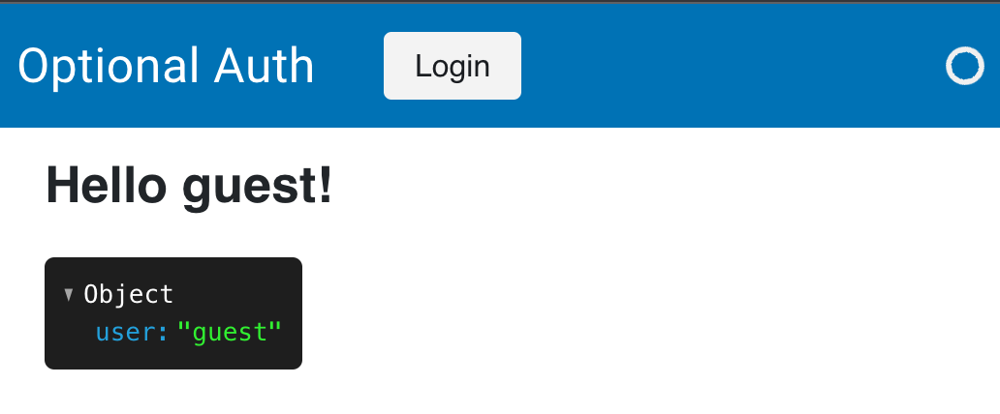

# Allowing Guest Users

Sometimes you will want to allow guest users to have access to certain endpoints of your application or grant them access to all applications without having to log in. For these cases you can make the authentication flow optional and guide them towards the `login_endpoint` only when they are accessing functionality that requires authentication.

## Optional Authentication

The simplest way to make authentication optional is to set the `--oauth-optional` on the commandline or when using `pn.serve` passing the `oauth_optional` keyword argument:

```bash
panel serve app.py ... --oauth-optional
```

Panel will now let the user access all endpoints without being redirected to the authentication provider or local login page. If specific functionality in your application requires authentication you may then redirect the user to the [login endpoint](./configuration#endpoints), e.g. by default you would redirect them to `/login`. As an example let's take this app:

```python
import panel as pn

pn.extension(template='material')

pn.state.template.title = 'Optional Auth'

if pn.state.user == 'guest':
    button = pn.widgets.Button(name='Login').servable(target='header')
    button.js_on_click(code='window.location.href="/login"')

pn.Column(f'# Hello {pn.state.user}!', pn.state.user_info).servable()
```

Serving this app with `panel serve app.py ... --oauth-optional` and then visiting the `/app` endpoint will show the following:



After clicking the login link the user will be directed through the login flow.

Alternatively you can declare an [`authorize_callback`](./authorization) as part of your application which will redirect a guest user should they attempt to access a restricted endpoint:

```python
import panel as pn

def authorize(user_info, path):
    if user_info['user'] == 'guest' and path == '/admin':
        return '/login'
    return True

pn.extension(authorize_callback=authorize, template='material')

pn.state.template.title = 'Admin'

pn.Column(f'# Hello {pn.state.user}!', pn.state.user_info).servable()
```

## Guest Endpoints

If you only want to open up specific endpoints to guest users you may also provide `--oauth-guest-endpoints`, e.g. let's say you have `app.py` and `admin.py`. On the commandline you can provide:

```bash
panel serve app.py admin.py ... --oauth-guest-endpoints /app
```

This will allow users to access the `/app` endpoint as a guest but force them through the login flow if they attempt to access the `/admin` endpoint.
