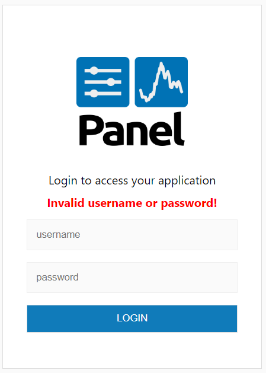

# Configuring PAM Authentication

For scenarios where you want to leverage your system's existing user credentials, configuring PAM (Pluggable Authentication Modules) authentication is an effective solution. PAM authentication allows your application to authenticate users using the operating system's user database, eliminating the need to manage separate credentials.

```{admonition} Prerequisites
PAM authentication requires the [`pamela` library](https://github.com/minrk/pamela). Install it with:

:::::{tab-set}

::::{tab-item} pip

```bash
pip install pamela
```

::::

::::{tab-item} conda

```bash
conda install -c conda-forge pamela
```

::::

:::::

```

## Setting up PAM authentication

PAM authentication can be set up by specifying the --oauth-provider pam command-line argument (despite PAM not being an OAuth provider). User credentials are inherited directly from the system, simplifying the authentication process. Here’s how to configure it:

Create a basic `app.py` file.

```python
import panel as pn

pn.extension(template="fast")

logout = pn.widgets.Button(name="Log out")
logout.js_on_click(code="""window.location.href = './logout'""")
pn.Column(f"Congrats `{pn.state.user}`. You got access!", logout).servable()
```

Now serve the application using PAM authentication:

```bash
panel serve app.py --oauth-provider pam --cookie-secret my_super_safe_cookie_secret
```

When accessing the application, users will be prompted to log in using their system credentials:


If you enter an invalid password it will look like



If you enter the valid password (i.e. `my_password`) it will look like


If you click the *Log out* button you will be sent back to the log in form.

## User credentials

With PAM authentication, there is no need to manage a separate file for user credentials. Instead, authentication is handled directly through the operating system, ensuring that user credentials are consistent across all system applications.

## Custom templates

```{admonition} Prerequisites
For a more in-depth understanding of custom template take a look at the [how to > Build a Custom Template](../templates/template_custom) guide.
```

If you wish to customize the authentication template, you can provide a custom template using the --basic-login-template CLI argument. The template must submit username and password to the /login endpoint of the Panel server. For reference, the form structure of the default PAM authentication template is similar to basic authentication. You can view the default template here for inspiration.
