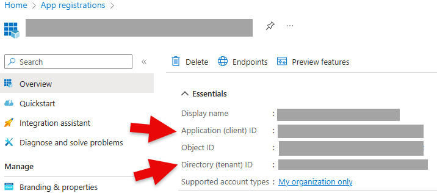
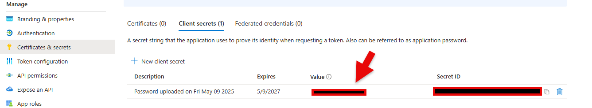
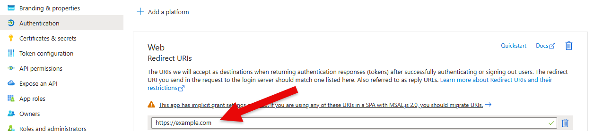

# OAuth Providers

Panel supports a number of OAuth providers out-of-the-box. Follow the guide for setting up an OAuth application specific to your provider and then refer to the [Configuring OAuth guide](configuration) to add OAuth to your application.

If you experience issues check out the [OAuth Troubleshooting](trouble_shooting.md) guide for further guidance.

## **Azure Entra ID**

Previously known as Azure Active Directory.

To set up OAuth2.0 authentication for Azure Entra ID follow [these instructions](https://docs.microsoft.com/en-us/azure/api-management/api-management-howto-protect-backend-with-aad). Ensure that you supply the tenant ID using `oauth_extra_params`, a configuration may look like:

```bash
panel serve app.py \
--oauth-provider=azure \
--oauth-key='CLIENT_ID' \
--oauth-secret='CLIENT_SECRET' \
--cookie-secret='COOKIE_SECRET' \
--oauth-encryption-key='ENCRYPTION_KEY' \
--oauth-redirect-uri=REDIRECT_URI \
--oauth-extra-params "{'tenant': 'TENANT_ID'}" \
...
```

or with environment variables

```bash
PANEL_OAUTH_PROVIDER=azure \
PANEL_OAUTH_KEY=CLIENT_ID \
PANEL_OAUTH_SECRET=CLIENT_SECRET \
PANEL_COOKIE_SECRET=COOKIE_SECRET \
PANEL_OAUTH_ENCRYPTION=ENCRYPTION_KEY \
PANEL_OAUTH_REDIRECT_URI=REDIRECT_URI \
PANEL_OAUTH_EXTRA_PARAMS="{'tenant': 'TENANT_ID'}" \
panel serve app.py ...
```

The `CLIENT_ID` corresponds to the `Application (client) ID` and the `TENANT_ID` to the `Directory (tenant) ID` below:



The `CLIENT_SECRET` corresponds to the `Value` below:



The `REDIRECT_URI` should be included in the list of Web Redirect URIs:



## **Bitbucket**

Bitbucket provides instructions about [setting up an OAuth consumer](https://support.atlassian.com/bitbucket-cloud/docs/use-oauth-on-bitbucket-cloud/). Follow these and then supply the `oauth_key` and `oauth_secret` to Panel as described above.

## **GitHub**

GitHub provides detailed instructions on [creating an OAuth app](https://developer.github.com/apps/building-oauth-apps/creating-an-oauth-app/). Follow these and then supply the `oauth_key` and `oauth_secret` to Panel as described above.

## **GitLab**

GitLab provides a detailed guide on [configuring an OAuth](https://docs.gitlab.com/ee/api/oauth2.html) application. In addition to the `oauth_key` and `oauth_secret`, you will also have to supply a custom URL using the `oauth_extra_params` if you have a custom GitLab instance (the default is `oauth_extra_params="{'url': 'gitlab.com'}"`).

## **Google**

Google provides a guide about [configuring an OAuth application](https://developers.google.com/identity/protocols/oauth2/native-app). By default, nothing except the `oauth_key` and `oauth_secret` are required, but to access Google services, you may also want to override the default `scope` via the `oauth_extra_params`.

## **Okta**

Okta provides a guide about [configuring OAuth2](https://developer.okta.com/docs/concepts/oauth-openid/). You must provide an `oauth_key` and `oauth_secret`, but in most standard setups, you will also have to provide a `url` via the `oauth_extra_params`. If you have set up a custom authentication server (i.e., not 'default') with Okta, you must also provide 'server'. The `oauth_extra_params` should then look something like this: `{'server': 'custom', 'url': 'dev-***.okta.com'}`

## **Auth0**

Auth0 provides detailed documentation about [configuring an OAuth application](https://auth0.com/docs/get-started/applications/application-settings). In addition to the `oauth_key` and `oauth_secret`, you must also provide a `subdomain` via the `oauth_extra_params`, i.e., you must provide something like: `{'subdomain': 'dev-....us'}`. We also recommend you obtain the `audience` for your Auth0 API and provide that along with the subdomain.

## **Generic**/**Password**/**Code**

The `'generic'`, `'password'` and `'code'` OAuth providers allow you to provide custom authentication endpoints using the `--oauth-extra-params` or using environment variables. Specifically, you must provide:

- `AUTHORIZE_URL`: The authorization endpoint of the authentication server, may also be provided using the `PANEL_OAUTH_AUTHORIZE_URL` environment variable.
- `TOKEN_URL`: The token endpoint of the authentication server, may also be provided using the `PANEL_OAUTH_TOKEN_URL` environment variable.
- `USER_URL`: The user information endpoint of the authentication server, may also be provided using the `PANEL_OAUTH_USER_URL` environment variable.

The difference between these three providers is the authentication flow they perform. The `generic` provider uses the standard authentication flow, which requests authorization using the client secret, while the `password` based workflow lets the user log in via a form served on the server (only recommended for testing and development), and the `code` uses a code challenge based auth flow.

## Plugins

The Panel OAuth providers are pluggable, in other words, downstream libraries may define their own Tornado `RequestHandler` to be used with Panel. To register such a component, the `setup.py` of the downstream package should register an entry_point that Panel can discover. To read more about entry points, see the [Python documentation](https://packaging.python.org/specifications/entry-points/). A custom OAuth request handler in your library may be registered as follows:

```python
entry_points={
    'panel.auth': [
        "custom = my_library.auth:MyCustomOAuthRequestHandler"
    ]
}
```
