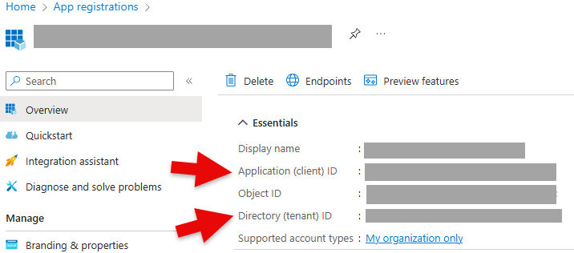
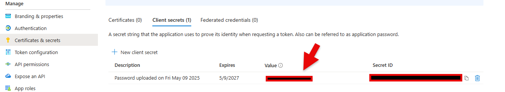
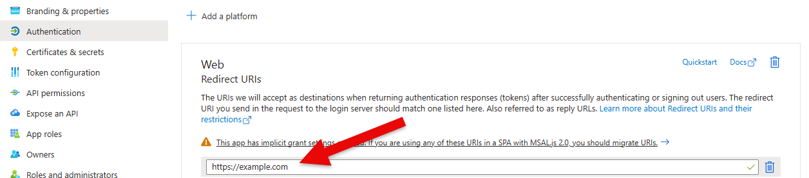

## **Azure Entra ID**

Previously known as Azure Active Directory.

To set up OAuth2.0 authentication for Azure Entra ID follow [these instructions](https://docs.microsoft.com/en-us/azure/api-management/api-management-howto-protect-backend-with-aad). Ensure that you supply the tenant ID using `oauth_extra_params`, a configuration may look like:

```bash
panel serve app.py \
--oauth-provider=azure \
--oauth-key='CLIENT_ID' \
--oauth-secret='CLIENT_SECRET' \
--cookie-secret='COOKIE_SECRET' \
--oauth-encryption-key='ENCRYPTION_KEY' \
--oauth-redirect-uri=REDIRECT_URI \
--oauth-extra-params "{'tenant': 'TENANT_ID'}" \
...
```

or with environment variables

```bash
PANEL_OAUTH_PROVIDER=azure \
PANEL_OAUTH_KEY=CLIENT_ID \
PANEL_OAUTH_SECRET=CLIENT_SECRET \
PANEL_COOKIE_SECRET=COOKIE_SECRET \
PANEL_OAUTH_ENCRYPTION=ENCRYPTION_KEY \
PANEL_OAUTH_REDIRECT_URI=REDIRECT_URI \
PANEL_OAUTH_EXTRA_PARAMS="{'tenant': 'TENANT_ID'}" \
panel serve app.py ...
```

The `CLIENT_ID` corresponds to the `Application (client) ID` and the `TENANT_ID` to the `Directory (tenant) ID` below:



The `CLIENT_SECRET` corresponds to the `Value` below:



The `REDIRECT_URI` should be included in the list of Web Redirect URIs:



## Handling multiple accounts

Users who are signed into more than one Microsoft account in the same browser (for
example a corporate and a personal account) may be logged in with the wrong account,
or be confused about which account is used. You can control this by forwarding a
`prompt` parameter to the Azure authorization endpoint via `oauth_extra_params`:

```bash
panel serve app.py \
--oauth-provider=azure \
--oauth-key='CLIENT_ID' \
--oauth-secret='CLIENT_SECRET' \
--cookie-secret='COOKIE_SECRET' \
--oauth-redirect-uri=REDIRECT_URI \
--oauth-extra-params "{'tenant': 'TENANT_ID', 'prompt': 'select_account'}" \
...
```

- `prompt=select_account` always shows the account picker so the user can choose which
  account to sign in with.
- `prompt=login` forces the user to re-authenticate.

Restricting `tenant` to your directory ID (rather than `common`) additionally ensures
that only accounts from your organization are accepted.

```{note}
Forwarding arbitrary authorization parameters such as `prompt` requires the Panel
release that includes [#8635](https://github.com/holoviz/panel/pull/8635).
```

```{warning}
Multiple accounts are sometimes mistaken for the cause of a `Could not open websocket`
error. That error is almost always a request-header **size** problem rather than an
account problem — see [Troubleshooting OAuth](../trouble_shooting) for the diagnosis
and fixes.
```
