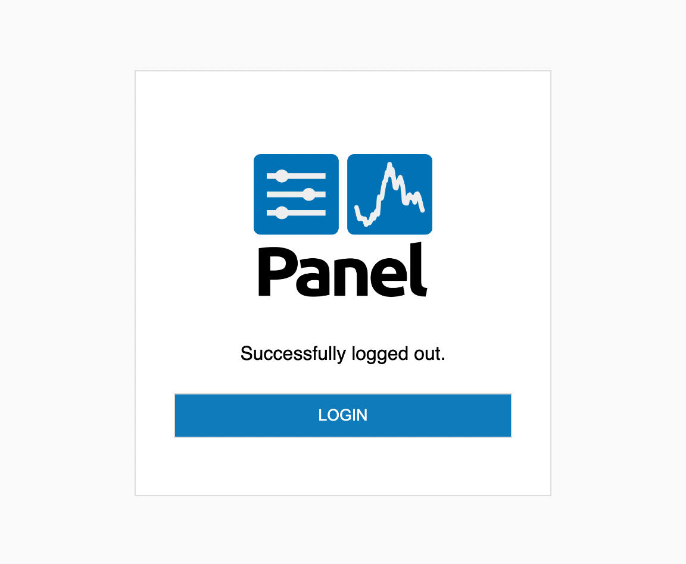

# Authentication Templates

Authentication flows have multiple stages and in certain scenarios Panel has to serve pages that provide you with information when authentication has not succeeded or allow you the option of logging back into the application. Panel includes default templates for these cases, specifically it has:

- Error Template: The template that is displayed if the authentication errored for any reason, e.g. the user was not authorized to access the application.
- Logout Template: The template served when a user hits the `/logout` endpoint.

Both templates use Jinja2 syntax to render certain variables.

## Error Template

The error template is used to display errors when authentication errored out. This can occur for any number of reasons, e.g. authentication is misconfigured or the user is not authorized to access the application.

The template can be configured on the commandline using the `--oauth-error-template` option. The provided value must be a valid HTML file relative to the current working directory or an absolute path:

```bash
panel serve app.py ... --oauth-error-template error.html
```

When using `panel.serve` to dynamically serve the application you can configure the template with the `oauth_error_template` argument:

```python
pn.serve(..., oauth_error_template='error.html')
```

The error template may be a completely static file or use Jinja2 templating syntax with the following variables:

`npm_cdn`
: The CDN to load NPM resources from.

`title`
: The HTML page title.

`error_type`
: The type of error being raised.

`error`
: A short description of the error.

`error_msg`
: The full error message providing additional context.

## Logout Template

The logout template is rendered when a user hits the `/logout` endpoint with authentication enabled. It is meant to be a simple static page that confirms that the logout process was completed and optionally allows the user to log back in.

The default template looks like this:



The template can be configured on the commandline using the `--logout-template` option. The provided value must be a valid HTML file relative to the current working directory or an absolute path:

```bash
panel serve app.py ... --logout-template logout.html
```

When using `panel.serve` to dynamically serve the application you can configure the template with the `logout_template` argument:

```python
pn.serve(..., logout_template=logout.html')
```

The template may be a completely static HTML file or use Jinja2 templating syntax with the following variables being provided:

`PANEL_CDN`
: The URL of the CDN (or local path) that Panel resources will be loaded from.
