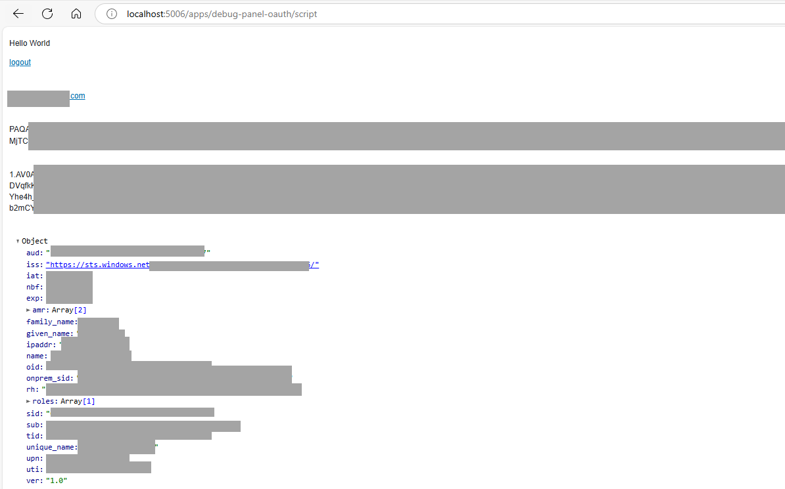

# Troubleshooting OAuth

## Debugging

In order to learn about, configure and debug OAuth configuration, it can be useful to follow the example below.

Create the `script.py` file:

```python
print("Start of script ...")

import panel as pn

pn.extension()

user = pn.state.user or "Guest User"
access_token = pn.state.access_token or "No access token"
refresh_token = pn.state.refresh_token or "No refresh token"
user_info = pn.state.user_info or "No user info"
pn.Column(
    "Hello World\n\n[logout](./logout)",
    user,
    access_token,
    refresh_token,
    user_info,
).servable()
print("End of script ...")
```

Depending on your OAuth provider and setup, you may run a command similar to the one below to get extensive debugging information:

```bash
BOKEH_LOG_LEVEL=trace \
BOKEH_PY_LOG_LEVEL=debug \
PANEL_LOG_LEVEL=debug \
panel serve script.py \
--oauth-provider=azure \
--oauth-key='CLIENT_ID' \
--oauth-secret='CLIENT_SECRET' \
--cookie-secret='COOKIE_SECRET' \
--oauth-encryption-key='ENCRYPTION_KEY' \
--oauth-redirect-uri=REDIRECT_URI \
--oauth-extra-params "{'tenant': 'TENANT_ID'}" \
--address 0.0.0.0 \
--port 5006 \
--allow-websocket-origin=localhost:5006 \
--prefix=apps/debug-panel-oauth
```

Try opening your app in a new private/incognito browser window. Your debugging app should look something like this:



## Known Issues

As always, try to search our [GitHub Issue tracker](https://github.com/holoviz/panel/issues) or [Discord community](https://discord.gg/rb6gPXbdAr) to see if someone else has experienced the same issue. If you need further assistance, reach out to the [community](../../community.md).

### Could not open websocket

If the websocket cannot connect, you will see an error like this in the browser console:

```bash
WebSocket connection to 'wss://example.org/apps/panel-oauth-app/script/ws' failed
[bokeh 3.7.2] Failed to connect to Bokeh server: Could not open websocket
[bokeh 3.7.2] Failed to load Bokeh session XXXXXXXXXXXXXXXXXXXXXXXXXXXX: Error: Could not open websocket
Error rendering Bokeh items: Error: Could not open websocket
[bokeh 3.7.2] Lost websocket 0 connection, 1006 ()
[bokeh 3.7.2] Websocket connection 0 disconnected, will not attempt to reconnect
```

#### Cause: Token Too Big

You may experience this issue when the *token* used by the client to create the WebSocket connection to the Panel server has grown larger than allowed by your proxy settings.
This is particularly common when using the `--oauth-encryption-key` parameter, which significantly increases the token size.

To troubleshoot, try removing the `--oauth-encryption-key` parameter or `PANEL_OAUTH_ENCRYPTION` environment variable to see if encryption is the cause of the issue.

Potential solutions include:

1. **Update your proxy settings** to allow larger header sizes (recommended for production environments).

2. **Run without an encryption key** (less secure, but works with default proxy configurations)

For more details on this issue, see [Issue #7909](https://github.com/holoviz/panel/issues/7909).

#### Cause: Multiple Accounts

You may experience this issue when using multiple accounts (for example corporate and personal) in the same browser. Try opening your Panel application in a private/incognito browser window to test if this might be the cause.

If this confirms that browser history or configuration is causing the issue, try one or more of these steps:

1. Clear your browser cache and cookies (select `Delete ALL browsing data` in your browser settings)
2. Log out from all accounts before accessing your Panel application.
3. Use a dedicated browser profile for your Panel application
