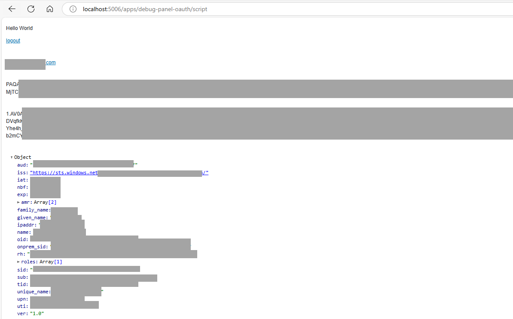

# Troubleshooting OAuth

## Debugging

In order to learn about, configure and debug OAuth configuration, it can be useful to follow the example below.

Create the `script.py` file:

```python
print("Start of script ...")

import panel as pn

pn.extension()

user = pn.state.user or "Guest User"
access_token = pn.state.access_token or "No access token"
refresh_token = pn.state.refresh_token or "No refresh token"
user_info = pn.state.user_info or "No user info"
pn.Column(
    "Hello World\n\n[logout](./logout)",
    user,
    access_token,
    refresh_token,
    user_info,
).servable()
print("End of script ...")
```

Depending on your OAuth provider and setup, you may run a command similar to the one below to get extensive debugging information:

```bash
BOKEH_LOG_LEVEL=trace \
BOKEH_PY_LOG_LEVEL=debug \
PANEL_LOG_LEVEL=debug \
panel serve script.py \
--oauth-provider=azure \
--oauth-key='CLIENT_ID' \
--oauth-secret='CLIENT_SECRET' \
--cookie-secret='COOKIE_SECRET' \
--oauth-encryption-key='ENCRYPTION_KEY' \
--oauth-redirect-uri=REDIRECT_URI \
--oauth-extra-params "{'tenant': 'TENANT_ID'}" \
--address 0.0.0.0 \
--port 5006 \
--allow-websocket-origin=localhost:5006 \
--prefix=apps/debug-panel-oauth
```

Try opening your app in a new private/incognito browser window. Your debugging app should look something like this:



## Known Issues

As always, try to search our [GitHub Issue tracker](https://github.com/holoviz/panel/issues) or [Discord community](https://discord.gg/rb6gPXbdAr) to see if someone else has experienced the same issue. If you need further assistance, reach out to the [community](../../community.md).

### Could not open websocket

If the websocket cannot connect, you will see an error like this in the browser console:

```bash
WebSocket connection to 'wss://example.org/apps/panel-oauth-app/script/ws' failed
[bokeh 3.7.2] Failed to connect to Bokeh server: Could not open websocket
[bokeh 3.7.2] Failed to load Bokeh session XXXXXXXXXXXXXXXXXXXXXXXXXXXX: Error: Could not open websocket
Error rendering Bokeh items: Error: Could not open websocket
[bokeh 3.7.2] Lost websocket 0 connection, 1006 ()
[bokeh 3.7.2] Websocket connection 0 disconnected, will not attempt to reconnect
```

#### Cause: Request Headers Too Big

This is by far the most common cause. The most important thing to understand is
that it is almost always a **header size** problem, *not* a problem with "multiple
accounts" or your browser, even though those are common ways to stumble onto it.

When a Bokeh/Panel session starts, the server hands the browser a **session token**
and the browser sends it back in the `Sec-WebSocket-Protocol` request header when it
opens the WebSocket. With OAuth enabled, this token embeds the originating request's
cookies and headers — and your OAuth cookies (`access_token`, `id_token`,
`refresh_token`) can be large, especially with Azure/Entra ID accounts that belong to
many groups, or when using `--oauth-encryption-key` (which inflates them further).

If the resulting header exceeds the limit your proxy allows for a single request
header line (for nginx this is `large_client_header_buffers`, **default 8&nbsp;KB**),
the proxy rejects the WebSocket upgrade — typically with an `HTTP 400` — *before* it
ever reaches the Panel server, and the browser reports `Could not open websocket`.

Because the failing header is often only a few hundred bytes over the limit, the same
app can appear to "work" in an incognito window, a different browser, or after
clearing cookies — simply because those carry slightly smaller headers and slip back
under the limit. These are **not** reliable fixes; the header will creep back over the
limit as tokens grow.

##### How to diagnose

In your browser developer tools, open the **Network** tab, reproduce the failure, and
inspect the failed `.../ws` request:

- If it shows *"Provisional headers are shown"* / no response and an `HTTP 400`, and
  the request never appears in your Panel server logs, the proxy is rejecting it.
- Look at the size of the `Sec-WebSocket-Protocol` and `Cookie` request headers. If
  either approaches or exceeds ~8&nbsp;KB, this is your problem. (Chromium's
  `chrome://net-export` / `edge://net-export` capture shows the exact failure reason.)

##### Solutions

1. **Increase your proxy's request-header buffer** (recommended for production). For
   nginx, raise `large_client_header_buffers` (and `client_header_buffer_size`), e.g.
   `large_client_header_buffers 4 32k;`. Note these are *request*-header settings —
   raising response buffers such as nginx's `proxy_buffer_size` will **not** help.
   On the Kubernetes `ingress-nginx` controller these are **not** available as
   per-`Ingress` annotations; they must be set in the controller's **ConfigMap**
   (`large-client-header-buffers`, `client-header-buffer-size`) — setting them as
   `nginx.ingress.kubernetes.io/...` annotations has no effect.

2. **Stop embedding the large OAuth cookies in the token.** Serve with
   `--exclude-cookies access_token id_token refresh_token` so they are not packed into
   the session token (they are still sent in the `Cookie` header and used for
   authentication). This shrinks the token dramatically. Note that
   `pn.state.access_token`, `pn.state.refresh_token` and `pn.state.user_info` are read
   from the session context, so they will not be available inside the app when those
   cookies are excluded — exclude only the ones your app does not need.

3. **Reduce the size of the tokens themselves.** Request fewer scopes, and for Azure
   configure group **overage** (so large group lists are not inlined into the token).

4. **Run without an encryption key** (less secure, but produces smaller cookies and
   works with default proxy configurations) by removing `--oauth-encryption-key` /
   `PANEL_OAUTH_ENCRYPTION`.

For more details see [Issue #7909](https://github.com/holoviz/panel/issues/7909) and
[Issue #8634](https://github.com/holoviz/panel/issues/8634).

#### A note on "multiple accounts"

Being signed into multiple accounts (e.g. a corporate and a personal Microsoft
account) does **not** by itself break the WebSocket — those extra accounts live as
cookies on the identity provider's domain, not on your app's domain, so they do not
enlarge your app's request headers. If multiple accounts *seem* to matter, it is
usually because one account simply has larger tokens and tips you over the header
limit described above.

What multiple accounts *can* cause is the wrong account being selected during login.
To control this, forward a `prompt` parameter to the provider via
`oauth_extra_params`, for example for Azure/Entra ID:

```bash
panel serve app.py --oauth-provider=azure \
--oauth-extra-params "{'tenant': 'TENANT_ID', 'prompt': 'select_account'}" \
...
```

`prompt=select_account` always shows the account picker so the user can choose the
right account; `prompt=login` forces re-authentication. See the
[Azure provider docs](providers/azure) for details.
