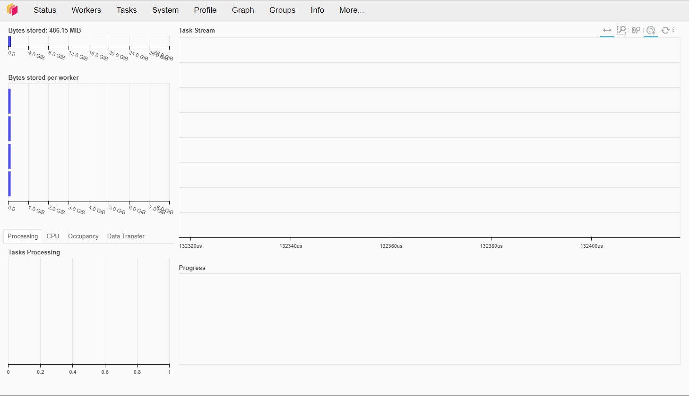

# Scaling with Dask

This guide demonstrates how you can *offload tasks* to [Dask](https://www.dask.org/) to **scale your apps to bigger datasets, bigger calculations and more users**.

</img> </img>

Panel supports `async` and `await`. This means you can easily **offload large computations to your Dask cluster asynchronously and keep your app responsive while you `await` the results**. Please note that off loading the computations to the Dask cluster can add ~250msec of overhead and thus is not suitable for all kinds of use cases.

## Installation

Lets start by installing *Panel*, *hvPlot* and *Dask Distributed*.

```bash
pip install panel hvplot dask[distributed]
```

## Start the Cluster

For development, testing and many use cases a [`LocalCluster`](https://docs.dask.org/en/stable/deploying-python.html#localcluster) is more than fine and will allow you to leverage all the CPUs on your machine. When you want to scale out to an entire cluster will you can switch to a non-local cluster. To avoid any issues when combining Panel and Dask we recommend starting the `LocalCluster`
separately from the Dask `Client` and your Panel app.

```python
# cluster.py
from dask.distributed import LocalCluster

DASK_SCHEDULER_PORT = 64719
DASK_SCHEDULER_ADDRESS = f"tcp://127.0.0.1:{DASK_SCHEDULER_PORT}"
N_WORKERS = 4

if __name__ == '__main__':
    cluster = LocalCluster(scheduler_port=DASK_SCHEDULER_PORT, n_workers=N_WORKERS)
    print(cluster.scheduler_address)
    input()
```

and running

```bash
$ python cluster.py
tcp://127.0.0.1:64719
```

You can now open the [Dask Dashboard](https://docs.dask.org/en/stable/dashboard.html) at [http://localhost:8787/status](http://localhost:8787/status).

So far there is not a lot to see here:



The Dask `Client` will serialize any *tasks* and send them to the Dask `Cluster` for execution. This means that the `Client` and `Cluster` must able to import the same versions of all *tasks* and python package dependencies.

## Dask Distributed

## Fibonacci Task Queue

In this section we will define a Panel app to *submit* and *monitor* Fibonacci tasks.

Let's start by defining the *fibonacci* tasks in a `tasks.py` file:

```python
# tasks.py
from datetime import datetime as dt

import numpy as np


def _fib(n):
    if n < 2:
        return n
    else:
        return _fib(n - 1) + _fib(n - 2)


def fibonacci(n):
    start = dt.now()
    print(start, "start", n)
    result = _fib(n)
    end = dt.now()
    print(end, "end", (end-start).seconds, n, result)
    return result
```

Lets now define the full `app.py` file.

```python
# app.py
from datetime import datetime as dt

from dask.distributed import Client

import panel as pn

from cluster import DASK_SCHEDULER_ADDRESS
from tasks import fibonacci

QUEUE = []

pn.extension("terminal", design="material", sizing_mode="stretch_width")

@pn.cache # We use caching to share the client across all users and sessions
async def get_client():
    return await Client(
        DASK_SCHEDULER_ADDRESS, asynchronous=True
    )

n_input = pn.widgets.IntInput(value=0, width=100, sizing_mode="fixed", name="n")
submit_button = pn.widgets.Button(name="SUBMIT", button_type="primary", align="end")
terminal_widget = pn.widgets.Terminal(
    height=200,
)

queue = pn.rx(QUEUE)

@pn.depends(submit_button, watch=True)
async def _handle_click(_):
    n = n_input.value
    n_input.value += 1

    start = dt.now()
    QUEUE.append(n)
    queue.rx.value = QUEUE

    client = await get_client()
    fib_n = await client.submit(fibonacci, n)

    end = dt.now()

    QUEUE.pop(QUEUE.index(n))
    queue.rx.value = QUEUE

    duration = (end - start).seconds
    terminal_widget.write(f"fibonacci({n})={fib_n} in {duration}sec\n")


pn.Column(
    "# Fibonacci Tasks",
    pn.Row(n_input, submit_button),
    pn.rx("## Task queue: {}").format(queue),
    "## Results",
    terminal_widget,
).servable()
```

You can now run `panel serve app.py` and the app will look like

<video muted controls loop poster="../../_static/images/dask_fibonacci_queue.png" style="max-height: 400px; max-width: 100%;">
    <source src="https://assets.holoviz.org/panel/how_to/concurrency/dask-fibonacci-queue.mp4" type="video/mp4">
    Your browser does not support the video tag.
</video>

## Dask Dashboard Components

It can be very useful to include some of the live [Dask endpoints](https://distributed.dask.org/en/stable/http_services.html) in your app. Its easy to do by embedding the specific urls in an *iframe*.

In the `dashboard.py` file we define the `DaskViewer` component that can be used to explore the *individual dask plots*.

```python
# dashboard.py
import os

import param

import panel as pn

DASK_DASHBOARD_ADDRESS = os.getenv("DASK_DASHBOARD", "http://localhost:8787/status")

VIEWS = {
    "aggregate-time-per-action": "individual-aggregate-time-per-action",
    "bandwidth-types": "individual-bandwidth-types",
    "bandwidth-workers": "individual-bandwidth-workers",
    "cluster-memory": "individual-cluster-memory",
    "compute-time-per-key": "individual-compute-time-per-key",
    "cpu": "individual-cpu",
    "exceptions": "individual-exceptions",
    "gpu-memory": "individual-gpu-memory",
    "gpu-utilization": "individual-gpu-utilization",
    "graph": "individual-graph",
    "groups": "individual-groups",
    "memory-by-key": "individual-memory-by-key",
    "nprocessing": "individual-nprocessing",
    "occupancy": "individual-occupancy",
    "profile-server": "individual-profile-server",
    "profile": "individual-profile",
    "progress": "individual-progress",
    "scheduler-system": "individual-scheduler-system",
    "task-stream": "individual-task-stream",
    "workers-cpu-timeseries": "individual-workers-cpu-timeseries",
    "workers-disk-timeseries": "individual-workers-disk-timeseries",
    "workers-disk": "individual-workers-disk",
    "workers-memory-timeseries": "individual-workers-memory-timeseries",
    "workers-memory": "individual-workers-memory",
    "workers-network-timeseries": "individual-workers-network-timeseries",
    "workers-network": "individual-workers-network",
    "workers": "individual-workers",
}

VIEWER_PARAMETERS = ["url", "path"]

def dask_dashboard_view(path="individual-cpu", url=DASK_DASHBOARD_ADDRESS):
    url = url.replace("/status", "/") + path
    return f"""<iframe src="{url}" frameBorder="0" style="height:100%;width:100%"></iframe>"""

class DaskViewer(pn.viewable.Viewer):
    url = param.String(DASK_DASHBOARD_ADDRESS, doc="The url of the Dask status dashboard")
    path = param.Selector(default="individual-cpu", objects=VIEWS, doc="the endpoint", label="View")

    def __init__(self, size=20, **params):
        viewer_params = {k:v for k, v in params.items() if k in VIEWER_PARAMETERS}
        layout_params = {k:v for k, v in params.items() if k not in VIEWER_PARAMETERS}

        super().__init__(**viewer_params)

        view = pn.bind(dask_dashboard_view, self.param.path, self.param.url)
        self._iframe =  pn.pane.HTML(view, sizing_mode="stretch_both")
        self._select = pn.widgets.Select.from_param(self.param.path, size=size, width=300, sizing_mode="fixed", margin=(20,5,10,5))
        self._link = pn.panel(f"""<a href="{DASK_DASHBOARD_ADDRESS}" target="_blank">Dask Dashboard</a>""", height=50, margin=(0,20))
        self._panel = pn.Column(pn.Row(self._iframe, self._select, sizing_mode="stretch_both"), self._link, **layout_params)

    def __panel__(self):
        return self._panel

if __name__.startswith("bokeh"):
    pn.extension(sizing_mode="stretch_width")

    DaskViewer(height=500, size=25).servable()
```

Try running `panel serve dashboard.py`. If your Dask cluster is working, you will see something like


## Additional Resources

- [Panel - Use Async Callbacks](../callbacks/async.md)
- [Dask - Async/Await and Non-Blocking Execution Documentation](https://examples.dask.org/applications/async-await.html#Async/Await-and-Non-Blocking-Execution)
- [Dask - Async Web Server](https://examples.dask.org/applications/async-web-server.html)
