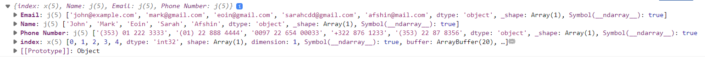

# Rendering DataFrames using ESM components

In this guide we will show you how to implement ESM components with a `DataFrame` parameter.

## Creating a `JSComponent`

In this example we will show you how to create a custom DataFrame Pane. The example will be based on the [GridJS table](https://gridjs.io/).

```{pyodide}
import random
import pandas as pd
import param
import panel as pn

from panel.custom import JSComponent

class GridJS(JSComponent):

    object = param.DataFrame()

    _esm = """
    import * as gridjs from "https://esm.sh/gridjs@6.2.0"

    function get_config(model) {
      const data = model.object
      const columns = Object.keys(data).filter(key => key !== "index");
      const rows = []
      for (let index=0; index < data["index"].shape[0]; index++) {
        const row = columns.map(key => data[key][index])
        rows.push(row)
      }
      return {columns: columns, data: rows, resizable: true, sort: true}
    }

    export function render({model, el}) {
      console.log(model.object)
      const config = get_config(model)
      console.log(config)
      const grid = new gridjs.Grid(config).render(el)
      model.on('object', () => grid.updateConfig(get_config(model)).forceRender())
    }
    """

    __css__ = [
      "https://unpkg.com/gridjs/dist/theme/mermaid.min.css"
    ]


def data(event):
  return pd.DataFrame([
    ["John", "john@example.com", "(353) 01 222 3333", random.uniform(0, 1)],
    ["Mark", "mark@gmail.com", "(01) 22 888 4444", random.uniform(0, 1)],
    ["Eoin", "eoin@gmail.com", "0097 22 654 00033", random.uniform(0, 1)],
    ["Sarah", "sarahcdd@gmail.com", "+322 876 1233", random.uniform(0, 1)],
    ["Afshin", "afshin@mail.com", "(353) 22 87 8356", random.uniform(0, 1)]
  ], columns= ["Name", "Email", "Phone Number", "Random"])

update_button = pn.widgets.Button(name="UPDATE", button_type="primary")

grid = GridJS(object=pn.bind(data, update_button), sizing_mode="stretch_width")

pn.Column(update_button, grid).servable()
```

The main challenge of creating this component is understanding the structure of `data.value` and how it can be converted to a format (`config`) that `gridjs.Grid` accepts.

To help you understand what the `data.value` and `config` values looks like, I've logged them to the *browser console* using `console.log`.



## Creating a `ReactComponent`

Now let's see how to implement the same thing using the [GridJS React integration](https://gridjs.io/docs/integrations/react/).

```{pyodide}
import random
import pandas as pd
import param
import panel as pn

from panel.custom import PaneBase, ReactComponent

class GridJS(ReactComponent):

    object = param.DataFrame()

    _esm = """
	import { useEffect, useState } from "react"
    import { Grid } from "https://esm.sh/gridjs-react@6.1.1"

    function get_config(data) {
      const columns = Object.keys(data).filter(key => key !== "index");
      const rows = []
      for (let index=0; index < data["index"].shape[0]; index++) {
        const row = columns.map(key => data[key][index])
        rows.push(row)
      }
      return {columns: columns, data: rows, resizable: true, sort: true}
    }

    export function render({model, el}) {
      const [data] = model.useState("object")
	  const [config, setConfig] = useState(get_config(data))
      useEffect(() => {
        const newConfig = get_config(data);
        setConfig(newConfig);
      }, [data])
      return <Grid {...config}></Grid>
    }
    """

    __css__ = [
      "https://unpkg.com/gridjs/dist/theme/mermaid.min.css"
    ]


def data(event):
  return pd.DataFrame([
    ["John", "john@example.com", "(353) 01 222 3333", random.uniform(0, 1)],
    ["Mark", "mark@gmail.com", "(01) 22 888 4444", random.uniform(0, 1)],
    ["Eoin", "eoin@gmail.com", "0097 22 654 00033", random.uniform(0, 1)],
    ["Sarah", "sarahcdd@gmail.com", "+322 876 1233", random.uniform(0, 1)],
    ["Afshin", "afshin@mail.com", "(353) 22 87 8356", random.uniform(0, 1)]
  ], columns= ["Name", "Email", "Phone Number", "Random"])

update_button = pn.widgets.Button(name="UPDATE", button_type="primary")

grid = GridJS(object=pn.bind(data, update_button), sizing_mode="stretch_width")

pn.Column(update_button, grid).servable()
```
