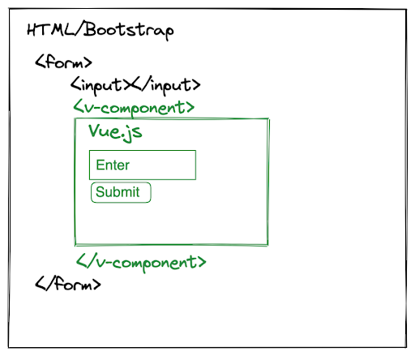

# Wrap a Vue component

This example will demonstrate how to wrap a Vue.js component in panel. We will build a series of classes culminating in a Panel+Vue.js custom component inspired by medicinal chemistry.

This guide is heavily inspired by [Web Development with Python and Vue.js Components](https://blog.reverielabs.com/python-vue-components/).

## What is a Vue Component?

[Vue components](https://vuejs.org/v2/guide/components.html) are self-contained elements that can render HTML/CSS, store data within Javascript variables, and much more. Once defined, they are callable as HTML tags. For example, within existing HTML a Vue component can be rendered like below:



Here, the Vue component tags `<v-component></v-component>` are responsible for rendering a part of the frontend that takes user input.

The components are usually defined in a .vue file and require Webpack to serve.

With Panel you can take a **simpler approach**, there is no need to configure, learn and maintain an advanced javascript build tool chain to utilize Vue.js. We will show you how this is done below using Panels [ReactiveHTML](https://panel.holoviz.org/how_to/custom_components/custom_reactiveHTML.html).

## Let's get started

In order to ensure that all the resources we need (such as Vue.js) are loaded appropriately we need to declare baseclasses which declare these dependencies **before** we run the `panel.extension`:

```{pyodide}
import panel as pn
import param
import requests

class BasicVueComponent(pn.reactive.ReactiveHTML):

    _template = """
    <div id="container" style="height:100%; width:100%; background:#0072B5; border-radius:4px; padding:6px; color:white">
      <vue-component></vue-component>
    </div>
    """

    _scripts = {
        "render": """
    const template = "<div>Hello Panel + Vue.js World!</div>"
    const vue_component = {template: template}
    el=new Vue({
        el: container,
        components: {
            'vue-component' : vue_component
        }
    })
    """
    }

    _extension_name = 'vue'

    __javascript__ = [
        "https://cdn.jsdelivr.net/npm/vue@2/dist/vue.js"
    ]

class BootstrapVueComponent(BasicVueComponent):

    __javascript__= [
        "https://cdn.jsdelivr.net/npm/vue@2/dist/vue.js",
        "https://unpkg.com/bootstrap-vue@latest/dist/bootstrap-vue.min.js",
    ]
    __css__=[
        "https://unpkg.com/bootstrap/dist/css/bootstrap.min.css",
        "https://unpkg.com/bootstrap-vue@latest/dist/bootstrap-vue.min.css",
    ]

pn.extension('vue', sizing_mode="stretch_width", template="bootstrap")
```

In this example we are building a Vue.js component containing an input field and a button that will update the `value` parameter of the `PDBInput` component:

```{pyodide}

class PDBInput(BootstrapVueComponent):

    value = param.String()

    _template = """
    <div id="container" style="height:100%; width:100%">
      <vue-component></vue-component>
    </div>
    """

    _scripts = {
        "render": """
    const template = `
    <div>
      <b-form v-on:keydown.enter.prevent>
        <b-form-input v-model="pdb_id" placeholder="Enter PDB ID" required></b-form-input>
        <b-button variant="secondary" size="sm" v-on:click="setPDBId" style="margin-top:10px;width:100%">
            Retrieve PDB metadata
        </b-button>
      </b-form>
    </div>`
    const vue_component = {
      template: template,
      delimiters: ['[[', ']]'],
      data: function () {
        return {
          pdb_id: data.value,
        }
      },
      methods: {
        setPDBId() {
          data.value = this.pdb_id
        }
      }
    }
    const el = new Vue({
        el: container,
        components: {
            'vue-component': vue_component
        }
    })
    """
    }
```

## Featurize Protein Structure

Use the Vue component below to retrieve PDB metadata from [KLIFS](https://klifs.net/). For example for *`2xyu`* or *`4WSQ`*:

```{pyodide}
URL = "https://klifs.net/api/structures_pdb_list"

def get_pdb_data_from_klifs(pdb_id):
    if not pdb_id:
        return "Please specify a PDB ID."

    params = {'pdb-codes': pdb_id}
    res = requests.get(url = URL, params = params)
    data = res.json()

    if res.status_code == 400:
        return f"Error 400, Could not get PDB {pdb_id}", data[1]

    return data[0]

pdb_input = PDBInput(height=90, max_width=800)

iget_klifs_data = pn.bind(get_pdb_data_from_klifs, pdb_id=pdb_input.param.value)

pn.Column(
    pdb_input,
    pn.pane.JSON(iget_klifs_data, theme="light")
).servable()
```
