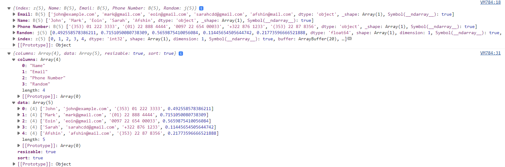

# DataFrames and ReactiveHTML

In this guide we will show you how to implement `ReactiveHTML` components with a `DataFrame` parameter.

## Creating a Custom DataFrame Pane

In this example we will show you how to create a custom DataFrame Pane. The example will be based on the [GridJS table](https://gridjs.io/).

```{pyodide}
import random
import pandas as pd
import param
import panel as pn

from panel.custom import ReactiveHTML

class GridJS(ReactiveHTML):

    value = param.DataFrame()

    _template = '<div id="wrapper" styles="height:100%;width:100%;"></div>'

    _extension_name = 'gridjs'

    _scripts = {
      "render": """
      console.log(data.value)
      state.config = () => {
        const columns = Object.keys(data.value).filter(key => key !== "index");
        const rows = []
        for (let index=0; index < data.value["index"].shape[0]; index++) {
          const row = columns.map(key => data.value[key][index])
          rows.push(row)
        }
        return {columns: columns, data: rows, resizable: true, sort: true}
      }
      const config = state.config()
      console.log(config)
      state.grid = new gridjs.Grid(config).render(wrapper);
      """,
      "value": """
        config = state.config()
        state.grid.updateConfig(config).forceRender()
      """
    }

    __css__ = [
      "https://unpkg.com/gridjs/dist/theme/mermaid.min.css"
    ]

    __javascript__ = [
      "https://unpkg.com/gridjs/dist/gridjs.umd.js"
    ]


def data(event):
  return pd.DataFrame([
    ["John", "john@example.com", "(353) 01 222 3333", random.uniform(0, 1)],
    ["Mark", "mark@gmail.com", "(01) 22 888 4444", random.uniform(0, 1)],
    ["Eoin", "eoin@gmail.com", "0097 22 654 00033", random.uniform(0, 1)],
    ["Sarah", "sarahcdd@gmail.com", "+322 876 1233", random.uniform(0, 1)],
    ["Afshin", "afshin@mail.com", "(353) 22 87 8356", random.uniform(0, 1)]
  ], columns= ["Name", "Email", "Phone Number", "Random"])

update_button = pn.widgets.Button(name="UPDATE", button_type="primary")

grid = GridJS(value=pn.bind(data, update_button), sizing_mode="stretch_width")

pn.Column(update_button, grid).servable()
```

The main challenge of creating this component is understanding the structure of `data.value` and how it can be converted to a format (`config`) that `gridjs.Grid` accepts.

To help you understand what the `data.value` and `config` values looks like, I've logged them to the *browser console* using `console.log`.


