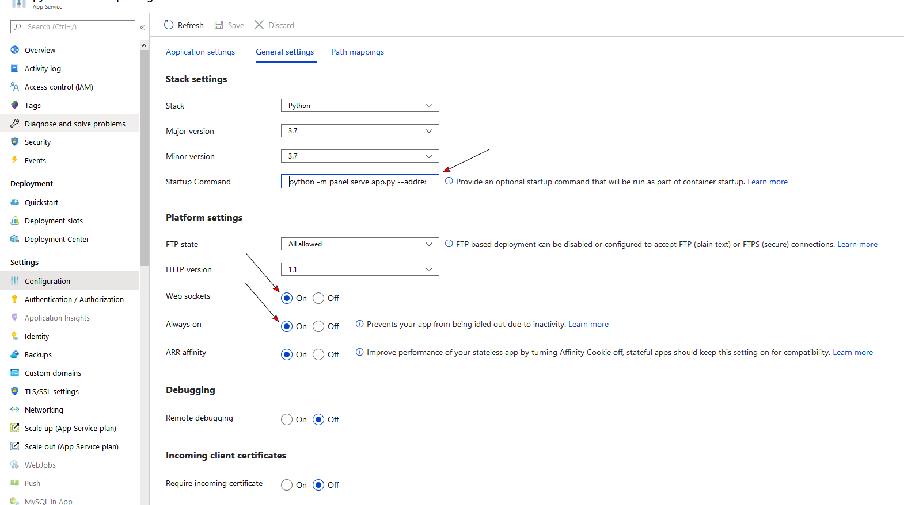

# Microsoft Azure

Azure is popular choice for enterprises often in combination with an automated CI/CD pipeline via Azure DevOps. To get started you can use the [Azure Portal](https://portal.azure.com) to deploy your app as a Linux Web App via the web based user interface.

There are a few things you need to be aware of in order to be able to start your app.

Python Web Apps assumes your web app

- is using `gunicorn` (like Flask or Django) or alternative is started by a `python` command. Thus
    - You **cannot use** `panel serve app.py ...` as a *Startup Command*.
    - You **can use** `python -m panel serve app.py ...` or `python app.py ...` as a *Startup command*.
- is served on address 0.0.0.0 and port 8000

Thus you can use

```bash
python -m panel serve app.py --address 0.0.0.0 --port 8000 --allow-websocket-origin=app-name.azurewebsites.net
```

as a *Startup command*.

You might be able to use `python app.py` as a *Startup command* with `.show()` or `panel.serve` inside your `app.py` file, if you can configure the `address`, `port` and `allow-websocket-origin` in the app.py file or via environment variables.

You also need to configure your app service **general settings** to

- allow `Web sockets` and
- be `Always on`

</img>

If you would like to setup **automated CI/ CD** via Azure DevOps, Azure Pipelines and Docker to a Web App for Containers, you can find a good starting point in the [devops Folder](https://github.com/MarcSkovMadsen/awesome-panel/tree/master/devops) of [awesome-panel.org](https://awesome-panel.org).
