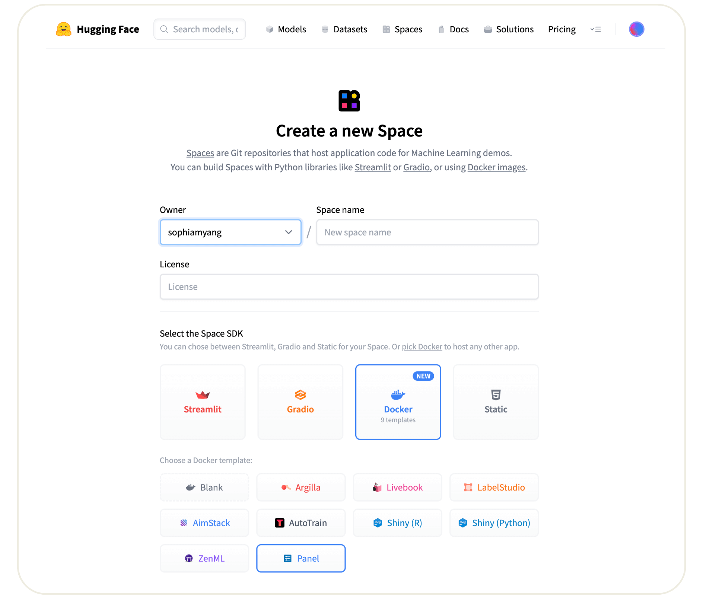
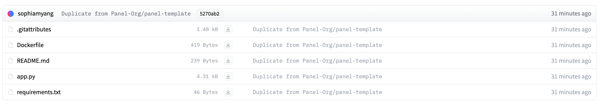

# Hugging Face

The guides below assumes you have already signed up and logged into your account at [huggingface.co](https://huggingface.co/).

## 🚀 Deploy Panel on Spaces

You can deploy Panel on Spaces with just a few clicks:

There are a few key parameters you need to define: the Owner (either your personal account or an organization), a Space name, and Visibility. In case you intend to execute computationally intensive deep learning models, consider upgrading to a GPU to boost performance.

</img>

Once you have created the space, it will start out in “Building” status, which will change to “Running” once your space is ready to go.

## ⚡️ What will you see?
When your space is built and ready, you will see this image classification Panel app which will let you fetch a random image and run the OpenAI CLIP classifier model on it. Check out our [blog post](https://blog.holoviz.org/building_an_interactive_ml_dashboard_in_panel.html) for a walkthrough of this app.

</img>

## 🛠️ How to customize and make your own app?

The Space template will populate a few files to get your app started:

</img>

Three files are important:

### 1. app.py

This file defines your Panel application code. You can start by modifying the existing application or replace it entirely to build your own application. To learn more about writing your own Panel app, refer to the [Panel documentation](https://panel.holoviz.org/).

### 2. Dockerfile

The Dockerfile contains a sequence of commands that Docker will execute to construct and launch an image as a container that your Panel app will run in. Typically, to serve a Panel app, we use the command "panel serve app.py". In this specific file, we divide the command into a list of strings. Furthermore, we must define the address and port because Hugging Face will expects to serve your application on port 7860. Additionally, we need to specify the "allow-websocket-origin" flag to enable the connection to the server's websocket.

### 3. requirements.txt

This file defines the required packages for our Panel app. When using Space, dependencies listed in the requirements.txt file will be automatically installed. You have the freedom to modify this file by removing unnecessary packages or adding additional ones that are required for your application. Feel free to make the necessary changes to ensure your app has the appropriate packages installed.
