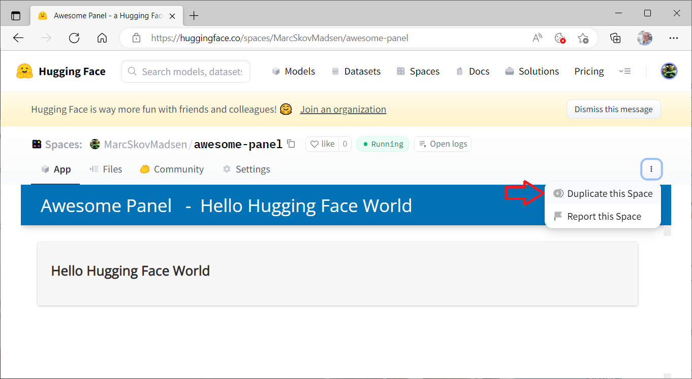
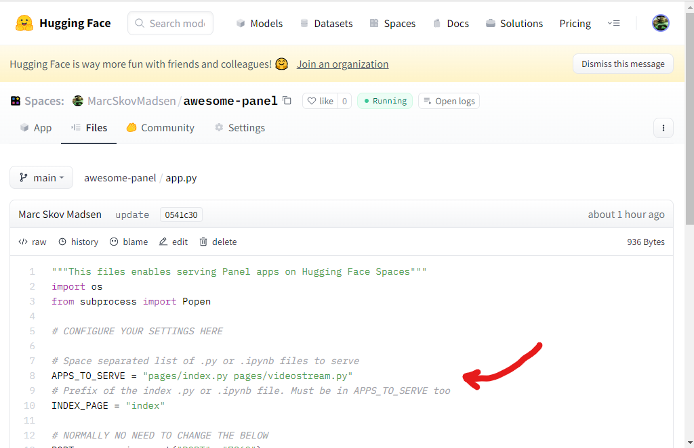
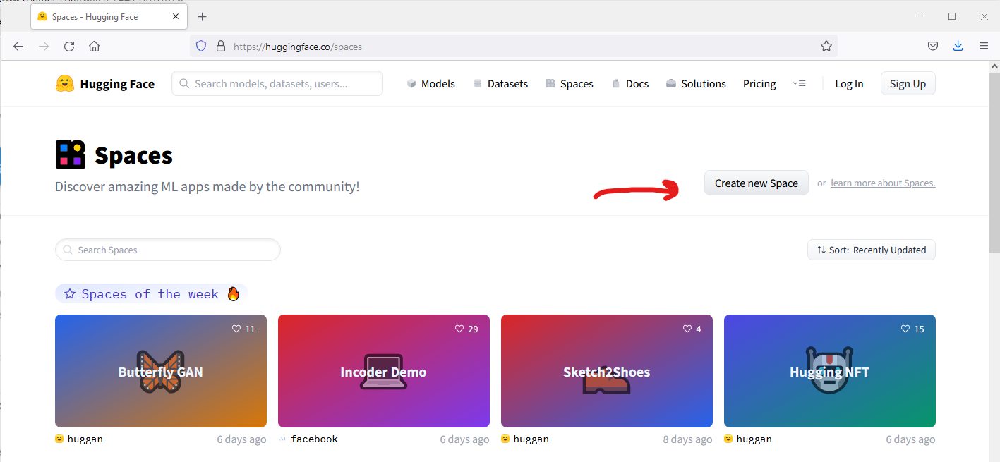
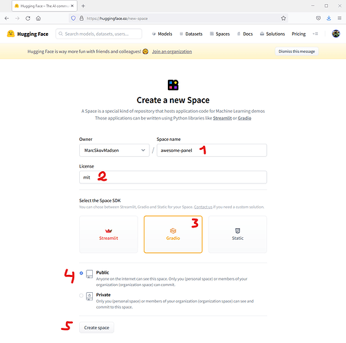
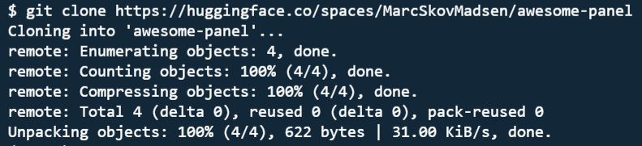

# Hugging Face

The guides below assumes you have already signed up and logged into your account at [huggingface.co](https://huggingface.co/).

## Duplicate an existing space

The easiest way to get started is to  [search](https://huggingface.co/spaces), find and duplicate an existing space. A simple space to duplicate is
[MarcSkovMadsen/awesome-panel](https://huggingface.co/spaces/MarcSkovMadsen/awesome-panel).

- Open the space [MarcSkovMadsen/awesome-panel](https://huggingface.co/spaces/MarcSkovMadsen/awesome-panel).
- Click the 3 dots and select *Duplicate this Space*.

</img>

- Follow the instructions to finish the duplication.

Once you have finalized the duplication you will need to take a look at the `app.py` file in the new space to figure out what to replace.

</img>

## Creating a new space from scratch

You can deploy Panel to Hugging Face Spaces as a [*Custom Python Space*](https://huggingface.co/docs/hub/spaces-sdks-python). For a general introduction to Hugging Face Spaces see the [Spaces Overview](https://huggingface.co/docs/hub/spaces-overview).

Go to [Spaces](https://huggingface.co/spaces) and click the "Create New Space" button.

</img>

Fill out the form. Make sure to select the *Gradio Space SDK*.

</img>

A Gradio space will serve your app via the commmand `python app.py`. I.e. you cannot run `panel serve app.py ...`.

To work around this your `app.py` will need to either

- Use `subprocess` to run `panel serve ...` or
- Use `pn.serve` to serve one or more functions.

The app also needs to run on a port given by the `PORT` environment variable.

Check out the example repository [MarcSkovMadsen/awesome-panel](https://huggingface.co/spaces/MarcSkovMadsen/awesome-panel/tree/main) for inspiration.

## Git clone

Optionally you can git clone your repository using

```bash
git clone https://huggingface.co/spaces/NAME-OF-USER/NAME-OF-SPACE
```

</img>
