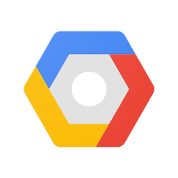

# Deploying Panel Applications

Panel is built on top of Bokeh, which provides a powerful [Tornado](https://www.tornadoweb.org/en/stable/) based web-server to communicate between Python and the browser. The bokeh server makes it possible to share the app or dashboard you have built locally, your own web server or using any of the numerous cloud providers. In the deployment guides we will go through the details of deploying an app on a local system or cloud provider step-by-step.

For guides on running and configuring a Panel server see the [server how-to guides](../server/index).

::::{grid} 2 3 3 5
:gutter: 1 1 1 2

:::{grid-item-card} Azure
:link: azure
:link-type: doc


:::

:::{grid-item-card} Binder
:link: binder
:link-type: doc


:::

:::{grid-item-card} Google Cloud Platform
:link: gcp
:link-type: doc


:::

:::{grid-item-card} Heroku
:link: heroku
:link-type: doc


:::

:::{grid-item-card} Hugging Face
:link: huggingface
:link-type: doc


:::

:::{grid-item-card} Ploomber Cloud
:link: ploomber
:link-type: doc


:::

::::

## Other Cloud Providers

Panel can be used with just about any cloud provider that can launch a Python process, including Amazon Web Services (AWS) and DigitalOcean. The Panel developers will add documentation for these services as they encounter them in their own work, but we would greatly appreciate step-by-step instructions from users working on each of these systems.

```{toctree}
:titlesonly:
:hidden:
:maxdepth: 2

azure
binder
gcp
heroku
huggingface
```
