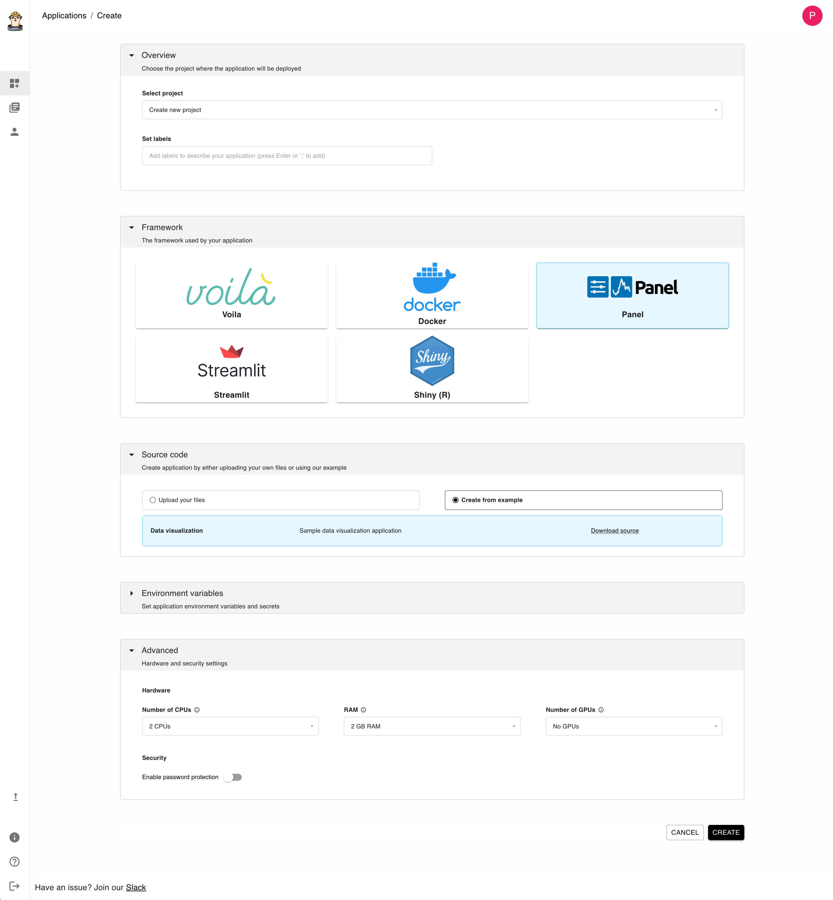

# Ploomber Cloud

Ploomber Cloud offers a [free deployment](https://platform.ploomber.io) option for Panel apps. Once you create an account and log in, follow these steps for deploying using the web application:

1. Click on the "NEW" button. You'll find the below page:

</img>

2. In the "Framework" section, click on Panel.
3. In the "Source code" section, click on "Upload your files".
4. Upload your `.zip` file with the `app.py` and `requirements.txt` file.
5. Click on "CREATE"
6. Wait until deployment finishes. To see your app, click on the `VIEW APPLICATION` button.


Full instructions for deploying Panel apps are available [here](https://docs.cloud.ploomber.io/en/latest/apps/panel.html).

You can also deploy the panel app using the Ploomber command line interface by following the below steps:

1. First, install the package:

```bash
pip install ploomber-cloud
```

2. Get an [API Key](https://docs.cloud.ploomber.io/en/latest/quickstart/apikey.html) and set the key:

```bash
ploomber-cloud key YOURKEY
```

3. `cd` into the panel app folder that you want to deploy.
4. Initialize your project:

```bash
ploomber-cloud init
```

5. This will prompt you for the project type. You need to enter `panel`.
6. Once your project is configured it will generate a `ploomber-cloud.json` with the project info.
7. Deploy the project by running:

```bash
ploomber-cloud deploy
```

8. To view your application, login to the web application and click on the `VIEW APPLICATION` button.

Full instructions for deploying apps using the CLI are available [here](https://docs.cloud.ploomber.io/en/latest/user-guide/cli.html).
