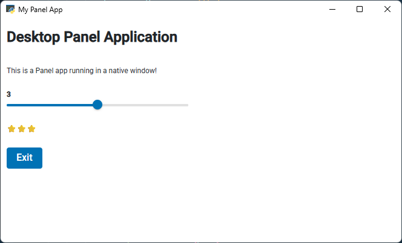

# Create Desktop Apps with pywebview

Convert Panel applications into standalone desktop executables using [pywebview](https://pywebview.flowrl.com/) and package them for distribution.

## Install Dependencies

```bash
pip install panel pywebview pyinstaller
```

:::{note}
Linux requires additional GTK dependencies. See [pywebview installation guide](https://pywebview.flowrl.com/guide/installation.html).
:::

## Create Your Panel Application

Create a Panel application with optional *exit* functionality:

```python
import panel as pn
import os

def create_app():
    """Example Panel app with exit functionality."""
    pn.extension(design="material")

    pn.pane.Markdown.disable_anchors = True

    slider = pn.widgets.IntSlider(value=3, start=1, end=5)
    stars = pn.bind(lambda n: "⭐" * n, slider)

    def exit_app(event):
        """Exit the desktop application."""
        os._exit(0)
        # an alternative way:
        # import webview
        # webview.windows[0].destroy()

    exit_btn = pn.widgets.Button(name="Exit", on_click=exit_app, button_type="primary")

    return pn.Column(
        "# Desktop Panel Application",
        "This is a Panel app running in a native window!",
        slider, stars, exit_btn
    )

if pn.state.served:
    create_app().servable()
```

## Wrap with pywebview

Create `app.py` to wrap your Panel application:

```python
import webview
import panel as pn
import threading
import time
import os
import socket

class PanelDesktop:
    """Serve Panel apps as desktop applications using webview."""

    def __init__(self, title="Panel Desktop App", width: int=600, height: int=600):
        self.title = title
        self.width = width
        self.height = height

    @staticmethod
    def _find_free_port():
        """Find a free port on localhost."""
        with socket.socket(socket.AF_INET, socket.SOCK_STREAM) as s:
            s.bind(('', 0))
            s.listen(1)
            port = s.getsockname()[1]
        return port

    def serve(self, func_or_path, port: int=0):
        """Serve a Panel function or file in a desktop window."""
        if not port:
            port = self._find_free_port()
        # Start Panel server in daemon thread
        server_thread = threading.Thread(
            target=lambda: pn.serve(func_or_path, port=port, show=False, autoreload=False),
            daemon=True
        )
        server_thread.start()

        # Wait for server to start
        time.sleep(1)

        # Create and start webview
        webview.create_window(
            self.title,
            f'http://localhost:{port}',
            resizable=True,
            fullscreen=False,
            width=self.width,
            height=self.height,
            text_select=True,

        )
        webview.start()

def create_app():
    """Example Panel app with exit functionality."""
    pn.extension(design="material")

    pn.pane.Markdown.disable_anchors = True

    slider = pn.widgets.IntSlider(value=3, start=1, end=5)
    stars = pn.bind(lambda n: "⭐" * n, slider)

    def exit_app(event):
        """Exit the desktop application."""
        os._exit(0)
        # an alternative way:
        # import webview
        # webview.windows[0].destroy()

    exit_btn = pn.widgets.Button(name="Exit", on_click=exit_app, button_type="primary")

    return pn.Column(
        "# Desktop Panel Application",
        "This is a Panel app running in a native window!",
        slider, stars, exit_btn
    )

if __name__ == "__main__":
    desktop = PanelDesktop("My Panel App")
    desktop.serve(create_app)
```

:::{note}
You can serve an external file instead of a function:
```python
desktop.serve("my_panel_app.py")
```
:::

## Test the Application

Run:

```bash
python app.py
```

The app should look like



Verify all functionality works before packaging.

## Package for Distribution

Packaging frameworks by platform:

- **Windows/Linux**: [PyInstaller](https://www.pyinstaller.org/) or [Nuitka](http://nuitka.net/)
- **macOS**: [py2app](https://py2app.readthedocs.io/en/latest/)
- **Android**: [Buildozer](https://buildozer.readthedocs.io/en/latest/)

See the [pywebview freezing guide](https://pywebview.flowrl.com/guide/freezing.html) for complete platform-specific instructions.

### Package for Windows

Build with PyInstaller:

```bash
pyinstaller app.py
```

The executable will be in the `dist` folder.

**Options:**

- `--debug all` - Enable debugging
- `--icon=favicon.ico` - Add custom icon ([download Panel icon](https://raw.githubusercontent.com/holoviz/panel/refs/heads/main/doc/_static/icons/favicon.ico))
- `--noconsole` - Hide console window
- `--onefile` - Create single executable (makes the loading of the application slow)

#### Troubleshooting

**Blank window or errors:**

- Add hidden imports: `--hidden-import=panel --hidden-import=bokeh`
- Increase sleep time in the `serve()` method
- Run without `--noconsole` to see error messages

### Create installer for Windows

For professional distribution, create an installer using [InstallForge](https://installforge.net/), [NSIS](https://nsis.sourceforge.io/), or [Inno Setup](https://jrsoftware.org/isinfo.php).

## Alternative: Distribute as UV Tool

A simple alternative to PyInstaller, would be to distribute the app as a [`uv` tool](https://docs.astral.sh/uv/guides/tools/).
