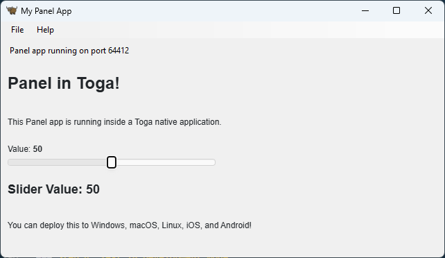

# Create Cross-Platform Apps with Toga

This guide demonstrates how to convert a Panel application into a cross-platform desktop and mobile application using [Toga](https://toga.readthedocs.io/) and [Briefcase](https://briefcase.readthedocs.io/).

---

## Overview

Toga is a Python native, OS native, cross-platform GUI toolkit. Combined with Briefcase, a tool for converting Python projects into standalone native applications, you can package your Panel application to run on Windows, macOS, Linux, iOS, and Android.

Unlike pywebview, Toga provides a native UI framework, allowing you to integrate native controls alongside your Panel web content.

**What you'll learn:**

- How to integrate Panel with Toga
- How to package applications with Briefcase
- How to create cross-platform distributions

## Prerequisites

- Basic familiarity with Panel applications
- Understanding of your target platforms
- Git installed

## Installation

Install Briefcase, which will handle Toga and other dependencies:

```bash
pip install briefcase
```

:::{note}
For Windows, this will install everything. For other OSes, refer to the [BeeWare Tutorial | Install Dependencies](https://tutorial.beeware.org/en/latest/tutorial/tutorial-0/#install-dependencies) guide.
:::

## Creating a Cross-Platform Application

### Step 1: Initialize a Briefcase Project

Initialize a new project with Briefcase:

```bash
briefcase new
```

Briefcase will prompt you for project details:

- **Formal Name**: "My Panel App"
- **App Name**: "mypanelapp"
- **Bundle Identifier**: "com.example.mypanelapp"
- **Project Name**: "My Panel App"
- **Description**: "A Panel app packaged with Toga"
- **Author**: Your name
- **Author's Email**: Your email
- **URL**: Your project URL
- **License**: Choose a license
- **GUI Framework**: Select "Toga"

### Step 2: Create Your Panel Application

Navigate to the source directory and modify the main application file. The structure will look like:

```
my_panel_app/
├── pyproject.toml
└── src/
    └── mypanelapp/
        ├── __init__.py
        ├── __main__.py
        └── app.py
```

Edit `src/mypanelapp/app.py` to integrate Panel with Toga:

```python

import toga
from toga.style import Pack

import panel as pn

pn.extension(raw_css=["""
    body {
        background-color: white !important;
    }
"""])


class MyPanelApp(toga.App):
    """A Toga application that hosts a Panel app."""

    def __init__(self, *args, **kwargs):
        super().__init__(*args, **kwargs)
        self.server = None
        self.port = 0

    def create_panel_app(self):
        """Create your Panel application."""
        slider = pn.widgets.IntSlider(
            name='Value',
            start=0,
            end=100,
            value=50
        )

        def update_text(value):
            return f"## Slider Value: {value}"

        text = pn.bind(update_text, slider.param.value)

        app = pn.Column(
            "# Panel in Toga!",
            "This Panel app is running inside a Toga native application.",
            slider,
            text,
            pn.pane.Markdown(
                "You can deploy this to Windows, macOS, Linux, iOS, and Android!"
            ),
        )

        return app

    async def start_panel_server(self, widget, **kwargs):
        """Start the Panel server asynchronously."""
        app = self.create_panel_app()

        # Start Panel server on a random available port
        self.server = pn.serve(
            {'/': app},
            port=0,  # Use 0 to get a random available port
            show=False,
            start=True
        )

        # Get the actual port that was assigned
        self.port = self.server.port

        # Update the webview URL
        self.webview.url = f'http://localhost:{self.port}'
        self.status_label.text = f'Panel app running on port {self.port}'

    def startup(self):
        """Construct and show the Toga application."""
        # Create the main window
        self.main_window = toga.MainWindow(title=self.formal_name)

        # Create a status label
        self.status_label = toga.Label(
            'Starting Panel server...',
            style=Pack(padding=5)
        )

        # Create a webview to display the Panel app
        self.webview = toga.WebView(
            style=Pack(flex=1)
        )

        # Create the layout
        button_box = toga.Box(
            children=[self.status_label],
            style=Pack(direction='row', padding=5)
        )

        main_box = toga.Box(
            children=[button_box, self.webview],
            style=Pack(direction='column', flex=1, background_color='silver')
        )

        self.main_window.content = main_box

        # Start the Panel server in the background
        self.add_background_task(self.start_panel_server)

        # Show the main window
        self.main_window.show()


def main():
    """Entry point for the application."""
    return MyPanelApp('My Panel App', 'com.example.mypanelapp')


if __name__ == '__main__':
    main().main_loop()
```

### Step 3: Update Dependencies

Edit `pyproject.toml` to include Panel and its dependencies:

```toml
[tool.briefcase.app.mypanelapp]
requires = [
    "toga>=0.4.0",
    "panel>=1.0.0",
]
```

### Step 4: Test in Development Mode

Test your application in development mode:

```bash
briefcase dev
```

This runs your application using your local Python environment, which is faster for testing and debugging.

The app should look like:



## Building and Packaging

### Desktop Applications

#### Build for Your Platform

Build the application for your current platform:

```bash
briefcase build
```

This creates a native application bundle in the appropriate format for your OS.

#### Run the Built Application

Test the built application:

```bash
briefcase run
```

#### Package for Distribution

Create a distributable package:

```bash
briefcase package
```

This creates:

- **Windows**: An MSI installer
- **macOS**: A DMG file
- **Linux**: DEB or RPM packages

### Mobile Applications

#### iOS

Build for iOS (requires macOS):

```bash
briefcase create iOS
briefcase build iOS
briefcase run iOS
```

Package for App Store:

```bash
briefcase package iOS
```

:::{note}

We have not tested building Panel iOS apps with Toga and Briefcase. If you try it, we would love to hear about your experience.

Panel ships with a lot of JavaScript. Apple is strict about what gets packaged, so we don't know if they'll flag any of that during app submission.

Building for iOS requires a Mac, Xcode, and an Apple Developer account for distribution.

The BeeWare project provides [iOS versions of Pandas](https://anaconda.org/channels/beeware/packages/pandas/overview) and [iOS versions of other dependencies](https://anaconda.org/beeware/repo) with the eventual plan for these maintainers to create packages for iOS themselves.

:::

#### Android

Build for Android:

```bash
briefcase create android
briefcase build android
briefcase run android
```

Package for Google Play:

```bash
briefcase package android
```

:::{note}

We have not tested building Panel Android apps with Toga and Briefcase. If you try it, we would love to hear about your experience.

Building for Android requires Android SDK. Briefcase will help you install it if needed.

:::

## Related Resources

- [BeeWare Project](https://beeware.org/)
  - [BeeWare Tutorial](https://tutorial.beeware.org/en/latest/tutorial/tutorial-0/)
- [Toga Documentation](https://toga.readthedocs.io/)
  - [Toga Positron](https://github.com/beeware/toga/tree/main/positron): Boilerplate templates for Electron-like apps using Python. A Panel template could be added in the future.
- [Briefcase Documentation](https://briefcase.readthedocs.io/)
