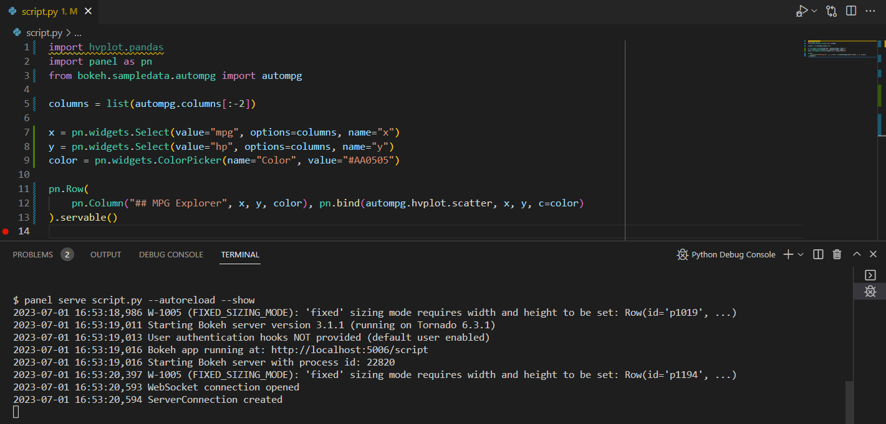

# Develop Apps in an Editor

This guide addresses how to rapidly develop a Panel application in your favorite IDE or editor.

---

You can edit your Panel code as a ``.py`` file in any text editor, marking the objects you want to render as ``.servable()``. For example:

:::{card} app.py
```{code-block} python
:emphasize-lines: 14

import panel as pn
import hvplot.pandas
from bokeh.sampledata.autompg import autompg

columns = list(autompg.columns[:-2])

x = pn.widgets.Select(value='mpg', options=columns, name='x')
y = pn.widgets.Select(value='hp', options=columns, name='y')
color = pn.widgets.ColorPicker(name='Color', value='#AA0505')

pn.Row(
    pn.Column('## MPG Explorer', x, y, color),
    pn.bind(autompg.hvplot.scatter, x, y, c=color)
).servable()
```
:::

Then, from the command line, launch a server with:

```bash
panel serve app.py --show --autoreload
```

:::{admonition} Note
The `--show` flag will open a browser tab with the live app and the ``--autoreload`` flag ensures that the app reloads whenever you make a change to the Python source.
:::

In VS Code this looks like



The app looks like


