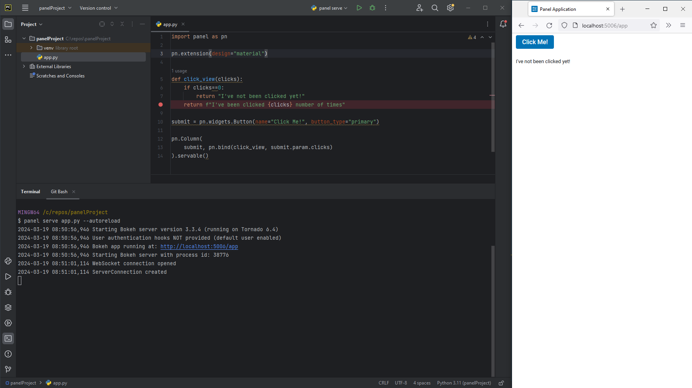
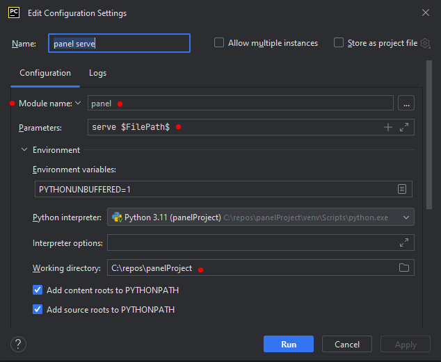
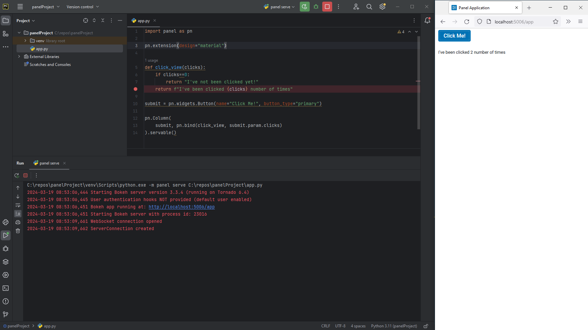
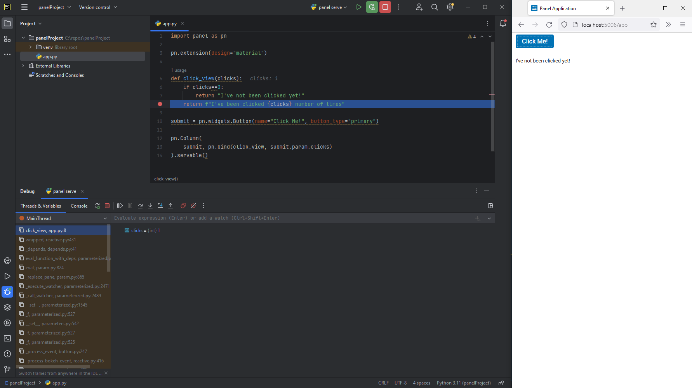
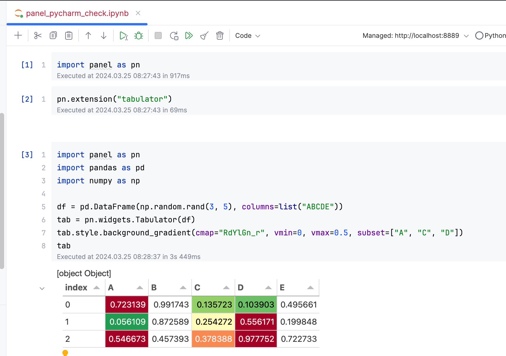

# Configure PyCharm

This guide addresses how to configure PyCharm for an efficient Panel development workflow.

We assume you have a basic understanding of [working with Python projects in PyCharm](https://www.jetbrains.com/help/pycharm/creating-and-running-your-first-python-project.html), including running and [debugging](https://www.jetbrains.com/help/pycharm/debugging-python-code.html) Python applications.

:::{note}
In the following, we assume you have already created a Python project, installed Panel, and other requirements, and created your Panel file.
:::

---

## Serve from the Terminal

You can use `panel serve` to serve apps from the PyCharm terminal, just as you would with in any other terminal.

## Run/Debug Configurations

To learn how to configure PyCharm in general, check out [the official guide](https://www.jetbrains.com/help/pycharm/run-debug-configuration.html).

To enable you to run and debug Panel apps in PyCharm, you should create a configuration as shown below:

- Configuration Name: `panel serve`
- Module Name: `panel`
- Parameters: `serve $FilePath$`
- Working Directory: The path to your *project root*

### Run

With the configuration in place, you can now easily `run` Panel apps via the `panel serve` configuration.

### Debug

With the configuration in place, you can now easily `debug` Panel apps via the `panel serve` configuration. The picture below shows debugging in action, where a breakpoint is hit when the Button is clicked.

## Notebook Environment

PyCharm Professional offers support for [Jupyter Notebooks](https://www.jetbrains.com/help/pycharm/ipython-notebook-support.html) and [ipywidgets](https://www.jetbrains.com/help/pycharm/interactive-js-widgets.html), enhancing interactive Python development.

To integrate Panel effectively, ensure the installation of `jupyter_bokeh` by executing `pip install jupyter_bokeh` or `conda install -c bokeh jupyter_bokeh`. Subsequently, activate the extension using `pn.extension()`.

Below, observe the implementation of a notebook within the PyCharm Notebook Environment.

