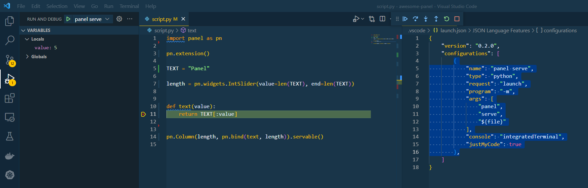

# Develop Apps in VS Code

This guide addresses how to rapidly develop Panel applications in VS Code.

We assume you have installed the VS Code Python extension and have a basic understanding of working with Python in VS Code.

---

## Scripts

### Editing

You can edit your Panel code as a ``.py`` file in VS Code, marking the objects you want to render as ``.servable()``. For example:


You launch the app with

```bash
panel serve app.py --show --autoreload
```

:::{admonition} Note
The `--show` flag will open a browser tab with the live app and the ``--autoreload`` flag ensures that the app reloads whenever you make a change to the Python source.
:::


### Debugging

You can learn how to use the *integrated debugger* [here](https://code.visualstudio.com/docs/editor/debugging).

To configure the integrated debugger for Panel, you will need to add a debugging configuration like the below.

```bash
{
    "version": "0.2.0",
    "configurations": [
        {
            "name": "panel serve",
            "type": "python",
            "request": "launch",
            "program": "-m",
            "args": [
                "panel",
                "serve",
                "${relativeFile}",
                "--show"
            ],
            "console": "integratedTerminal",
            "justMyCode": true
        },
    ]
}
```

Then set your breakpoint(s) and start the debugger.



## Notebooks

Ensure you install `jupyter_bokeh` with `pip install jupyter_bokeh` or `conda install -c bokeh jupyter_bokeh` and then enable the extension with `pn.extension()`.

You can see an example in action below.


## Configuration

### Keyboard Shortcuts

To speed up your workflow you can configure keyboard shortcuts like below.

```bash
[
    {
        "key": "ctrl+shift+space",
        "command": "workbench.action.terminal.sendSequence",
        "args": { "text": "panel serve ${relativeFile} --autoreload --show\u000D" }
    }
]
```

On Windows you will need to add quotes around `${relativeFile}`, i.e. replace it with `'${relativeFile}'`.

When you press `CTRL+SHIFT+SPACE` you will `panel serve` your file in the terminal (if you have an open terminal).

### Snippets

To speed up your workflow you can configure [*user defined snippets*](https://code.visualstudio.com/docs/editor/userdefinedsnippets) like [these](../../_static/json/vscode-snippets-python.json). When you start typing `import panel` you will get the option to select between the snippets as shown below.


The snippets will be available in the script, notebook and the interactive environments.
