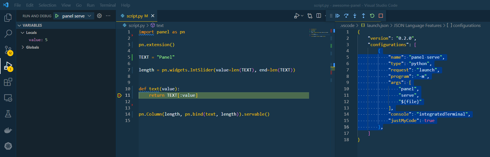
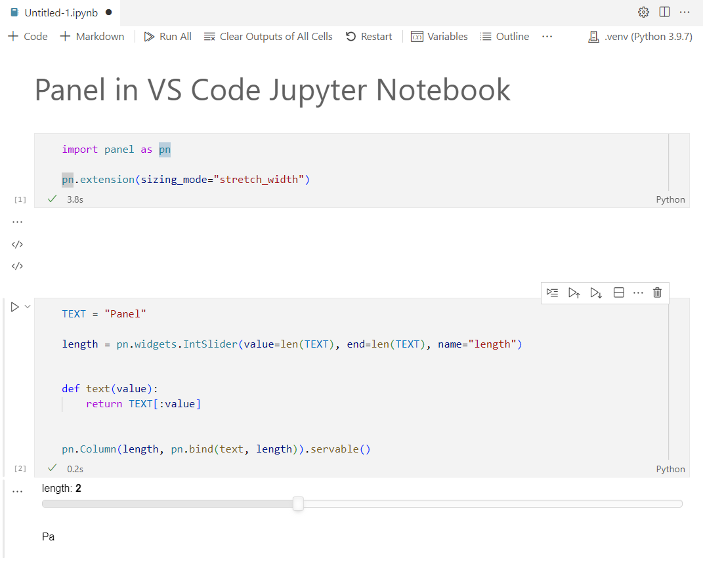
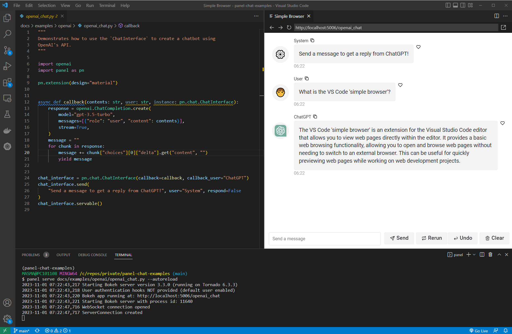
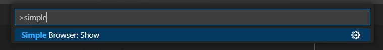
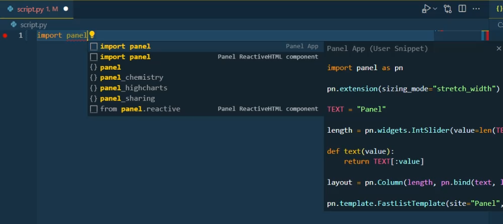

# Configure VS Code

This guide explains how to configure VS Code for an efficient Panel development workflow.

We assume you have:

- A basic understanding of [working with Python in VS Code](https://code.visualstudio.com/docs/python/python-tutorial).
- Installed the VS Code [Python extension](https://github.com/Microsoft/vscode-python).

---

## Debugging

To learn how to use the *integrated debugger* in general, check out [the official guide](https://code.visualstudio.com/docs/editor/debugging).

To enable debugging applications with `panel serve`, you can add a `"panel serve"` debugging configuration like the one below to your VS Code debugging configuration file.

```json
{
    "version": "0.2.0",
    "configurations": [
        {
            "name": "panel serve",
            "type": "debugpy",
            "request": "launch",
            "program": "-m",
            "args": [
                "panel",
                "serve",
                "${relativeFile}",
                "--index",
                "${fileBasenameNoExtension}",
                "--show"
            ],
            "console": "integratedTerminal",
            "justMyCode": true
        }
    ]
}
```

When used, it looks like this:



## Extensions

The following extensions will help speed up your Panel workflow

- [Live Server](https://github.com/ritwickdey/vscode-live-server-plus-plus): Enables you to easily view `.html` files created using `.save()` or `panel convert`.

## General Settings

We recommend adding the below to your `settings.json` file on Windows

```bash
"explorer.copyRelativePathSeparator": "/" # Relevant on Windows only
```

## Keyboard Shortcuts

To speed up your workflow we recommend configuring a keyboard short cut to `panel serve` your app.

```bash
[
    {
        "key": "ctrl+shift+space",
        "command": "workbench.action.terminal.sendSequence",
        "args": { "text": "panel serve ${relativeFile} --autoreload --show\u000D" }
    }
]
```

On Windows you will need to add quotes around `${relativeFile}`, i.e. replace it with `'${relativeFile}'`.

When you press `CTRL+SHIFT+SPACE` you will `panel serve` your file in the terminal, if you have an open terminal.

## Notebook and Interactive Environment

Ensure you install `jupyter_bokeh` with `pip install jupyter_bokeh` or `conda install -c bokeh jupyter_bokeh` and then enable the extension with `pn.extension()`.

You can see a notebook in action below.



## Simple Browser

To keep your app right next to your code while you develop, it can be super productive to use the VS Code *simple browser*.



You can open it via the *Command Palette*



To make it even simpler, you can add a task to `.vscode/tasks.json`

```json
{
    "version": "2.0.0",
    "tasks": [
        {
            "label": "Open Panel in Simple Browser",
            "command": "${input:openSimpleBrowser}",
            "problemMatcher": []
        }
    ],
    "inputs": [
        {
            "id": "openSimpleBrowser",
            "type": "command",
            "command": "simpleBrowser.show",
            "args": [
                "http://localhost:5006"
            ]
        }
    ]
}
```

and keybinding to `keybindings.json`

```json
[
  {
    "key": "ctrl+shift+b",
    "command": "workbench.action.tasks.runTask",
    "args": "Open Panel in Simple Browser"
  },
]
```

## Snippets

To speed up your workflow you can configure [*user defined snippets*](https://code.visualstudio.com/docs/editor/userdefinedsnippets) like these [example Panel snippets](../../_static/json/vscode-snippets-python.json). When you start typing `import panel` you will get the option to select between the snippets as shown below.



The snippets will be available in the script, notebook and the interactive environments.
