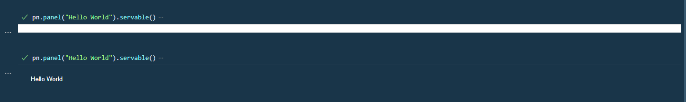

# Configure VS Code

This guide explains how to configure VS Code for an efficient Panel development workflow.

We assume you have:

- [x] The **latest version of VS Code installed**.
- [x] A basic understanding of [working with Python in VS Code](https://code.visualstudio.com/docs/python/python-tutorial).
- [x] Installed the **latest versions** of the VS Code extensions:
  - [Python](https://github.com/Microsoft/vscode-python)
  - [Jupyter](https://marketplace.visualstudio.com/items?itemName=ms-toolsai.jupyter) including [Jupyter Notebook Renderers](https://marketplace.visualstudio.com/items?itemName=ms-toolsai.jupyter-renderers)

---

## Installation

:::info

For `panel` to work with the [VS Code Jupyter Extension](https://marketplace.visualstudio.com/items?itemName=ms-toolsai.jupyter) and [Jupyter Notebook Renderers](https://marketplace.visualstudio.com/items?itemName=ms-toolsai.jupyter-renderers)
you need to have [`jupyter_bokeh`](https://github.com/bokeh/jupyter_bokeh) and [`ipykernel`](https://github.com/ipython/ipykernel) installed in your virtual environment.

We strongly recommend you to install into a **new virtual environment** before starting to use Panel with in the Interactive environment. Installing `jupyter_bokeh` and `ipykernel` into an old environment can lead to problems that are hard to reproduce, understand and solve.

:::

Install the requirements

:::::{tab-set}

::::{tab-item} pip

```bash
pip install panel watchfiles jupyter_bokeh ipykernel
```

::::

::::{tab-item} conda

```bash
conda install -c conda-forge panel watchfiles jupyter_bokeh ipykernel
```

::::

:::::

You should now be able to `panel serve` your python file or notebook as usual.

## Simple Browser

To keep your app right next to your code while you develop, it can be super productive to use the VS Code *simple browser*.


You can open it via the *Command Palette*


To make it even simpler, you can add a task to `.vscode/tasks.json`

```json
{
    "version": "2.0.0",
    "tasks": [
        {
            "label": "Open Panel in Simple Browser",
            "command": "${input:openSimpleBrowser}",
            "problemMatcher": []
        }
    ],
    "inputs": [
        {
            "id": "openSimpleBrowser",
            "type": "command",
            "command": "simpleBrowser.show",
            "args": [
                "http://localhost:5006"
            ]
        }
    ]
}
```

and keybinding to `keybindings.json`

```json
[
  {
    "key": "ctrl+shift+b",
    "command": "workbench.action.tasks.runTask",
    "args": "Open Panel in Simple Browser"
  },
]
```

## Notebook and Interactive Environment

If you have followed the [installation instructions above](#installation) and added `pn.extension()` after your python imports you should be able to use the Jupyter Interactive environment as shown below.


### Trouble Shooting

The support for Jupyter and Panel widgets in the interactive environment is fragile and you might experience issues.

Below is some advice for solving the issues. If that does not work for you, try

- closing the interactive window
- upgrading VS Code to the latest version
- upgrading the Python and Jupyter VS Code extensions to the latest versions
- creating a new virtual environment, install as [described above](#installation)
- restarting VS code.

#### No output

If your first output does not show, try executing the command in a new cell. Sometimes VS Code need a little time to install some javascript packages behind the scenes.



## Debugging

To learn how to use the *integrated debugger* in general, check out [the official guide](https://code.visualstudio.com/docs/editor/debugging).

To enable debugging applications with `panel serve`, you can add a `"panel serve"` debugging configuration like the one below to your VS Code debugging configuration file.

```json
{
    "version": "0.2.0",
    "configurations": [
        {
            "name": "panel serve",
            "type": "debugpy",
            "request": "launch",
            "program": "-m",
            "args": [
                "panel",
                "serve",
                "${relativeFile}",
                "--index",
                "${fileBasenameNoExtension}",
                "--show"
            ],
            "console": "integratedTerminal",
            "justMyCode": true
        }
    ]
}
```

When used, it looks like this:


## Extensions

The following optional extensions can help speed up your Panel workflow

- [Live Server](https://github.com/ritwickdey/vscode-live-server-plus-plus): Enables you to easily view `.html` files created using `.save()` or `panel convert`.

## General Settings

We recommend adding the below to your `settings.json` file on Windows

```bash
"explorer.copyRelativePathSeparator": "/" # Relevant on Windows only
```

## Keyboard Shortcuts

To speed up your workflow we recommend configuring a keyboard short cut to `panel serve` your app.

```bash
[
    {
        "key": "ctrl+shift+space",
        "command": "workbench.action.terminal.sendSequence",
        "args": { "text": "panel serve ${relativeFile} --dev --show\u000D" }
    }
]
```

On Windows you will need to add quotes around `${relativeFile}`, i.e. replace it with `'${relativeFile}'`.

When you press `CTRL+SHIFT+SPACE` you will `panel serve` your file in the terminal, if you have an open terminal.

## Snippets

To speed up your workflow you can configure [*user defined snippets*](https://code.visualstudio.com/docs/editor/userdefinedsnippets) like these [example Panel snippets](../../_static/json/vscode-snippets-python.json). When you start typing `import panel` you will get the option to select between the snippets as shown below.


The snippets will be available in the script, notebook and the interactive environments.
