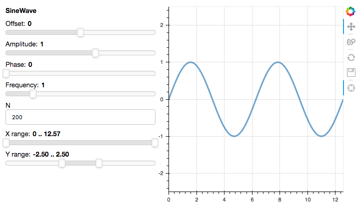

# Running Panel apps inside Django

Panel generally runs on the Bokeh server which itself runs on Tornado. However, it is also often useful to embed a Panel app in large web application, such as a Django web server. Using Panel with Django requires a bit more work than for notebooks and Bokeh servers.

To run this example app yourself, you will first need to install django (e.g. `conda install "django=2"`).

Additionally, you should also install the `channels` library (using `pip install channels==2` or `conda install channels=2 -c conda-forge`). This makes it possible to run bokeh without launching a separate Tornado server.

Note that these examples can also be run with django 3 or django 4 (which will require channels 3), by installing the additional `bokeh_django` library. In this case replace all instances of `bokeh.server.django` with `bokeh_django` in the example below.

## Configuration

Before we start adding a bokeh app to our Django server we have to set up some of the basic plumbing. In the `examples/apps/django/project` folder we will add some basic configurations.

First of all we need to set up a Asynchronous Server Gateway Interface (ASGI) instead of the usual WSGI setup. For this purpose we add `examples/apps/django/project/asgi.py`:

```python
import os

import django

from channels.routing import get_default_application

os.environ.setdefault('DJANGO_SETTINGS_MODULE', 'project.settings')

django.setup()

application = get_default_application()
```


Next we need to ensure the routing is configured correctly to handle a bokeh server in `examples/apps/django/project/routing.py`:


```python
from channels.auth import AuthMiddlewareStack
from channels.routing import ProtocolTypeRouter, URLRouter
from django.apps import apps

bokeh_app_config = apps.get_app_config('bokeh.server.django')

application = ProtocolTypeRouter({
    'websocket': AuthMiddlewareStack(URLRouter(bokeh_app_config.routes.get_websocket_urlpatterns())),
    'http': AuthMiddlewareStack(URLRouter(bokeh_app_config.routes.get_http_urlpatterns())),
})
```

Lastly we need to add some configuration to `examples/apps/django/project/settings.py`. As a first step we need to add both `channels` and `bokeh.server.django` to the ``INSTALLED_APPS``:

```python

INSTALLED_APPS = [
    ...,
    'channels',
    'bokeh.server.django',
]
```

Secondly we need to declare the `bokehjsdir` as part of the `STATICFILES_DIRS`:

```python
from bokeh.settings import bokehjsdir

STATICFILES_DIRS = [bokehjsdir()]
```

Now we need to add any templates we have:

```python
TEMPLATES = [
    {
        'DIRS': [os.path.join(BASE_DIR, 'sliders', 'templates')],
        ...: ...,
    }
]
```

and lastly add the app(s) and `static_extensions()` to the `urlpatterns` in the `urls.py` file:

```python
from bokeh.server.django import autoload, static_extensions
from django.apps import apps
from django.contrib import admin
from django.urls import path, include
from django.contrib.staticfiles.urls import staticfiles_urlpatterns

import sliders.pn_app as sliders_app

pn_app_config = apps.get_app_config('bokeh.server.django')

urlpatterns = [
    path('sliders/', include('sliders.urls')),
    path('admin/', admin.site.urls),
]

bokeh_apps = [
    autoload("sliders", sliders_app.app),
]

urlpatterns += static_extensions()
urlpatterns += staticfiles_urlpatterns()
```

Now it's time to configure an actual app and add it to our Django server.

## Sliders app

Based on a standard Django app template, this app shows how to integrate Panel with a Django view

The sliders app is in `examples/apps/django/sliders`. We will cover the following additions/modifications to the Django app template:

  * `sliders/sinewave.py`: a parameterized object (representing your pre-existing code)

  * `sliders/pn_app.py`: creates an app function from the SineWave class

  * `sliders/apps.py`: how a Django app can import and use Bokeh server

  * `sliders/views.py` and `templates/base.html`: getting the Bokeh app into a Django view



To start with, in `sliders/sinewave.py` we create a parameterized object to serve as a placeholder for your own, existing code:

```python
import numpy as np
import param
from bokeh.models import ColumnDataSource
from bokeh.plotting import figure


class SineWave(param.Parameterized):
    offset = param.Number(default=0.0, bounds=(-5.0, 5.0))
    amplitude = param.Number(default=1.0, bounds=(-5.0, 5.0))
    phase = param.Number(default=0.0, bounds=(0.0, 2 * np.pi))
    frequency = param.Number(default=1.0, bounds=(0.1, 5.1))
    N = param.Integer(default=200, bounds=(0, None))
    x_range = param.Range(default=(0, 4 * np.pi), bounds=(0, 4 * np.pi))
    y_range = param.Range(default=(-2.5, 2.5), bounds=(-10, 10))

    def __init__(self, **params):
        super(SineWave, self).__init__(**params)
        x, y = self.sine()
        self.cds = ColumnDataSource(data=dict(x=x, y=y))
        self.plot = figure(plot_height=400, plot_width=400,
                           tools="crosshair, pan, reset, save, wheel_zoom",
                           x_range=self.x_range, y_range=self.y_range)
        self.plot.line('x', 'y', source=self.cds, line_width=3, line_alpha=0.6)

    @param.depends('N', 'frequency', 'amplitude', 'offset', 'phase', 'x_range', 'y_range', watch=True)
    def update_plot(self):
        x, y = self.sine()
        self.cds.data = dict(x=x, y=y)
        self.plot.x_range.start, self.plot.x_range.end = self.x_range
        self.plot.y_range.start, self.plot.y_range.end = self.y_range

    def sine(self):
        x = np.linspace(0, 4 * np.pi, self.N)
        y = self.amplitude * np.sin(self.frequency * x + self.phase) + self.offset
        return x, y
```

However the app itself is defined we need to configure an entry point, which is a function that accepts a bokeh Document and adds the application to it. In case of the slider app it looks like this:

```python
import panel as pn

from .sinewave import SineWave

def app(doc):
    sw = SineWave()
    row = pn.Row(sw.param, sw.plot)
    row.server_doc(doc)
```

Next we create a ``views.py`` file which returns a view the Django server can render:

```python
# Create your views here.
from bokeh.embed import server_document

from django.http import HttpRequest, HttpResponse
from django.shortcuts import render


def sliders(request: HttpRequest) -> HttpResponse:
    script = server_document(request.build_absolute_uri())
    return render(request, "base.html", dict(script=script))
```

The `base.html` template should be in the `TEMPLATES` `DIRS` directory we declared in the `settings.py` file above. A very basic template might look like this but can be as complex as you need:

```html
<!DOCTYPE html>
<html>
  <head>
    <title>Panel in Django: sliders</title>
  </head>
  <body>
  
    {{ script|safe }}
  
  </body>
</html>
```

Next we declare a `urls.py` file to declare the urlpattern where to serve the sliders app to Django:

```python
from django.urls import path

from . import views

app_name = 'sliders'
urlpatterns = [
    path('', views.sliders, name='sliders'),
]
```

You should be able to run this app yourself by changing to the `examples/apps/django` directory and then running: `python manage.py runserver`; then visit http://localhost:8000/sliders in your browser to try the app.

## Multiple apps

This is the most basic configuration for a bokeh server. It is of course possible to add multiple apps in the same way and then registering them with Django in the way described in the [configuration](#configuration) section above. To see a multi-app Django server have a look at ``examples/apps/django_multi_apps`` and launch it with `python manage.py runserver` as before.
