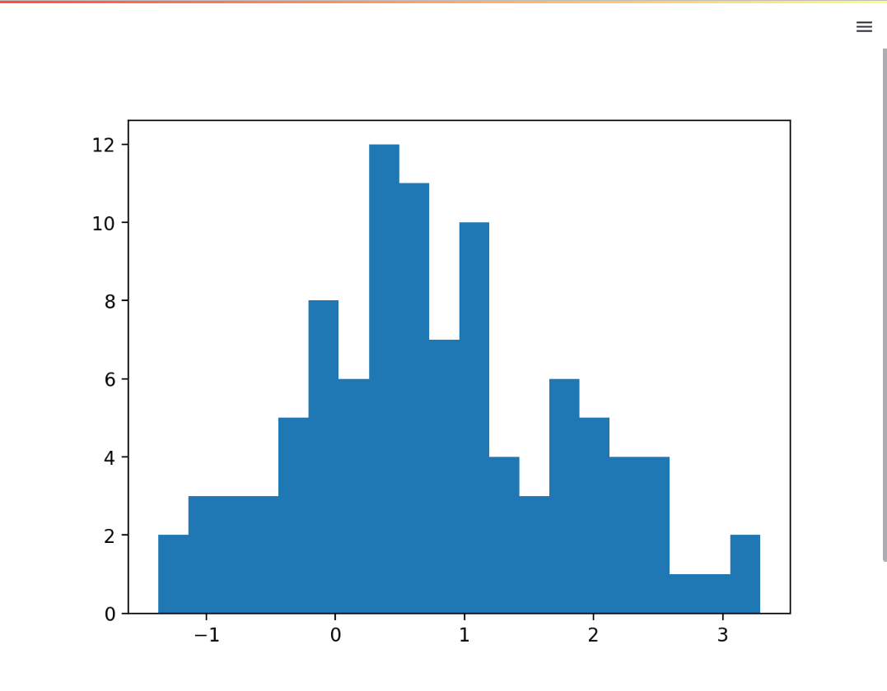
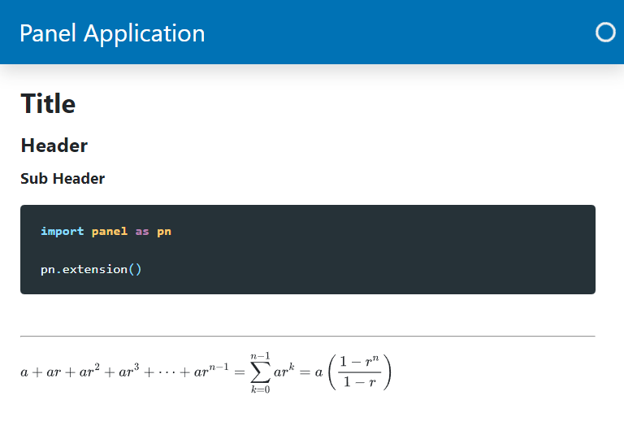
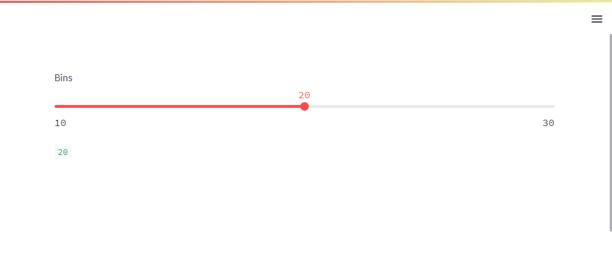

# Migrate from Streamlit

This guide addresses how to migrate from Streamlit to Panel.

This guide can also be used as:

- An alternative *Introduction to Panel* guide if you are already familiar with Streamlit.
- A means of comparing Streamlit and Panel on a more detailed level, without going into some of the unique functionality that Panel provides.

---

## The Basics

Lets start by converting a *Hello World* application.

### Streamlit Hello World Example

```python
import streamlit as st

st.write("Hello World")
```

You *run* and *show* the app with *autoreload* via

```bash
streamlit run app.py
```


### Panel Hello World Example

```python
import panel as pn

pn.extension(sizing_mode="stretch_width", template="bootstrap")

pn.panel("Hello World").servable()
```

You *serve* and *show* (i.e. open) the app in your browser with *autoreload* via

```bash
panel serve app.py --autoreload --show
```


### Basic Migration Steps

You should replace:

- `import streamlit as st` with `import panel as pn` and
- `st.write` with `pn.panel`.

You will have to:

- add `pn.extension` to configure your Panel application via optional arguments like `sizing_mode` and `template`.
- add `.servable` to the Panel objects you want to include in your apps *template* when served as
a web app.

For production you will also have to migrate some of your app configuration to `panel serve` [command line options](../server/commandline.md) or environment variables.

You **won't** have to provide your email or opt out of telemetry data collection. We have never collected or had plans to collect telemetry data from our users apps.

## Displaying Content with Panes

In Panel the objects that can display your Python objects are called *panes*. With Panels *panes* you will be able to:

- Get notifications about interactions like click events on your plots and tables and react to them.
- Use unique data visualization ecosystems like HoloViz, ipywidgets and VTK.

Check out the [Panes Section](../../reference/index.md#panes) of the [Component Gallery](../../reference/index.md) for the full list of *panes*.

### Streamlit Matplotlib Example

```python
import numpy as np
import streamlit as st

import matplotlib.pyplot as plt

data = np.random.normal(1, 1, size=100)
fig, ax = plt.subplots(figsize=(8,4))
ax.hist(data, bins=20)

st.pyplot(fig)
```



### Panel Matplotlib Example

You will find Panels *panes* in the `pn.pane` module.

We use Matplotlibs `Figure` interface instead of the `pyplot` interface to
avoid memory leaks if you forget to close the figure. This is all described in the
[Matplotlib Guide](../../reference/panes/Matplotlib.md).

```python
import panel as pn
import numpy as np

from matplotlib.figure import Figure

pn.extension(sizing_mode="stretch_width", template="bootstrap")

data = np.random.normal(1, 1, size=100)
fig = Figure(figsize=(8,4))
ax = fig.subplots()
ax.hist(data, bins=20)

pn.pane.Matplotlib(fig, format='svg', sizing_mode='scale_both').servable()
```


### Display Text Using the Markdown Pane

You can replace `st.markdown` with [`pn.pane.Markdown`](../../reference/panes/Markdown.md).

You can also use the `Markdown` pane to replace the text elements `st.title`, `st.header`, `st.sub_header`, `st.code` and `st.text`.

You may use the `Markdown` pane to replace `st.divider` and `st.latex`, but you can also use the *finetuned* Panel components [`pn.layout.Divider`](../../reference/layouts/Divider.md) and [`pn.pane.LaTeX`](../../reference/panes/LaTeX.md).

Here is how to do it

````python
import panel as pn

pn.extension("mathjax", sizing_mode="stretch_width", template="bootstrap")

pn.pane.Markdown(r"""
# Title

## Header

### Sub Header

```python
import panel as pn

pn.extension()
```

---

$$ a + ar + a r^2 + a r^3 + \cdots + a r^{n-1} = \sum_{k=0}^{n-1} ar^k = a \left(\frac{1-r^{n}}{1-r}\right)$$
""").servable()
````



### Display Content Migration Steps

To display content in Panel:

- Replace your Streamlit `st.some_object` *snake cased* functions with the corresponding Panel
`pn.pane.SomeObject` *CamelCased* classes.
- Replace your Streamlit text elements with `pn.pane.Markdown`.

You can identify the corresponding Panel *pane* in the [Panes Section](../../reference/index.md#panes) of the [Component Gallery](../../reference/index.md).

## Organizing Components with Layouts

*Layouts* helps you organize your Panel *components*, i.e. *panes*, *widgets* and *layouts*.

Panel provides layouts similar to the ones you know from Streamlit and many unique ones.

Check out the [Layouts Section](../../reference/index.md#layouts) of the [Component Gallery](../../reference/index.html) for the full list of *layouts*.

### Streamlit Layout Example

```python
import streamlit as st

col1, col2 = st.columns(2)

with col1:
    st.image("https://streamlit.io/images/brand/streamlit-logo-primary-colormark-darktext.png")
    st.write("# A faster way to build and share data apps")

with col2:
    st.image("https://panel.holoviz.org/_images/logo_horizontal_light_theme.png")
    st.write("# The powerful data exploration & web app framework for Python")
```


### Panel Layout Example

You can access Panel's *layouts* in the top-level `pn` namespace:

```python
import panel as pn

pn.extension(sizing_mode="stretch_width", template="bootstrap")

row1 = pn.Row(
    pn.pane.Image(
        "https://streamlit.io/images/brand/streamlit-logo-primary-colormark-darktext.png",
        align="center",
    ),
    pn.pane.Image(
        "https://panel.holoviz.org/_images/logo_horizontal_light_theme.png",
        align="center",
    ),
)
row2 = pn.Row(
    "# A faster way to build and share data apps",
    "# The powerful data exploration & web app framework for Python",
)

pn.Column(row1, row2).servable()
```


Panels `Column` and `Row` are *list like* objects. So you can use familiar methods like `.append`, `.pop` and `[]` indexing when you work with them. For the details check out the [`Column` Guide](../../reference/layouts/Column.md) and the [`Row` Guide](../../reference/layouts/Row.md)

### Layout Migration Steps

To migrate your layouts to Panel

- replace your Streamlit `st.some_layout` *snake cased* function with the corresponding Panel
`pn.SomeLayout` *CamelCased* class.

You can identify the relevant layout to migrate to in the [Layouts Section](../../reference/index.md#layouts) of the [Component Gallery](../../reference/index.md).

## Adding Layout and Style with Templates

Streamlit always uses the same *template* with a *main* and *sidebar* area to layout and style your app.

With Panel you have the flexibility to use the *default, blank template*, one of the *built in templates* or even create your own *custom template*.

Here is an example with the [`FastListTemplate`](../../reference/templates/FastListTemplate.md) for illustration.

```python
from asyncio import sleep
from datetime import datetime

import panel as pn

pn.extension(sizing_mode="stretch_width", template="fast", theme="dark")

pn.Column(
    "# 📖 Info",
    """This app is an example of a built in template with a
*sidebar*, *header* and *main* area.

We have

- set the *header* background, site and title parameters
- set the default *theme* to `dark`

The app streams the current date and time using an *async generator function*.
""",
).servable(target="sidebar")

async def stream():
    for i in range(0, 100):
        await sleep(0.25)
        yield datetime.now()

pn.Column(
    "The current date and time:", *(stream for i in range(5))
).servable(target="main")

pn.state.template.param.update(
    site="Panel",
    title="Template Example",
    header_background="#E91E63",
    accent_base_color="#E91E63",
)
```


### Template Migration Steps

When migrating you will have to decide which template to use

- Blank (default)
- A built-in template like *vanilla*, *bootstrap*, *material* or *fast*. See the [Templates Section](../../reference/index#templates) of the [Components Guide](../../reference/index).
- A custom template declared using Jinja2 syntax.

## Accepting User Inputs with Widgets

In Panel the objects that can accept user inputs are called *widgets*.

Panel provides widgets similar to the ones you know from Streamlit and some unique ones in addition.

Check out the [Widgets Section](../../reference/index.md#widgets) of the [Component Gallery](../../reference/index.md) for the full list of *widgets*.

### Streamlit Integer Slider Example

```python
import streamlit as st

bins = st.slider(value=20, min_value=10, max_value=30, step=1, label="Bins")

st.write(bins)
```



### Panel Integer Slider Example

You will find Panels input *widgets* in `pn.widgets` module.

```python
import panel as pn

pn.extension(sizing_mode="stretch_width", template="bootstrap")

bins = pn.widgets.IntSlider(value=20, start=10, end=30, step=1, name="Bins")

pn.Column(bins, pn.pane.Str(bins)).servable()
```


If you check the type of the variables, you will notice a key difference. Streamlit's `bins` returns the value of the slider as an `integer` while Panel's `bins` returns an `IntSlider`!

To access the value of the slider in Panel, you would need to call `bins.value`.

For more info about the `IntSlider` check out the [`IntSlider` Guide](../../reference/widgets/IntSlider.md).

### Input Migration Steps

To migrate your app's widget inputs to Panel:

- Replace your Streamlit `st.some_widget` function with the corresponding Panel
`pn.widgets.SomeWidget` class.

You can identify the corresponding widget via the [Widgets Section](../../reference/index.md#widgets) of the [Component Gallery](../../reference/index.md).

## Show Activity

Panel supports many ways of indicating activity

- Indicators. See the [Indicators Section](../../reference/index.md#indicators) of the [Component Gallery](../../reference/index.md).
- `disabled`/ `loading` parameters on Panel components
- `loading_indicator` parameter for `pn.panel` or `pn.config`. If `True` a loading indicator will be shown on your *bound functions* when they are re-run.

```python
import panel as pn

pn.extension(sizing_mode="stretch_width", template="bootstrap")

SPIN_CSS = """
@keyframes icon-rotation {
  from {transform: rotate(0deg);} to {transform: rotate(359deg);}
}
.bk-TablerIcon {animation: icon-rotation 2s infinite linear;}
"""

pn.Row(
    pn.Column(
        "## Loading Spinner",
        pn.Column(
            pn.indicators.LoadingSpinner(value=False, height=25, width=25),
            pn.indicators.LoadingSpinner(
                value=True, height=25, width=25, color="secondary"
            ),
        ),
    ),
    pn.Column(
        "## Progress",
        pn.Column(
            pn.indicators.Progress(
                name="Progress", value=20, width=150, bar_color="secondary"
            ),
            pn.indicators.Progress(
                name="Progress", active=True, width=150, bar_color="secondary"
            ),
        ),
    ),
    pn.Column(
        "## Disabled",
        pn.Column(
            pn.widgets.Button(name="Loading", icon="progress", disabled=True),
            pn.widgets.Button(
                name="Loading", icon="progress", disabled=True, stylesheets=[SPIN_CSS]
            ),
        ),
    ),
    pn.Column(
        "## Loading",
        pn.Column(
            pn.widgets.Button(name="Loading", loading=True, button_type="primary"),
            pn.WidgetBox(
                pn.widgets.Checkbox(name="Checked", value=True),
                pn.widgets.Button(name="Submit", button_type="primary"),
                loading=True, margin=(10,10),
            ),
        ),
    ),
).servable()
```


We will show you how to migrate your Streamlit activity indicators to Panel in the [Interactivity Section](#add-interactivity-with-pnbind) just below.

## Add Interactivity with `pn.bind`

Both Streamlit and Panel are *reactive* frameworks that *react* when you interact with your application. But they work very differently:

- Streamlit executes the whole script *top to bottom* on user interactions.
- Panel executes specific *bound* functions on user interactions.

Panels `pn.bind` provides the functionality to *bind* functions to widgets. We call the resulting functions *bound functions*. You use `pn.bind` as follows

```python
# 1. Define your function(s)
def my_func(value):
    return ...
# 2. Define your widgets
slider = pn.widgets.IntSlider(...)
# 3. Bind your function to the widget(s)
my_bound_func = pn.bind(my_func, value=slider)
# 4. Layout your bound functions and widgets
pn.Column(slider, my_bound_func)
```

With Panels interactivity architecture you will be able develop and maintain large, advanced and fast apps.

### Basic Interactivity Example

This example will show you how to migrate code that produces a single result and only updates the UI once the code execution has completed.

#### Streamlit Basic Interactivity Example

```python
import matplotlib.pyplot as plt
import numpy as np
import streamlit as st

from matplotlib.figure import Figure

data = np.random.normal(1, 1, size=100)
fig = Figure(figsize=(8,4))
ax = fig.subplots()
bins = st.slider(value=20, min_value=10, max_value=30, step=1, label="Bins")
ax.hist(data, bins=bins)

st.pyplot(fig)
```


The entire script is rerun *top to bottom* when you change the `bins` slider.

#### Panel Basic Interactivity Example

```python
import panel as pn
import numpy as np

from matplotlib.figure import Figure

pn.extension(sizing_mode="stretch_width", template="bootstrap")

def plot(data, bins):
    fig = Figure(figsize=(8,4))
    ax = fig.subplots()
    ax.hist(data, bins=bins)
    return fig

data = np.random.normal(1, 1, size=100)
bins_input = pn.widgets.IntSlider(value=20, start=10, end=30, step=1, name="Bins")
bplot = pn.bind(plot, data=data, bins=bins_input)

pn.Column(bins, bplot).servable()
```


With Panel only the `plot` function is rerun when you change the `bins` slider. This makes your Panel app update much quicker and more smoothly than the Streamlit app.

### Multiple Updates Example

This example will show you how to migrate code that produces a single result and updates the UI multiple times during the code execution.

#### Streamlit Multiple Updates Example

```python
import random
import time

import streamlit as st

def calculation_a():
    time.sleep(1.5)
    return random.randint(0, 100)

def calculation_b():
    time.sleep(3.5)
    return random.randint(-100, 0)

st.write("# Calculation Runner")
option = st.radio("Which calculation would you like to perform?", ("A", "B"))
st.write("You chose: ", option)
if st.button("Press to run calculation"):
    with st.spinner("Running... Please wait!"):
        time_start = time.perf_counter()
        result = calculation_a() if option == "A" else calculation_b()
        time_end = time.perf_counter()
    st.write(f"""
Done!

Result: {result}

The function took {time_end - time_start:1.1f} seconds to complete
"""
    )
else:
    st.write(f"Calculation {option} did not run yet")
```


#### Panel Multiple Updates Example

With Panel you will use a *generator function* to update a component multiple times during code execution.

```python
```


You will notice that we use the `pn.indicators.LoadingSpinner` to indicate the activity.

#### Panel Multiple Updates Alternative Indicator Example

An alternative to using an *indicator* would be to change the `.disabled` and `.loading` parameters of the `calculation_input` and `run_input`.

```python
import time
import random

import panel as pn

pn.extension(sizing_mode="stretch_width", template="bootstrap")
pn.state.template.param.update(site="Panel", title="Calculation Runner")

def notify_choice(calculation):
    return f"You chose: {calculation}"

def calculation_a():
    time.sleep(2)
    return random.randint(0, 100)

def calculation_b():
    time.sleep(1)
    return random.randint(0, 100)

def run_calculation(running, calculation):
    if not running:
        yield "Calculation did not run yet"
        return # This will break the execution

    calc = calculation_a if calculation == "A" else calculation_b
    with run_input.param.set(loading=True):
        yield pn.indicators.LoadingSpinner(
            value=True, size=50, name='Running... Please Wait!'
        )
        time_start = time.perf_counter()
        result = calc()
        time_end = time.perf_counter()
        yield f"""
        Done!

        Result: {result}

        The function took {time_end - time_start:1.1f} seconds to complete
        """

calculation_input = pn.widgets.RadioBoxGroup(name="Calculation", options=["A", "B"])
run_input = pn.widgets.Button(
    name="Press to run calculation",
    icon="caret-right",
    button_type="primary",
    width=250,
)
pn.Column(
    "Which calculation would you like to perform?",
    calculation_input,
    pn.bind(notify_choice, calculation_input),
    run_input,
    pn.bind(run_calculation, run_input, calculation_input),
).servable()
```


### Multiple Results Example

Sometimes you want to output multiple results individually as soon as they are ready.

This is for example the case for Large (AI) Language Models that generates one token after the other.

#### Streamlit Multiple Results Example

```python
import random
import time

import streamlit as st

run = st.button("Run model")

def model():
    time.sleep(1)
    return random.randint(0, 100)

if not run:
    st.write("The model has not run yet")
else:
    with st.spinner("Running..."):
        for i in range(0,10):
            result = model()
            st.write(f"Result {i}: {result}")
```


#### Panel Multiple Results Example

With Panel you will use a *generator function* to display multiple results from code execution as soon as they are ready.

```python
import random
import time
import panel as pn

pn.extension(sizing_mode="stretch_width")

def model():
    time.sleep(1)
    return random.randint(0, 100)

def results(running):
    if not running:
        return "The model has not run yet"

    for i in range(0, 10):
        result = model()
        yield f"Result {i}: {result}"

run_input = pn.widgets.Button(name="Run model")
output = pn.bind(results, run_input)

pn.Column(
    run_input,
    pn.panel(output, loading_indicator=True, generator_mode='append'),
).servable()
```


### Interactivity Migration Steps

You should

- Move your business logic to functions. Business logic can be code to load data, transform data, run calculations, create plots, calculate the mass of the milky way, train models, do inference etc.
- Add interactivity by using `pn.bind` to bind your functions to your widgets.
  - Use generator functions (`yield`) if you want to update the UI multiple times during the functions execution.
- Indicate activity as described in the [Show Activity Section](#show-activity).

## Caching

One of the key concepts in Streamlit is *caching*. In Streamlit your entire script is rerun
*top to bottom* on user interactions. Without caching you would be
reconnecting to your database, reloading your dataset and rerunning your expensive calculation
every time a user clicks a `Button` or changes a `slider` value. This would make your application
very slow.

In Panel

- the script served is rerun when a user visits the page.
- only your *bound functions* are rerun on user interactions.

In Panel you can use `pn.cache` to speed up

- the initial load of your page and
- expensive, bound functions

across users sessions.

Check out the [Cache How-To Guides](../caching/index.md) for more
details.

### Cache Example

This session will show you how to cache for a user session.

#### Streamlit Cache Example

```python
from time import sleep

import numpy as np
import streamlit as st
from matplotlib.figure import Figure

@st.cache_data
def get_data():
    print("get_data func")
    sleep(1.0)
    return np.random.normal(1, 1, size=100)

@st.cache_data(hash_funcs={Figure: lambda _: None})
def plot(data, bins):
    print("plot func", bins)
    sleep(2)
    fig = Figure(figsize=(8,4))
    ax = fig.subplots()
    ax.hist(data, bins=bins)
    return fig

data = get_data()
bins = st.slider(value=20, min_value=10, max_value=30, step=1, label="Bins")
st.pyplot(plot(data, bins))
```

I've added `sleep` statements to make the functions more *expensive*.

#### Panel Cache Example

```python
from time import sleep

import numpy as np
import panel as pn
from matplotlib.figure import Figure

@pn.cache
def get_data():
    print("get_data func")
    sleep(1.0)
    return np.random.normal(1, 1, size=100)

@pn.cache
def plot(data, bins):
    print("plot func", bins)
    sleep(2)
    fig = Figure(figsize=(8,4))
    ax = fig.subplots()
    ax.hist(data, bins=bins)
    return fig

pn.extension(sizing_mode="stretch_width", template="bootstrap")

data = get_data()
bins = pn.widgets.IntSlider(value=20, start=10, end=30, step=1)
bplot = pn.bind(plot, data, bins)
pn.Column(bins, pn.panel(bplot, loading_indicator=True)).servable()
```


You can also use `pn.cache` as an function. I.e. as

```python
plot = pn.cache(plot)
```

Using `pn.cache` as a function can help you keep your business logic
(`data` and `plot` function) and your caching logic (when and how to apply caching) separate. This
can help you reusable and maintainable code.

### Typical Caching Mistakes

- Using `pn.state.cache` instead of `pn.cache`. `pn.state.cache` is a simple dictionary and cannot be used as a function or a decorator.

### Cache Migration Steps

To migrate

- replace `st.cache_data` and `st.cache_resource` with `pn.cache`.

You should consider caching expensive

- functions that are run when your page loads
- *bound functions*

## Multi Page Apps

Migrating your Streamlit multi page app to Panel is simple. In Panel each page is simply a file
that you *serve*

```bash
panel serve home.py page1.py page2.ipynb
```

You can specify the *home* page with the `--index` flag.

```bash
panel serve home.py page1.py page2.ipynb --index=home
```

## Session State

Session state (and callbacks) were added to Streamlit as an after thought
to enable sharing variables between re-runs and across apps inside a multipage app.

Panels execution model is very different and session state can be handled automatically by storing variables in the applications namespace.

### Streamlit Session State Example

```python
import random
from uuid import uuid4

import streamlit as st

st.session_state.setdefault("rows", {})

def create_row(hex_id=None):
    if hex_id is None:
        hex_id = uuid4().hex
        value = random.randint(0, 100)
        st.session_state.rows[hex_id] = value
    else:
        value = st.session_state.rows[hex_id]

    st.number_input("Enter a number", value=value, key=f"num_{hex_id}")

st.title("Dynamically add new rows")

button_cols = st.columns(2)
with button_cols[0]:
    add_row = st.button("Add new row", use_container_width=True)
with button_cols[1]:
    clear_rows = st.button("Clear all rows", use_container_width=True)

if clear_rows:
    st.session_state.rows = {}

for hex_id in st.session_state.rows.keys():
    create_row(hex_id=hex_id)

if add_row:
    create_row()
```


With Streamlit you need session state to keep track of the dynamically created `rows`.

### Panel Session State Example

```python
import random

import panel as pn

pn.extension(sizing_mode="stretch_width", template='bootstrap')

def create_row(event):
    value = random.randint(0, 100)
    row = pn.widgets.TextInput(name="Enter a number", value=str(value))
    rows.append(row)

rows = pn.Column()
add_row = pn.widgets.Button(name="Add new row", on_click=create_row)
clear_rows = pn.widgets.Button(name="Clear all rows", on_click=lambda event: rows.clear())

pn.Column(
    "# Dynamically add new rows",
	pn.Row(add_row, clear_rows),
	rows
).servable()
```

As the Panel script is only executed once per session the `rows` objects will keep track of your
*session state*.


## Migration Support

We hope you will have fun with the Panel framework. If you have usage questions you can post them
on [Discourse](https://discourse.holoviz.org/). If you experience issues or have requests for
features please post them on [Github](https://github.com/holoviz/panel).

If you want to support Panel please

- give a ⭐ on [Github](https://github.com/holoviz/panel) or
- donate to [HoloViz](https://holoviz.org/) via [Numfocus](https://numfocus.org/support#donate)
