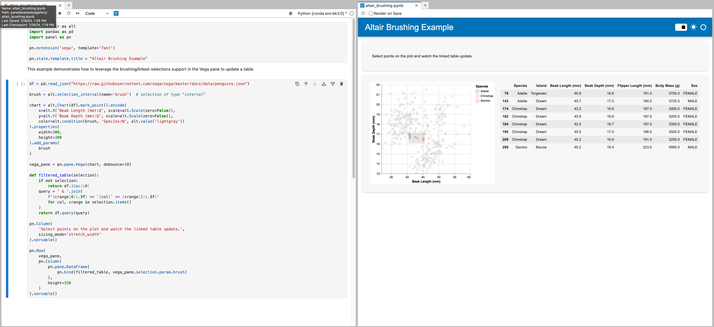

# Preview Apps in JupyterLab

This guide addresses how to use the *Preview* functionality in JupyterLab to rapidly develop applications.

---

With this functionality you can preview the app you are building in a JupyterLab tab right next to your code. This is a traditional setup for web developers, who like to  quickly visualize the effects of their code changes.

The Preview in JupyterLab has two different modes depending on whether you marked any component as `.servable()` or not. In this guide we will focus on the explicit mode where you use code to declare which components to publish and how they should be laid out. If you are simply publishing a notebook with or without importing Panel, you will see the [layout builder](./layout_builder.md).

To have your app appear in the *Preview*, you need to mark the objects you want to display with `.servable()`. This is identical to how you would mark objects that you want to serve with `panel serve ...`.

You can enable the *Preview* by clicking on Panel's logo in the menu bar of your notebook. Once clicked, you should see a new tab being opened next to your notebook tab, and after some moment your app will be rendered in this tab.

The *Preview* offers two update modes that are configurable in the preview tab:

- manual: click on the *Reload* button ({fas}`rotate-right`) to re-run and re-render your app.
- automatic: toggle the *Render on save* checkbox ({far}`square-check`) for the app to be automatically re-rendered when you save your notebook.

:::{tip}
Panel [built-in templates](https://panel.holoviz.org/reference/index.md#templates) don't render necessarily well in a notebook as their styling can badly interact with the notebook built-in styling. Using the *Preview* is a good way to circumvent this issue, while still being able to work within JupyterLab .
:::

## Related Resources
