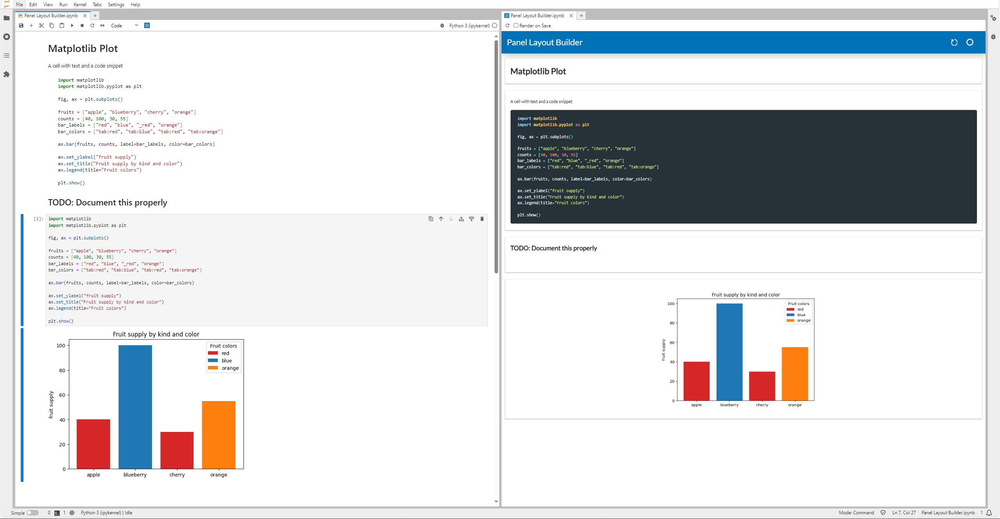
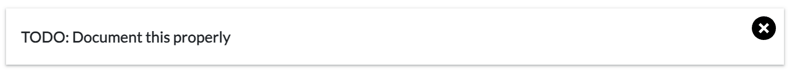

# Publish a Notebook as a Dashboard Using the Layout Builder

This guide demonstrates how to utilize the Panel layout builder to transform notebooks into dashboards. By leveraging a drag-and-drop layout builder, you can seamlessly create dashboards directly from your notebook.

---

**Notebooks can be turned into dashboards using one of two distinct approaches:**

1. **Explicitly Import Panel and Use `.servable()`**

    - In this approach, you first explicitly import the Panel library into your notebook.
    - Then, mark specific Panel components that you want to include in your dashboard with the `.servable()` method.
    - This method allows for fine-grained control over which elements of your notebook are exposed as part of the dashboard.

2. **Publish an Entire Notebook and Use the Drag and Drop Layout Builder**

    - Alternatively, you can publish your entire notebook as is.
    - After publishing, utilize the drag and drop layout builder to design and construct your dashboard visually.
    - This approach is more holistic and less selective about notebook contents, offering a straightforward way to design the dashboard layout post-publication.

**Focusing on the Layout Builder Approach:**

For the purposes of this guide, we will concentrate on **using the layout builder to convert a regular notebook into a dashboard**.

By following this guide, you will learn how to efficiently transform your analytical notebooks into interactive, user-friendly dashboards using HoloViz Panel's powerful layout builder.

## Initial Preview

Let us assume we have a simple notebook containing some Markdown cells, some code and a plot.

:::{dropdown} Code

```markdown
# Matplotlib Plot
```

````markdown
A cell with text and a code snippet

```python
import matplotlib
import matplotlib.pyplot as plt

matplotlib.use("agg")

fig, ax = plt.subplots()

fruits = ["apple", "blueberry", "cherry", "orange"]
counts = [40, 100, 30, 55]
bar_labels = ["red", "blue", "_red", "orange"]
bar_colors = ["tab:red", "tab:blue", "tab:red", "tab:orange"]

ax.bar(fruits, counts, label=bar_labels, color=bar_colors)

ax.set_ylabel("fruit supply")
ax.set_title("Fruit supply by kind and color")
ax.legend(title="Fruit colors")

plt.show()
```
````

```markdown
## TODO: Document this properly
```

```python
import matplotlib
import matplotlib.pyplot as plt

matplotlib.use("agg")

fig, ax = plt.subplots()

fruits = ["apple", "blueberry", "cherry", "orange"]
counts = [40, 100, 30, 55]
bar_labels = ["red", "blue", "_red", "orange"]
bar_colors = ["tab:red", "tab:blue", "tab:red", "tab:orange"]

ax.bar(fruits, counts, label=bar_labels, color=bar_colors)

ax.set_ylabel("fruit supply")
ax.set_title("Fruit supply by kind and color")
ax.legend(title="Fruit colors")

plt.show()
```

:::

The Jupyter Panel Preview will detect that you have not marked any specific component as `.servable()` and therefore fall back to the layout builder. The initial view will simply lay out all Markdown cells and outputs vertically. This will look something like this.



## Actions

The initial view will rarely reflect exactly how we want want our dashboard to look, so we can now perform a number of actions to re-arrange the dashboard in any way we desire.

### Hiding

We may have a number of outputs or Markdown cells that we don't want to include in the dashboard. As a first step we can delete these cells by hovering at the top right of each card and click the delete icon:



### Resizing

Next, we probably want to re-arrange the cards so that they are not simply stacked on top of each other. To resize a card simply hover on the bottom right corner of the card and then drag to resize.


### Rearrange

We may also want to re-arrange the cards on the page. To re-arrange the order of the cards hover at the top left of the card and then drag the card to a different position on the page.


### Reset

If for whatever reason you are unhappy with the layout you have generated you can reset it with the reset button at the top-right.

## Saving and Persistence

The layout builder has multiple layers of persistence built in. Whenever you perform any of the above actions, Panel will save the resulting layout specification into a sidecar file alongside the notebook, e.g. if you have a notebook called `Example.ipynb` the layout will be saved into a file called `.Example.ipynb.layout`. This file is sufficient to restore the layout and will take precedence over layout data that is embedded in the notebook. The second layer of persistence is metadata embedded in the notebook. As long as you have `pyviz_comms >= 3.1.0` installed saving the notebook will request the layout data from Panel and then persist that layout data inside the notebook metadata itself. This means that you can send someone the notebook or deploy it yourself and the layout will be restored from the notebook metadata.

Once you work outside the JupyterLab environment and serve the application you can override the embedded layout with a local persistence layer. Specifically you can append a `?editable=true` URL argument to the application URL and then edit the layout. Finally you can persist your local edits to local browser storage by hitting the save button at the top right.

## Sharing the dashboard

Once you have constructed the dashboard layout you want you can share and deploy the notebook like you would any other Panel application, specifically you can serve it with:

```bash
panel serve notebook.ipynb
```

and it will automatically restore the layout data persisted in the notebook.
