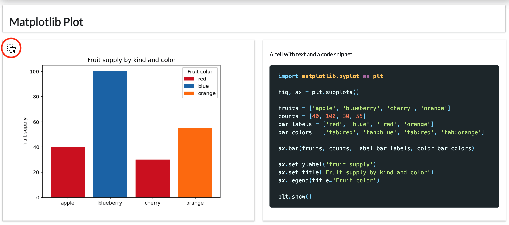

# Publish a Notebook as a Dashboard Using the Layout Builder

This guide will show you how to transform your notebooks into interactive dashboards using Panel's intuitive layout builder. With a simple drag-and-drop interface, creating dashboards from your notebooks has never been easier.

:::{note}
Ensure you have `panel >= 1.4.0` and `pyviz_comms >= 3.0.2` installed. Note if you are running JupyterLab in a separate environment from your notebook kernel, ensure these packages are installed in both.
:::

---

**Transforming notebooks into dashboards can be done in one of two ways:**

1. **Directly Import Panel and Apply `.servable()`**

    - Begin by importing the Panel library into your notebook.
    - Next, tag Panel components you wish to include in your dashboard with the `.servable()` method.
    - This method offers detailed control, allowing you to selectively expose notebook elements in your dashboard.

2. **Publish the Entire Notebook and Utilize the Drag and Drop Layout Builder**

    - Alternatively, publish your notebook as is.
    - Then, use the drag and drop layout builder to visually design your dashboard.
    - This method provides a more general approach, conveniently allowing for dashboard design after publication.

**Focusing on the Layout Builder Approach:**

We will focus on **how to use the layout builder to convert your standard notebook into a dashboard**.

This guide will help you easily turn your analytical notebooks into engaging, user-friendly dashboards using the powerful features of Panel's layout builder.

## Getting Started

Imagine we have a notebook containing Markdown cells, code, and a plot.

:::{dropdown} Example Code

```markdown
# Matplotlib Plot
```

````markdown
A cell with text and a code snippet

```python
import matplotlib
import matplotlib.pyplot as plt

fig, ax = plt.subplots()

fruits = ["apple", "blueberry", "cherry", "orange"]
counts = [40, 100, 30, 55]
bar_labels = ["red", "blue", "_red", "orange"]
bar_colors = ["tab:red", "tab:blue", "tab:red", "tab:orange"]

ax.bar(fruits, counts, label=bar_labels, color=bar_colors)

ax.set_ylabel("fruit supply")
ax.set_title("Fruit supply by kind and color")
ax.legend(title="Fruit colors")

plt.show()
```
````

```markdown
## TODO: Document this properly
```

```python
import matplotlib
import matplotlib.pyplot as plt

fig, ax = plt.subplots()

fruits = ["apple", "blueberry", "cherry", "orange"]
counts = [40, 100, 30, 55]
bar_labels = ["red", "blue", "_red", "orange"]
bar_colors = ["tab:red", "tab:blue", "tab:red", "tab:orange"]

ax.bar(fruits, counts, label=bar_labels, color=bar_colors)

ax.set_ylabel("fruit supply")
ax.set_title("Fruit supply by kind and color")
ax.legend(title="Fruit colors")

plt.show()
```

:::

Initially, the Jupyter Panel Preview will present all Markdown cells and outputs vertically, assuming no component has been marked as `.servable()`. This initial layout will look something like this:


## Customizing Your Dashboard

The initial layout might not fully match your vision, so let's explore how to tailor your dashboard.

### Removing Unwanted Elements

You might find some outputs or Markdown cells unnecessary for your dashboard. To remove these, hover over the top right of the card and click the delete icon:


### Resizing for Better Layout

To better utilize space, you can resize any card. Simply hover over the bottom right corner and drag to adjust the card's size.


### Reordering for Clarity

You might want to reorder the cards for a more logical flow. To do this, drag the card from the top left corner to your desired location.



### Undo

You might want to undo previous remove, resize and reorder actions:


### Resetting Layout

If you're not satisfied with the changes, you can start over by clicking the reset button at the top right.


## Saving and Persistence

Panel's layout builder supports two levels of persistence:

- **Immediate Persistence**: Any changes you make are automatically saved in a sidecar file (e.g., `.Example.ipynb.layout`) alongside your notebook. This file ensures your layout is preserved and prioritized over embedded layout data.

- **Notebook Metadata Persistence**: When you save your notebook, Panel syncs the layout data back into the notebook's metadata. This feature allows you to share or deploy the notebook with the layout intact.

Outside JupyterLab, when serving the application, you can further customize the layout by adding `?editable=true` to the URL, allowing for on-the-fly edits which can be saved to local browser storage.  You can persist your local edits to local browser storage by hitting the save button at the top right.


:::{notes}

- **Deleting a Notebook**: Remember to manually remove the `.NameOfNotebook.ipynb.layout` file.

- **Renaming a Notebook**: If you rename your notebook, also rename or delete the corresponding `.NameOfNotebook.ipynb.layout` file. You will also have to close and (re-)open the Jupyter Panel Preview.

:::

## Sharing Your Dashboard

After crafting your desired dashboard layout, you can share or deploy it as any Panel application. Simply serve your notebook with:

```bash
panel serve notebook.ipynb
```

This command will automatically restore the persisted layout data from the notebook.

## References

### Component Gallery

- [EditableTemplate](../../reference/templates/EditableTemplate)
