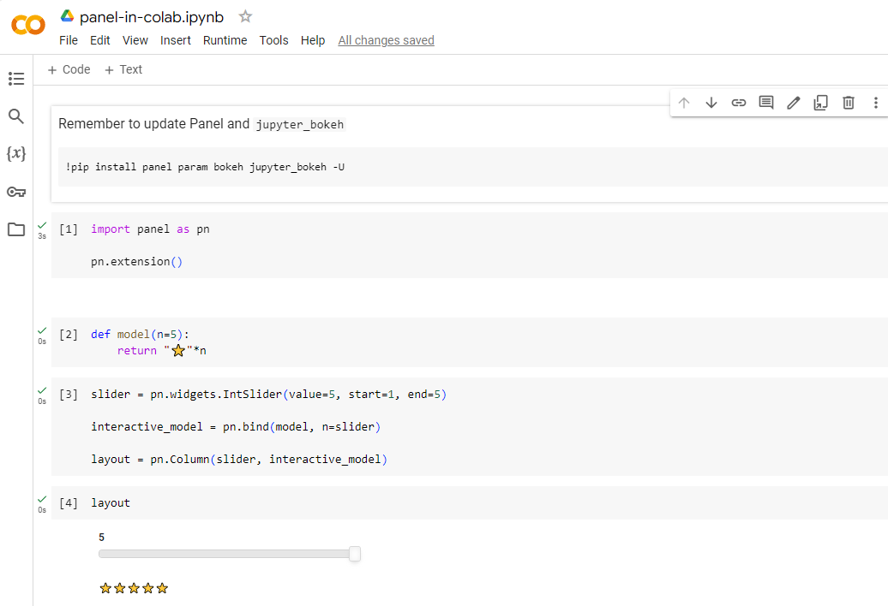

# Develop in other notebook environments

This guide addresses how to develop apps in Google Colab, VSCode, nteract, and other environments.

---

## Google Colab

:::{tip}

Before using a new [Colab notebook](https://colab.google/) you should make sure you are running on the latest version of Panel and that the latest version of [`jupyter_bokeh`](https://github.com/bokeh/jupyter_bokeh) is installed.

You can update Panel and `jupyter_bokeh` with

```bash
!pip install panel param bokeh jupyter_bokeh -U
```

:::

In the Google Colaboratory notebook, first make sure to load the `pn.extension()`. As usual Panel objects will then render themselves if they are the last item in a notebook cell.



:::{note}
Please note that in Colab rendering for each notebook cell is isolated, which means that every cell must reload the Panel extension code separately. This will result in somewhat slower and larger notebook than with other notebook technologies.
:::

:::{warning}
The [IpyWidgets](../../reference/panes/IpyWidget.ipynb) pane does not work in Google Colab. Thus you cannot use IpyWidgets with Panel in Colab.
:::

## PyCharm Notebook

PyCharm Professional offers support for [notebooks](https://www.jetbrains.com/help/pycharm/ipython-notebook-support.html) and [ipywidgets](https://www.jetbrains.com/help/pycharm/interactive-js-widgets.html). Thanks to the [`jupyter_bokeh`](https://github.com/bokeh/jupyter_bokeh) integration, Panel objects can be utilized as ipywidgets, allowing for interactive use of Panel components within PyCharm Professional. To ensure full functionality, install `jupyter_bokeh` using `pip install jupyter_bokeh` or `conda install -c bokeh jupyter_bokeh`, followed by activating the extension with `pn.extension()`.

For additional guidance, refer to the [How-To Configure PyCharm Guide](../editor/pycharm_configure.md).

## VSCode notebook

Visual Studio Code (VS Code) supports notebooks and ipywidgets, and Panel objects can be used as ipywidgets thanks to [`jupyter_bokeh`](https://github.com/bokeh/jupyter_bokeh), which means that you can use Panel components interactively in VS Code. Ensure you install `jupyter_bokeh` with `pip install jupyter_bokeh` or `conda install -c bokeh jupyter_bokeh` and then enable the extension with `pn.extension()`.

See also the [How-To Configure VS Code Guide](../editor/vscode_configure.md).

## nteract and other ipywidgets notebooks

In other notebook environments that support rendering ipywidgets interactively, such as nteract, you can use the same underlying ipywidgets support as for vscode: Install ``jupyter_bokeh`` and then use ``pn.extension(comms='ipywidgets')``.

## Other environments

If your development environment offers embedded Python processes but does not support ipywidgets or Jupyter "comms" (communication channels), you will notice that some or all interactive functionality is missing. Some widgets that operate only in JavaScript will work fine, but others require communication channels between JavaScript and Python. In such cases you can either request ipywidgets or Panel support from the editor or environment, or else use the Editor + Server approach above.

## Related Resources
