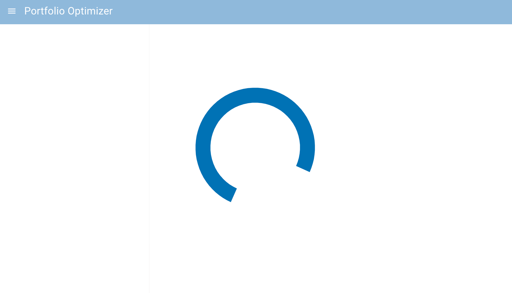
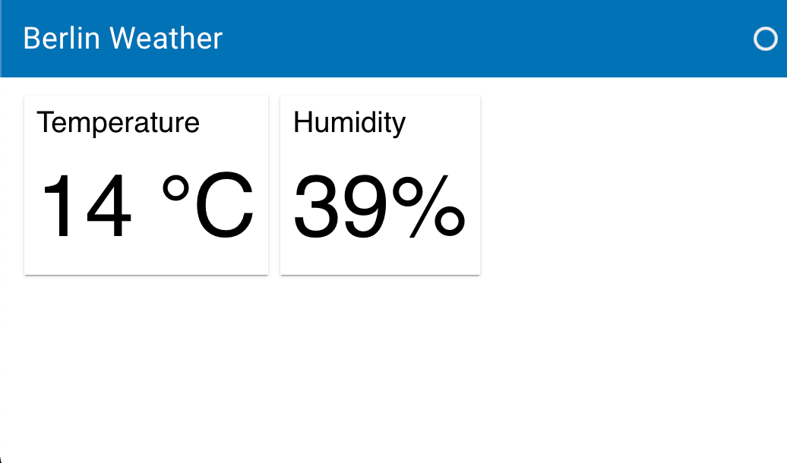

# Reuse sessions

This guide addresses how to reuse sessions to speed up the initial rendering.

---

In order to render a page for a visiting user the Panel server creates a so called session. This session has to execute the code associated with your application and then render the page template to HTML. This template could a custom `Template` that you instantiate explicitly (such as the `BootstrapTemplate` or `FastListTemplate`) or the basic default template. Once the frontend has rendered the initial template it will establish a Websocket connection and render the actual Panel components into the template.

Since the template being rendered initially is identical each time we can make use of that to speed up the time to initial render. You can enable this behavior very simply by passing the `--reuse-sessions` argument to `panel serve`. This can also be combined with `--global-loading-spinner` to display a loading spinner on top of your entire application, e.g.:

```bash
panel serve app.py --reuse-sessions --global-loading-spinner
```



:::{tip}
If you want to warm up the server with the cached sessions you can also provide the `--warm` option.
:::

## More complex cases

The above approach works well for simple cases but sometimes the layout or configuration of your template is dependent on other variables, e.g. let's say you have an app where a query parameter is used to set the title of our page:

```python
import random
import panel as pn

pn.extension(template='material')

city = pn.state.session_args.get('city', [b'Berlin'])[0].decode('utf-8')

pn.state.template.title = f'{city} Weather'

pn.FlexBox(
    pn.Card(pn.indicators.Number(
        name='Temperature', value=random.randint(-20, 45), format='{value} °C'
    ), hide_header=True),
    pn.Card(pn.indicators.Number(
        name='Humidity', value=random.randint(0, 100), format='{value}%'
    ), hide_header=True)
).servable()
```



Here the Template title is set via a query paramerer which we obtained from the `pn.state.session_args`. If we reuse this session then all sessions will use the initial value of the title. Therefore we have to define a so called `session_key_func`.

The `session_key_func` can be defined on `pn.config` (or via the `pn.extension`). For our example above we have to write a key function that ensures we cache a different version of our template depending on the value of the `city` query parameter. The `session_key_func` receives one argument (the `request` object).

:::{note}
The `request` object is a [`tornado.httputil.HTTPServerRequest`](https://www.tornadoweb.org/en/stable/httputil.html#tornado.httputil.HTTPServerRequest) and you can include any part of the request in your key as long as it is hashable.
:::

In our example we will write a function that returns the 'city' request argument:

```python
def session_key_func(request):
    return request.arguments.get('city', [b'Berlin'])[0]

pn.extension(template='material', session_key_func=session_key_func)
```

Now when a request arrives to serve our application it will check whether the city has been seen previously and if not it will create a new session for that unique key.
