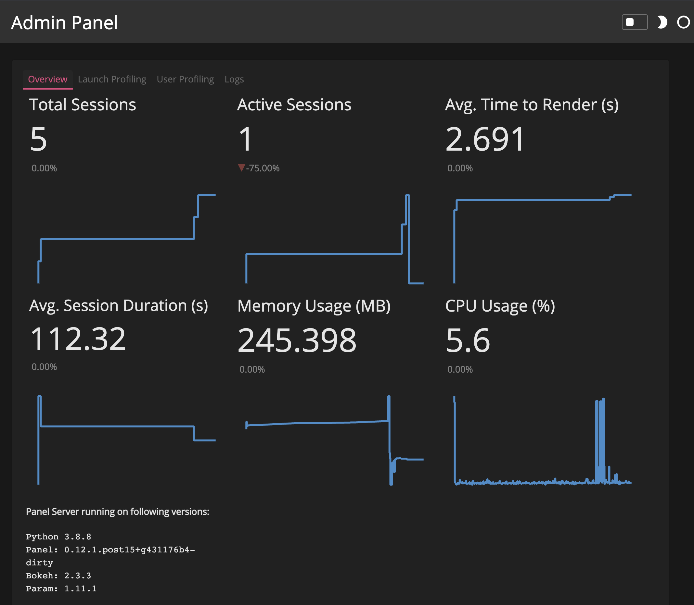

# Enable the admin panel

This guide addresses how to enable the admin Panel to begin monitoring resource usage and user behavior.

---

The `/admin` panel provides an overview of the current application and provides tools for debugging and profiling. It can be enabled by passing the ``--admin`` argument to the `panel serve` command.

When you have successfully enabled it you should be able to visit the `/admin` endpoint of your application, e.g. if you are serving locally on port 5006, visit `http://localhost:5006/admin`. You should now be greeted with the overview page, which provides some details about currently active sessions, running versions and resource usage (if `psutil` is installed):

</img>

## Related Resources
