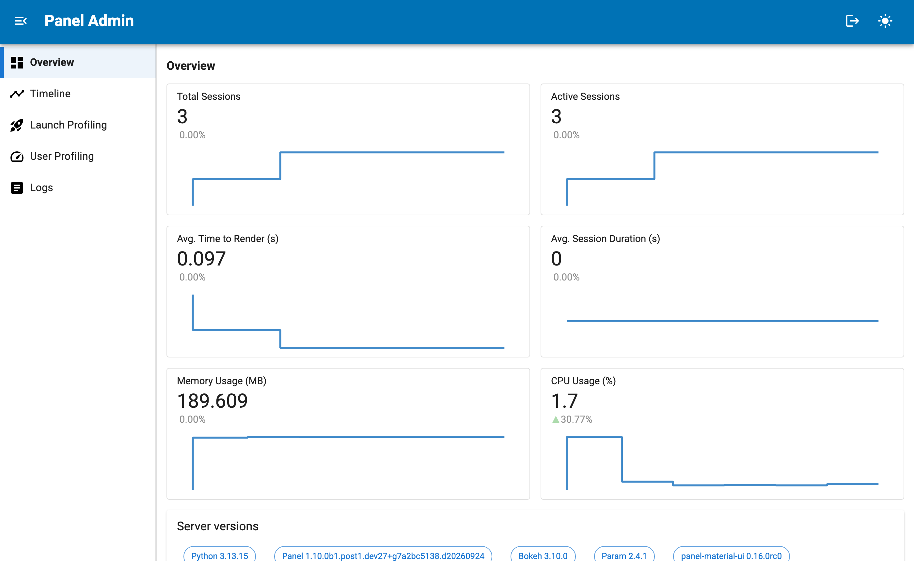
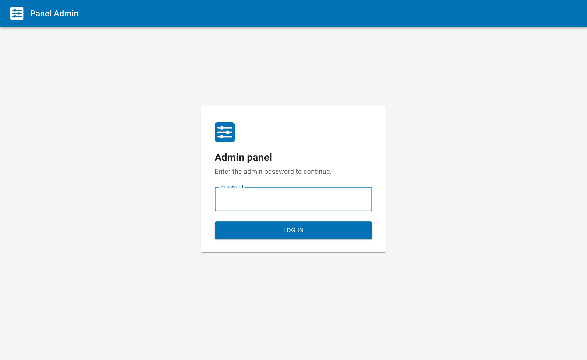

# Enable the admin panel

This guide addresses how to enable the admin Panel to begin monitoring resource usage and user behavior.

---

The `/admin` panel provides an overview of the current application and provides tools for debugging and profiling. It can be enabled by passing the ``--admin`` argument to the `panel serve` command.

```bash
panel serve my-app.py --admin
```

When you have successfully enabled it you should be able to visit the `/admin` endpoint of your application, e.g. if you are serving locally on port 5006, visit `http://localhost:5006/admin`. You should now be greeted with the overview page, which provides some details about currently active sessions, running versions and resource usage (if `psutil` is installed):

</img>

The sidebar switches between the pages of the admin panel:

- Overview: The number of total and active sessions, the average time to render and the average session duration, the memory and CPU usage of the server process and the versions of the main packages.
- Timeline: The lifecycle of each session, from initialization and rendering to the events it processes, periodic callbacks it executes and log messages it emits.
- Launch Profiling: The profiling output recorded while each application initialized, available when a profiler is enabled with `--profiler`, see [Profile your Application](./profile).
- User Profiling: The profiling output of callbacks decorated with `pn.io.profile`, see [Profile your Application](./profile).
- Logs: The session log messages, which can be filtered and downloaded, see [View application logs](./logs).

Each page is created the first time you open it. The admin panel follows the theme, logo and title configured with [`--page-config`](../server/page_config), so it matches the branding of the index, login and error pages, and its theme toggle switches between light and dark mode. Serving the admin panel does not change the design of the applications served alongside it.

## Adding pages

Additional pages can be registered with `pn.config.admin_plugins`, a list of tuples of a page title and a function returning the component to render on it. The function is called once per admin session, when the page is first opened. A `--setup` script is a good place to register them:

```python
import panel as pn

def cache_info():
    return pn.ui.Typography(f'Cached objects: {len(pn.state.cache)}')

pn.config.admin_plugins.append(('Cache', cache_info))
```

## Password protecting the admin panel

The admin panel exposes logs and profiling output of every session, so on a shared deployment you will want to restrict access to it. The `--admin-password` argument protects only the admin panel with a password, which works without configuring authentication for the applications themselves:

```bash
panel serve my-app.py --admin --admin-password "my-admin-password"
```

Visiting `/admin` now redirects to a login page at `/admin/login`, while the applications remain publicly accessible:

</img>

Once logged in, the logout button in the header ends the admin session. The password can also be supplied with the `PANEL_ADMIN_PASSWORD` environment variable, which keeps it out of the process list, or set with `pn.config.admin_password` when serving with `pn.serve`.

The login is stored in a signed `panel_admin` cookie valid for one day, or for `--oauth-expiry-days` when an OAuth provider is configured. It is signed with the `--cookie-secret` if one is configured, otherwise with a secret generated when the server starts, in which case restarting the server logs every admin out. Supply a `--cookie-secret` when serving with `--num-procs` or behind a load balancer, so that all processes accept the same cookie.

If the server already authenticates its users with `--basic-auth` or `--oauth-provider`, you can instead restrict the admin panel to particular users with `--admin-users` (or the comma separated `PANEL_ADMIN_USERS` environment variable):

```bash
panel serve my-app.py --admin --basic-auth credentials.json --cookie-secret my_super_safe_cookie_secret --admin-users alice bob
```

Any other authenticated user is shown an authorization error when visiting the admin panel. The two options can be combined, in which case the admin password is required in addition to logging in as one of the admin users.

## Changing the admin panel endpoint

You can change the endpoint that the admin page is rendered at by using the flag `--admin-endpoint="/my-new-admin-endpoint"`. This will change where the admin endpoint is in the Bokeh server, and cause a `404: Not Found` page to be shown if you navigate to the default `/admin` path discussed above. As an example, using the following command to start your Panel app

```bash
panel serve my-app.py --admin --admin-endpoint="/my-new-admin-endpoint"
```

and navigating to [http://localhost:5006/admin](http://localhost:5006/admin) will result in a 404 page, however, navigating to [http://localhost:5006/my-new-admin-endpoint](http://localhost:5006/my-new-admin-endpoint) will result in the admin panel.

## Related Resources
