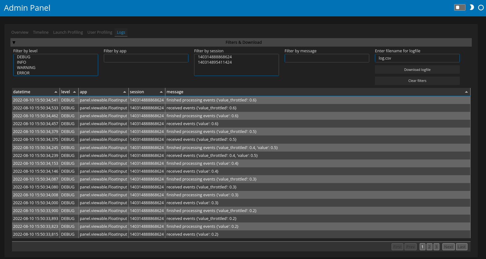

# View application logs

This guide addresses how to view application logs in the admin dashboard.

---

The logs page provides a detailed breakdown of the user interaction with the application. The log level of the logs stream sent to the Logs console can be set with the `PANEL_ADMIN_LOG_LEVEL` environment variable or with the `--admin-log-level` command line parameter, both accepting either `'debug'` (default), `'info'`, `'warning'`, `'error'` or `'critical'`. Additionally users may also log to this logger using the `pn.state.log` function, e.g. in this example we log the arguments to the clustering function:

```python
def get_clusters(x, y, n_clusters):
    pn.state.log(f'clustering {x!r} vs {y!r} into {n_clusters} clusters.')
    ...
    return ...
```

</img>

## Related Resources
