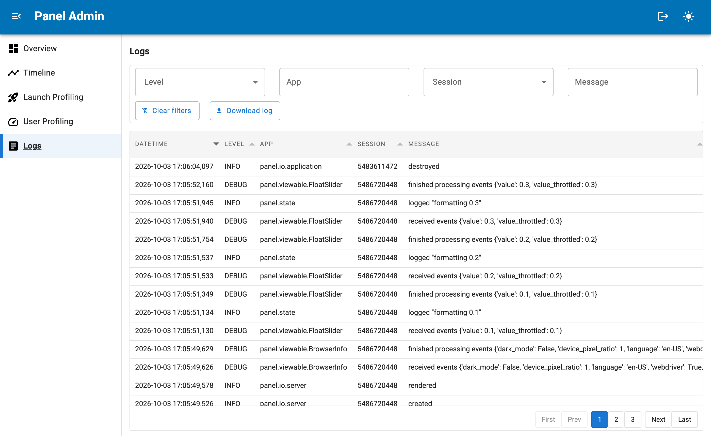

# View application logs

This guide addresses how to view application logs in the admin dashboard.

---

The logs page provides a detailed breakdown of the user interaction with the application. The log level of the logs stream sent to the Logs console can be set with the `PANEL_ADMIN_LOG_LEVEL` environment variable or with the `--admin-log-level` command line parameter, both accepting either `'debug'` (default), `'info'`, `'warning'`, `'error'` or `'critical'`. Additionally users may also log to this logger using the `pn.state.log` function, e.g. in this example we log the arguments to the clustering function:

```python
def get_clusters(x, y, n_clusters):
    pn.state.log(f'clustering {x!r} vs {y!r} into {n_clusters} clusters.')
    ...
    return ...
```

</img>

The filters above the table narrow down the log messages by level, by session and by text contained in the app (the logger name) and the message. The text filters match literally and ignore case, and the session filter lists every session that appears in the log. Each admin session has its own filters, so narrowing the logs does not affect other admins. **Clear filters** resets them and **Download log** saves the currently filtered messages as a CSV file.

## Related Resources
