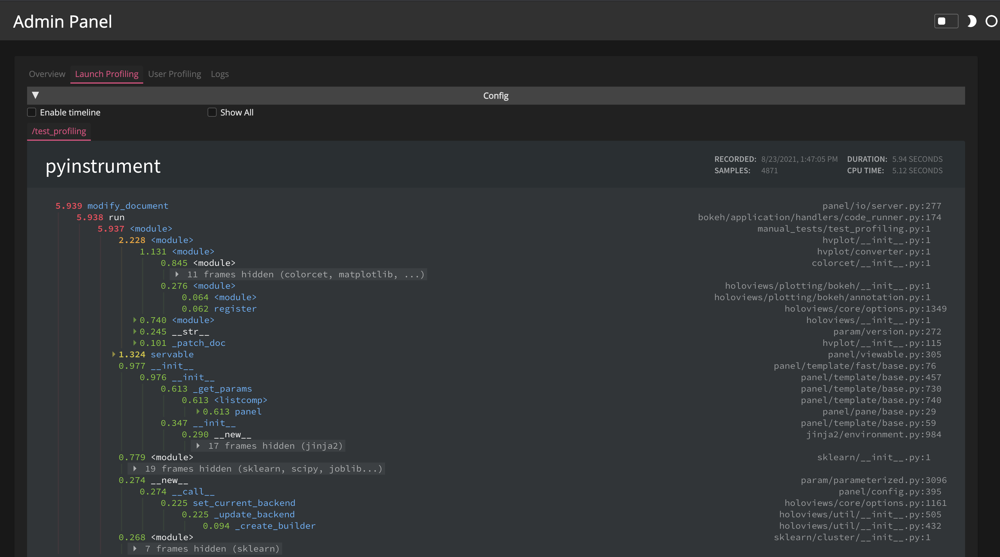
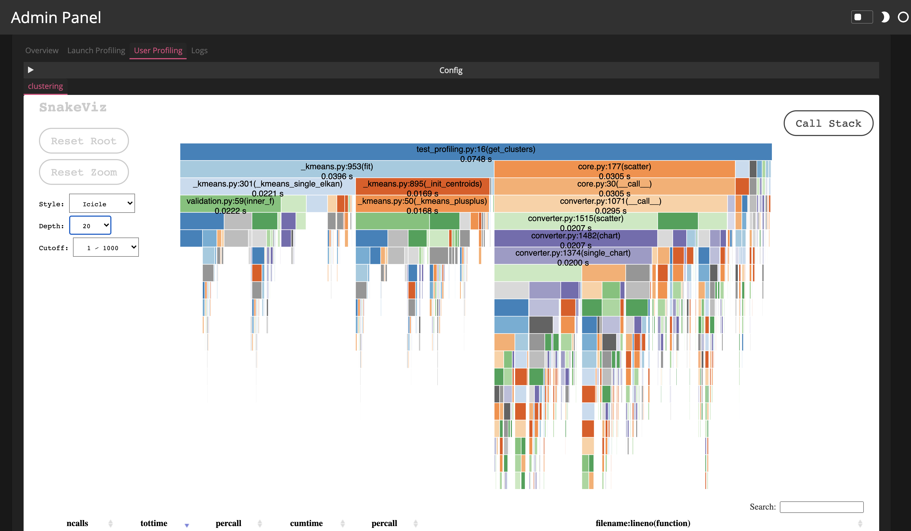

# Profile your Application

This guide addresses how to enable profilers like snakeviz or memray to track down bottlenecks in your application in terms of execution time and memory usage.

```{admonition} Prerequisites
1. Read the [How to > Enable the admin panel](./admin) guide to be able to start profiling your application
```
---

## Launch profiling

The launch profiler profiles the execution time of the initialization of a particular application. It can be enabled by setting a profiler using the commandline ``--profiler`` option to `panel serve`. Available profilers include:

- [`pyinstrument`](https://pyinstrument.readthedocs.io): A statistical profiler with nice visual output
- [`snakeviz`](https://jiffyclub.github.io/snakeviz/): SnakeViz is a browser based graphical viewer for the output of Python’s cProfile module and an alternative to using the standard library pstats module.
- [`memray`](https://bloomberg.github.io/memray/): memray is a memory profiler for Python. It can track memory allocations in Python code, in native extension modules, and in the Python interpreter itself.

Once enabled the launch profiler will profile each application separately and provide the profiler output generated by the selected profiling engine.

</img>

## User profiling

In addition to profiling the launch step of an application it is often also important to get insight into the interactive performance of an application. For that reason Panel also provides the `pn.io.profile` decorator that can be added to any callback and will report the profiling results in the [`/admin` panel](../profiling/admin.html). The `profile` helper takes two arguments, the name to record the profiling results under and the profiling `engine` to use.

```python
@pn.io.profile('clustering', engine='snakeviz')
def get_clustering(event):
    # some expensive calculation
    ...

widget.param.watch(my_callback, 'value')
```

</img>

The user profiling may also be used in an interactive session, e.g. we might decorate a simple callback with the `profile` decorator:

```python
import time

slider = pn.widgets.FloatSlider(name='Test')

@pn.io.profile('formatting')
def format_value(value):
    time.sleep(1)
    return f'Value: {value+1}'

pn.Row(slider, pn.bind(format_value, slider))
```

Then we can request the named profile 'formatting' using the `pn.state.get_profile` function:

```python
pn.state.get_profile('formatting')
```

## Related Resources
