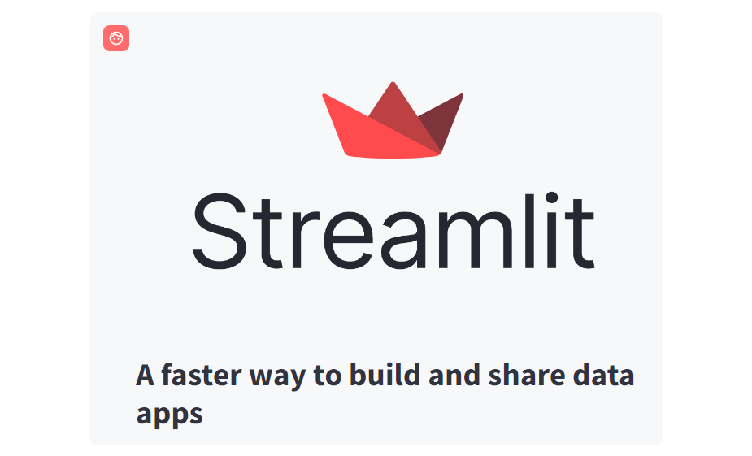
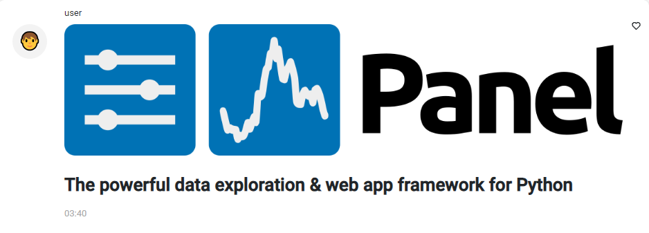
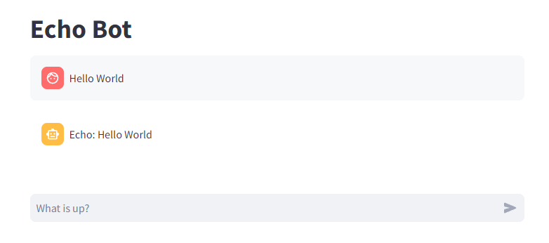
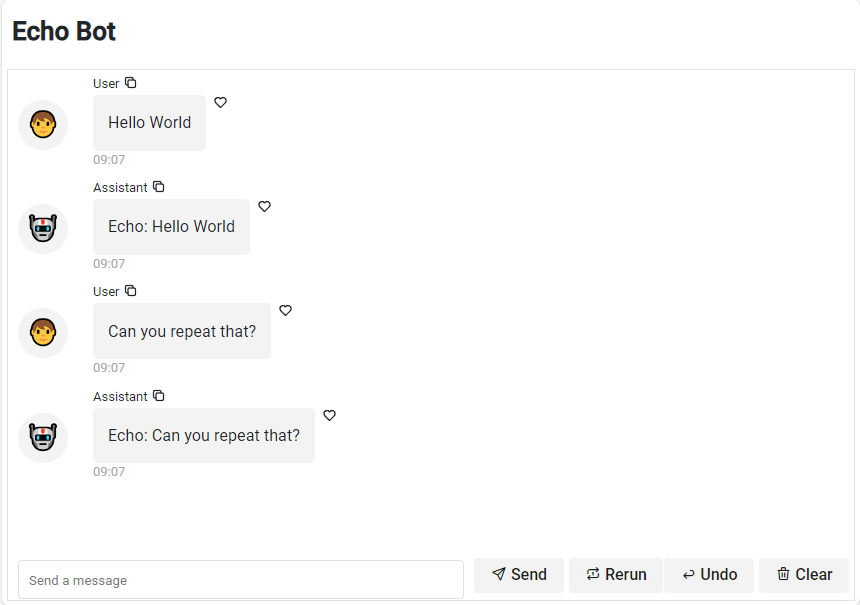

# Create Chat Interfaces

Both Streamlit and Panel provides special components to help you build conversational apps.

| Streamlit            | Panel               | Description                            |
| -------------------- | ------------------- | -------------------------------------- |
| [`chat_message`](https://docs.streamlit.io/library/api-reference/chat/st.chat_message)    | [`ChatMessage`](../../reference/chat/ChatMessage.md) | Display a chat message  |
| [`chat_input`](https://docs.streamlit.io/library/api-reference/chat/st.chat_input) |  [`ChatInput` example](https://holoviz-topics.github.io/panel-chat-examples/components/#chat_input) | Input a chat message |
| [`status`](https://docs.streamlit.io/library/api-reference/status/st.status) | [`Status` example](https://holoviz-topics.github.io/panel-chat-examples/components/#status) | Display the output of long-running tasks in a container |
|                      | [`ChatFeed`](../../reference/chat/ChatFeed.md)  | Display multiple chat messages         |
|                      | [`ChatInterface`](../../reference/chat/ChatInterface.md)  | High-level, easy to use chat interface |
| [`StreamlitCallbackHandler`](https://python.langchain.com/docs/integrations/callbacks/streamlit) | [`PanelCallbackHandler`](../../reference/chat/PanelCallbackHandler.md) | Display the thoughts and actions of a [LangChain](https://python.langchain.com/docs/get_started/introduction) agent |
| [`StreamlitChatMessageHistory`](https://python.langchain.com/docs/integrations/memory/streamlit_chat_message_history) |  | Persist the memory of a [LangChain](https://python.langchain.com/docs/get_started/introduction) agent |

The starting point for most Panel users is the *high-level* [`ChatInterface`](../../reference/chat/ChatInterface.md) or [`PanelCallbackHandler`](../../reference/chat/PanelCallbackHandler.md), not the *low-level* [`ChatMessage`](../../reference/chat/ChatMessage.md) and [`ChatFeed`](../../reference/chat/ChatFeed.md) components.

## Chat Message

Lets see how-to migrate an app that is using `st.chat_message`.

### Streamlit Chat Message Example

```python
import streamlit as st

with st.chat_message("user"):
    st.image("https://streamlit.io/images/brand/streamlit-logo-primary-colormark-darktext.png")
    st.write("# A faster way to build and share data apps")
```



### Panel Chat Message Example

```python
import panel as pn

pn.extension(design="material")

message = pn.Column(
    "https://panel.holoviz.org/_images/logo_horizontal_light_theme.png",
    "# The powerful data exploration & web app framework for Python"
)
pn.chat.ChatMessage(message, user="user").servable()
```



## Echo Bot

Lets see how to migrate a bot that echoes the user input.

### Streamlit Echo Bot

```python
import streamlit as st

def echo(prompt):
    return f"Echo: {prompt}"

st.title("Echo Bot")

if "messages" not in st.session_state:
    st.session_state.messages = []

for message in st.session_state.messages:
    with st.chat_message(message["role"]):
        st.markdown(message["content"])

if prompt := st.chat_input("What is up?"):
    st.chat_message("user").markdown(prompt)
    st.session_state.messages.append({"role": "user", "content": prompt})
    response = echo(prompt)

    with st.chat_message("assistant"):
        st.markdown(response)
    st.session_state.messages.append({"role": "assistant", "content": response})
```



### Panel Echo Bot

```python
import panel as pn

pn.extension(design="material")


def echo(contents, user, instance):
    return f"Echo: {contents}"


chat_interface = pn.chat.ChatInterface(
    callback=echo,
)

pn.Column(
    "# Echo Bot",
    chat_interface,
).servable()
```



## Search Agent with Chain of thought

Lets try to migrate an agent that uses the Duck Duck Go search tool and shows its
*chain of thought*.

### Streamlit Search Agent with Chain of thought

```python
from langchain.llms import OpenAI
from langchain.agents import AgentType, initialize_agent, load_tools
from langchain.callbacks import StreamlitCallbackHandler
import streamlit as st

llm = OpenAI(temperature=0, streaming=True)
tools = load_tools(["ddg-search"])
agent = initialize_agent(
    tools, llm, agent=AgentType.ZERO_SHOT_REACT_DESCRIPTION, verbose=True
)

if prompt := st.chat_input():
    st.chat_message("user").write(prompt)
    with st.chat_message("assistant"):
        st_callback = StreamlitCallbackHandler(st.container())
        response = agent.run(prompt, callbacks=[st_callback])
        st.write(response)
```

<video controls="" poster="../../_static/images/streamlit_callback_handler.png" style="max-height: 400px; max-width: 100%;">
    <source src="https://assets.holoviz.org/panel/how_to/streamlit_migration/streamlit_callback_handler.mp4" type="video/mp4">
    Your browser does not support the video tag.
</video>

### Panel Search Agent with Chain of thought

```python
from langchain.llms import OpenAI
from langchain.agents import AgentType, initialize_agent, load_tools
import panel as pn

pn.extension(design="material")

llm = OpenAI(temperature=0, streaming=True)
tools = load_tools(["ddg-search"])
agent = initialize_agent(
    tools, llm, agent=AgentType.ZERO_SHOT_REACT_DESCRIPTION, verbose=True,
)

async def callback(contents, user, instance):
    callback_handler = pn.chat.langchain.PanelCallbackHandler(instance)
    await agent.arun(contents, callbacks=[callback_handler])

pn.chat.ChatInterface(callback=callback).servable()
```

<video controls="" poster="../../_static/images/panel_callback_handler.png" style="max-height: 400px; max-width: 100%;">
    <source src="https://assets.holoviz.org/panel/how_to/streamlit_migration/panel_callback_handler.mp4" type="video/mp4">
    Your browser does not support the video tag.
</video>

## More Panel Chat Examples

For more inspiration check out [panel-chat-examples](https://holoviz-topics.github.io/panel-chat-examples/).
