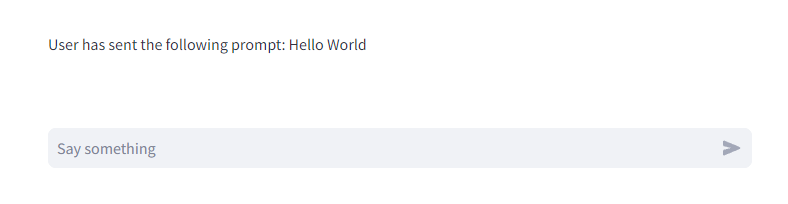
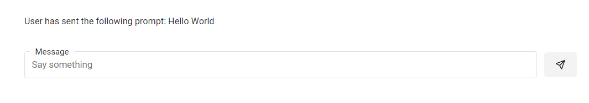

# Create Chat Interfaces

Both Streamlit and Panel provides special components to help you build conversational apps.

| Streamlit            | Panel               | Description                            |
| -------------------- | ------------------- | -------------------------------------- |
| [`chat_message`](https://docs.streamlit.io/library/api-reference/chat/st.chat_message)    | [`ChatMessage`](../../../examples/reference/chat/ChatMessage.ipynb) | Display a chat message  |
| [`chat_input`](https://docs.streamlit.io/library/api-reference/chat/st.chat_input) |  | Input a chat message |
| [`status`](https://docs.streamlit.io/library/api-reference/status/st.status) | | Display the output of long-running tasks in a container |
|                      | [`ChatFeed`](../../../examples/reference/chat/ChatFeed.ipynb)  | Display multiple chat messages         |
|                      | [`ChatInterface`](../../../examples/reference/chat/ChatInterface.ipynb)  | High-level, easy to use chat interface |
| [`StreamlitCallbackHandler`](https://python.langchain.com/docs/integrations/callbacks/streamlit) | [`PanelCallbackHandler`](../../../examples/reference/chat/ChatInterface.ipynb) | Display the thoughts and actions of a [LangChain](https://python.langchain.com/docs/get_started/introduction) agent |
| [`StreamlitChatMessageHistory`](https://python.langchain.com/docs/integrations/memory/streamlit_chat_message_history) |  | Persist the memory of a [LangChain](https://python.langchain.com/docs/get_started/introduction) agent |

The starting point for most Panel users is the *high-level* [`ChatInterface`](../../../examples/reference/chat/ChatInterface.ipyn), not the *low-level* [`ChatMessage`](../../../examples/reference/chat/ChatMessage.ipynb) and [`ChatFeed`](../../../examples/reference/chat/ChatFeed.ipynb) components.

For inspiration check out the many chat components and examples at [panel-chat-examples](https://holoviz-topics.github.io/panel-chat-examples/).

## Chat Message

Lets see how-to migrate an app that is using `st.chat_message`.

### Streamlit Chat Message Example

```python
import streamlit as st

with st.chat_message("user"):
    st.image("https://streamlit.io/images/brand/streamlit-logo-primary-colormark-darktext.png")
    st.write("# A faster way to build and share data apps")
```


### Panel Chat Message Example

```python
import panel as pn

pn.extension(design="material")

message = pn.Column(
    "https://panel.holoviz.org/_images/logo_horizontal_light_theme.png",
    "# The powerful data exploration & web app framework for Python"
)
pn.chat.ChatMessage(message, user="user").servable()
```


## Chat Input

Lets see how-to migrate an app that is using `st.chat_input`.

### Streamlit Chat Input

```python
import streamlit as st

prompt = st.chat_input("Say something")
if prompt:
    st.write(f"User has sent the following prompt: {prompt}")
```



### Panel Chat Input

Panel does not provide a dedicated *chat input* component because it is built into Panels high-level `ChatInterface`.

Below we will show you how to build and use a custom `ChatInput` widget.

```python
import panel as pn
import param

pn.extension(design="material")


class ChatInput(pn.viewable.Viewer):
    value = param.String()

    disabled = param.Boolean()
    max_length = param.Integer(default=5000)
    placeholder = param.String("Send a message")

    def __init__(self, **params):
        layout_params = {
            key: value
            for key, value in params.items()
            if not key in ["value", "placeholder", "disabled", "max_length"]
        }
        params = {
            key: value for key, value in params.items() if key not in layout_params
        }

        super().__init__(**params)

        self._text_input = pn.widgets.TextInput(
            align="center",
            disabled=self.param.disabled,
            max_length=self.param.max_length,
            name="Message",
            placeholder=self.param.placeholder,
            sizing_mode="stretch_width",
        )
        self._submit_button = pn.widgets.Button(
            align="center",
            disabled=self.param.disabled,
            icon="send",
            margin=(18, 5, 10, 0),
            name="",
            sizing_mode="fixed",
        )
        pn.bind(
            self._update_value,
            value=self._text_input,
            event=self._submit_button,
            watch=True,
        )

        self._layout = pn.Row(
            self._text_input, self._submit_button, align="center", **layout_params
        )

    def __panel__(self):
        return self._layout

    def _update_value(self, value, event):
        self.value = value or self.value
        self._text_input.value = ""
```

Let us use the custom `ChatInput` widget:

```Python
chat_input = ChatInput(placeholder="Say something")

def message(prompt):
    if not prompt:
        return ""
    return f"User has sent the following prompt: {prompt}"

pn.Column(pn.bind(message, chat_input.param.value), margin=50).servable()
```



## Chat Status

Lets see how-to migrate an app that is using `st.status`.

### Streamlit Chat Status

```python
import time
import streamlit as st

with st.status("Downloading data...", expanded=True):
    st.write("Searching for data...")
    time.sleep(1.5)
    st.write("Downloading data...")
    time.sleep(1.5)
    st.write("Validating data...")
    time.sleep(1.5)

st.button("Run")
```


### Panel Chat Status

Panel does not provide a dedicated *status* component. Instead it is built into Panels high-level `ChatInterface` as well as provided by a long list of alternative Panel [*indicators*](https://panel.holoviz.org/reference/index.html#indicators).

Below we will show you how to build and use a custom `Status` indicator.

```python
import time

from contextlib import contextmanager

import param

import panel as pn

from panel.widgets.indicators import LoadingSpinner

pn.extension(design="material")

COLORS = {
    "running": "green",
    "complete": "black",
    "error": "red",
    "next": "lightgray",
}


class Status(pn.viewable.Viewer):
    value = param.Selector(default="complete", objects=["running", "complete", "error"])
    title = param.String()

    bgcolor = param.ObjectSelector(
        default=LoadingSpinner.param.bgcolor.default,
        objects=LoadingSpinner.param.bgcolor.objects,
    )
    color = param.ObjectSelector(
        default="success", objects=LoadingSpinner.param.color.objects
    )
    collapsed = param.Boolean(default=True)

    steps = param.List(constant=True)
    step = param.Parameter(constant=True)

    def __init__(self, title: str, **params):
        params["title"] = title
        params["steps"] = params.get("steps", [])
        layout_params = {
            key: value
            for key, value in params.items()
            if not key
            in ["value", "title", "collapsed", "bgcolor", "color", "steps", "step"]
        }
        params = {
            key: value for key, value in params.items() if key not in layout_params
        }
        super().__init__(**params)

        self._indicators = {
            "running": pn.indicators.LoadingSpinner(
                value=True,
                color=self.param.color,
                bgcolor=self.param.bgcolor,
                size=25,
                # margin=(15, 0, 0, 0),
            ),
            "complete": "✔️",
            "error": "❌",
        }

        self._title_pane = pn.pane.Markdown(self.param.title, align="center")
        self._header_row = pn.Row(
            pn.panel(self._indicator, sizing_mode="fixed", width=40, align="center"),
            self._title_pane,
            sizing_mode="stretch_width",
            margin=(0, 5),
        )
        self._details_pane = pn.pane.HTML(
            self._details, margin=(10, 5, 10, 55), sizing_mode="stretch_width"
        )
        self._layout = pn.Card(
            self._details_pane,
            header=self._header_row,
            collapsed=self.param.collapsed,
            **layout_params,
        )

    def __panel__(self):
        return self._layout

    @param.depends("value")
    def _indicator(self):
        return self._indicators[self.value]

    @property
    def _step_color(self):
        return COLORS[self.value]

    def _step_index(self):
        if self.step not in self.steps:
            return 0
        return self.steps.index(self.step)

    @param.depends("step", "value")
    def _details(self):
        steps = self.steps

        if not steps:
            return ""

        index = self._step_index()

        html = ""
        for step in steps[:index]:
            html += f"<div style='color:{COLORS['complete']}'>{step}</div>"
        step = steps[index]
        html += f"<div style='color:{self._step_color}'>{step}</div>"
        for step in steps[index + 1 :]:
            html += f"<div style='color:{COLORS['next']};'>{step}</div>"

        return html

    def progress(self, step: str):
        with param.edit_constant(self):
            self.value = "running"
            if not step in self.steps:
                self.steps = self.steps + [step]
            self.step = step

    def reset(self):
        with param.edit_constant(self):
            self.steps = []
            self.value = self.param.value.default

    def start(self):
        with param.edit_constant(self):
            self.step = None
        self.value = "running"

    def complete(self):
        self.value = "complete"

    @contextmanager
    def report(self):
        self.start()
        try:
            yield self.progress
        except Exception as ex:
            self.value = "error"
        else:
            self.complete()
```

Let us use the custom `Status` indicator.

```python
status = Status("Downloading data...", collapsed=False, sizing_mode="stretch_width")

def run(_):
    with status.report() as progress:
        progress("Searching for data...")
        time.sleep(1.5)
        progress("Downloading data...")
        time.sleep(1.5)
        progress("Validating data...")
        time.sleep(1.5)

run_button = pn.widgets.Button(name="Run", on_click=run)

pn.Column(
    status,
    run_button,
).servable()
```


