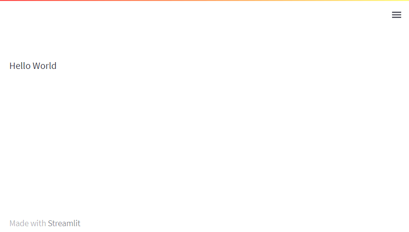
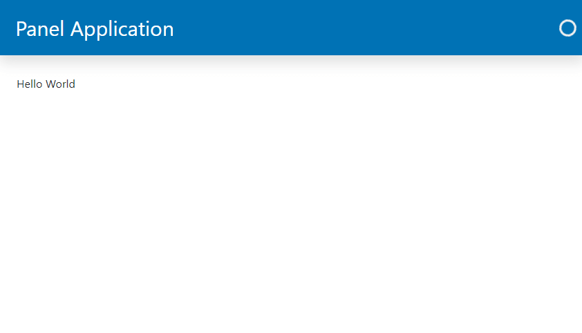

# Serve Apps

This guide will show you how-to migrate and serve a *Hello World* application.

---

## Migration Steps

You should replace:

- `import streamlit as st` with `import panel as pn` and
- `st.write` with `pn.panel`.

You will have to:

- add `pn.extension` to configure your Panel application via optional arguments like `sizing_mode` and `template`.
- add `.servable` to the Panel objects you want to include in your apps *template* when served as
a web app.

For production you will also have to migrate some of your app configuration to `panel serve` [command line options](../server/commandline.md) or environment variables.

## Examples

### Hello World

Lets show how to convert a *Hello World* application.

### Streamlit Hello World Example

```python
import streamlit as st

st.write("Hello World")
```

You *run* and *show* the app with *autoreload* via

```bash
streamlit run app.py
```



### Panel Hello World Example

```python
import panel as pn

pn.extension(sizing_mode="stretch_width", template="bootstrap")

pn.panel("Hello World").servable()
```

You *serve* and *show* (i.e. open) the app in your browser with *autoreload* via

```bash
panel serve app.py --dev --show
```


