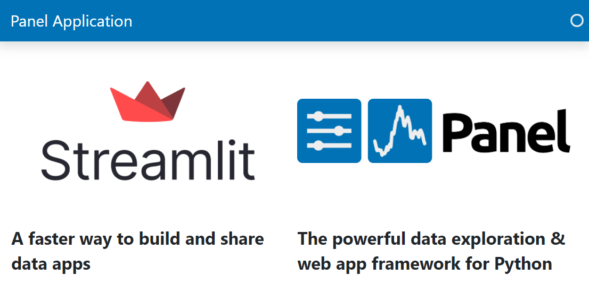

# Layout Objects

*Layouts* helps you organize your *objects* including Panel *components*.

Panel provides layouts similar to the ones you know from Streamlit and many unique ones too.

---

## Migration Steps

To migrate your layouts to Panel

- replace your Streamlit `st.some_layout` *snake cased* function with the corresponding Panel
`pn.SomeLayout` *CamelCased* class.

You can identify the relevant layout to migrate to in the [Layouts Section](../../reference/index.md#layouts) of the [Component Gallery](../../reference/index).

## Example

### Columns Example

#### Streamlit Columns Example

```python
import streamlit as st

col1, col2 = st.columns(2)

with col1:
    st.image("https://streamlit.io/images/brand/streamlit-logo-primary-colormark-darktext.png")
    st.write("# A faster way to build and share data apps")

with col2:
    st.image("https://panel.holoviz.org/_images/logo_horizontal_light_theme.png")
    st.write("# The powerful data exploration & web app framework for Python")
```


#### Panel Columns Example

You can access Panel's *layouts* in the top-level `pn` namespace:

```python
import panel as pn

pn.extension(sizing_mode="stretch_width", template="bootstrap")

row1 = pn.Row(
    pn.pane.Image(
        "https://streamlit.io/images/brand/streamlit-logo-primary-colormark-darktext.png",
        align="center",
    ),
    pn.pane.Image(
        "https://panel.holoviz.org/_images/logo_horizontal_light_theme.png",
        align="center",
    ),
)
row2 = pn.Row(
    "# A faster way to build and share data apps",
    "# The powerful data exploration & web app framework for Python",
)

pn.Column(row1, row2).servable()
```



Panels `Column` and `Row` are *list like* objects. So you can use familiar methods like `.append`, `.pop` and `[]` indexing when you work with them. For the details check out the [`Column` Guide](../../reference/layouts/Column) and the [`Row` Guide](../../reference/layouts/Row)
