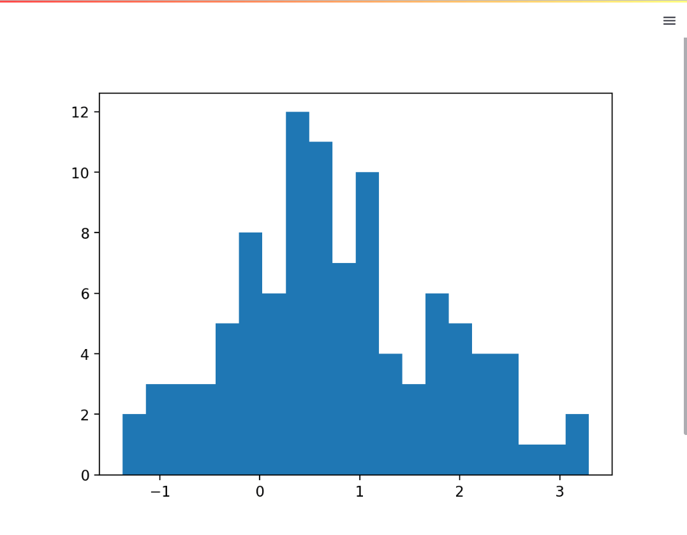
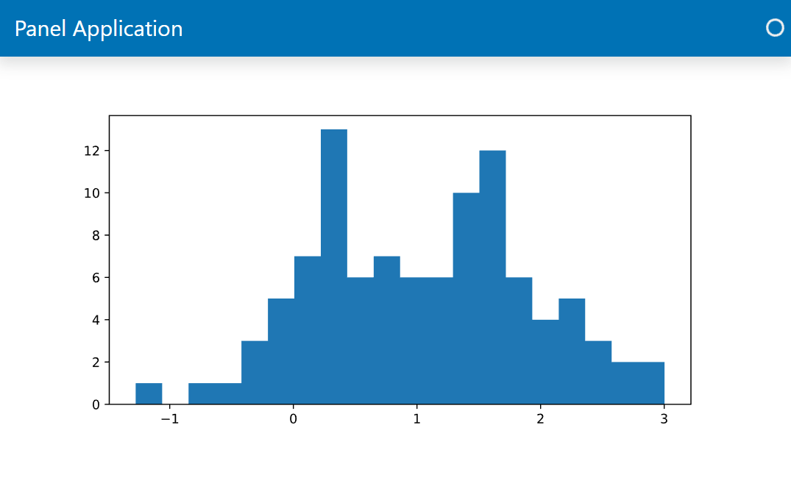
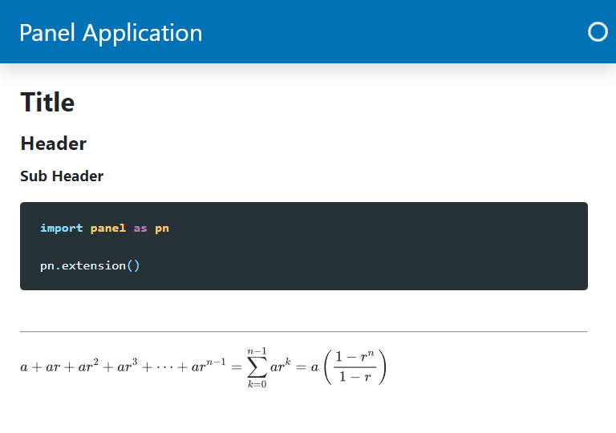

# Display Objects with Panes

In Panel the objects that can display your Python objects are called *panes*. With Panels *panes* you will be able to:

- Get notifications about interactions like click events on your plots and tables and react to them.
- Use unique data visualization ecosystems like HoloViz, ipywidgets and VTK.

Check out the [Panes Section](../../reference/index.md#panes) of the [Component Gallery](../../reference/index) for the full list of *panes*.

---

## Migration Steps

To display content in Panel:

- Replace your Streamlit `st.some_object` *snake cased* functions with the corresponding Panel
`pn.pane.SomeObject` *CamelCased* classes.
- Replace your Streamlit text elements with `pn.pane.Markdown`.

Identify the relevant Panel *pane*s in the [Panes Section](../../reference/index.md#panes) of the [Component Gallery](../../reference/index).

## Examples

### Matplotlib Pane

#### Streamlit Matplotlib Example

```python
import numpy as np
import streamlit as st

import matplotlib.pyplot as plt

data = np.random.normal(1, 1, size=100)
fig, ax = plt.subplots(figsize=(8,4))
ax.hist(data, bins=20)

st.pyplot(fig)
```



#### Panel Matplotlib Example

You will find Panels *panes* in the `pn.pane` module.

We use Matplotlibs `Figure` interface instead of the `pyplot` interface to
avoid memory leaks if you forget to close the figure. This is all described in the
[Matplotlib Guide](../../reference/panes/Matplotlib).

```python
import panel as pn
import numpy as np

from matplotlib.figure import Figure

pn.extension(sizing_mode="stretch_width", template="bootstrap")

data = np.random.normal(1, 1, size=100)
fig = Figure(figsize=(8,4))
ax = fig.subplots()
ax.hist(data, bins=20)

pn.pane.Matplotlib(fig, format='svg', sizing_mode='scale_both').servable()
```



### Markdown Pane

You can replace `st.markdown` with [`pn.pane.Markdown`](../../reference/panes/Markdown).

You can also use the `Markdown` pane to replace the text elements `st.title`, `st.header`, `st.sub_header`, `st.code` and `st.text`.

You may use the `Markdown` pane to replace `st.divider` and `st.latex`, but you can also use the *specialized* Panel components [`pn.layout.Divider`](../../reference/layouts/Divider) and [`pn.pane.LaTeX`](../../reference/panes/LaTeX).

Here is how to do it

````python
import panel as pn

pn.extension("mathjax", sizing_mode="stretch_width", template="bootstrap")

pn.pane.Markdown(r"""
# Title

## Header

### Sub Header

```python
import panel as pn

pn.extension()
```

---

$$ a + ar + a r^2 + a r^3 + \cdots + a r^{n-1} = \sum_{k=0}^{n-1} ar^k = a \left(\frac{1-r^{n}}{1-r}\right)$$
""").servable()
````


