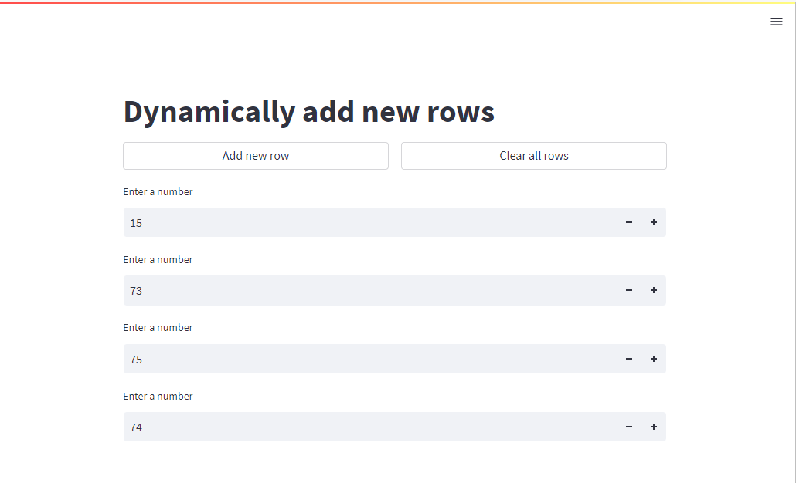
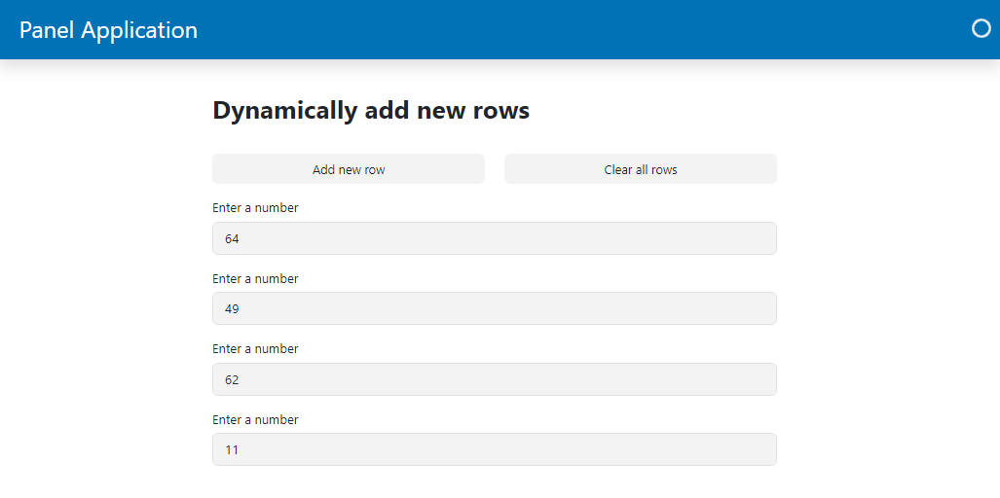

# Session State

Session state was added to Streamlit as an after thought
to enable sharing variables between re-runs and across apps inside a multipage app.

Panels execution model is very different and session state can be handled automatically by storing variables in the applications namespace.

---

## Migration Steps

- Move your session state to the applications namespace, i.e. to variables defined in your application file.

## Example

### Dynamic Layout Example

#### Streamlit Dynamic Layout Example

```python
import random
from uuid import uuid4

import streamlit as st

st.session_state.setdefault("rows", {})

def create_row(hex_id=None):
    if hex_id is None:
        hex_id = uuid4().hex
        value = random.randint(0, 100)
        st.session_state.rows[hex_id] = value
    else:
        value = st.session_state.rows[hex_id]

    st.number_input("Enter a number", value=value, key=f"num_{hex_id}")

st.title("Dynamically add new rows")

button_cols = st.columns(2)
with button_cols[0]:
    add_row = st.button("Add new row", use_container_width=True)
with button_cols[1]:
    clear_rows = st.button("Clear all rows", use_container_width=True)

if clear_rows:
    st.session_state.rows = {}

for hex_id in st.session_state.rows.keys():
    create_row(hex_id=hex_id)

if add_row:
    create_row()
```



With Streamlit you need session state to keep track of the dynamically created `rows`.

#### Panel Dynamic Layout Example

```python
import random

import panel as pn

pn.extension(sizing_mode="stretch_width", template='bootstrap')

def create_row(event):
    value = random.randint(0, 100)
    row = pn.widgets.TextInput(name="Enter a number", value=str(value))
    rows.append(row)

rows = pn.Column()
add_row = pn.widgets.Button(name="Add new row", on_click=create_row)
clear_rows = pn.widgets.Button(name="Clear all rows", on_click=lambda event: rows.clear())

pn.Column(
    "# Dynamically add new rows",
    pn.Row(add_row, clear_rows),
    rows
).servable()
```

As the Panel script is only executed once per session the `rows` objects will keep track of your
*session state*.


