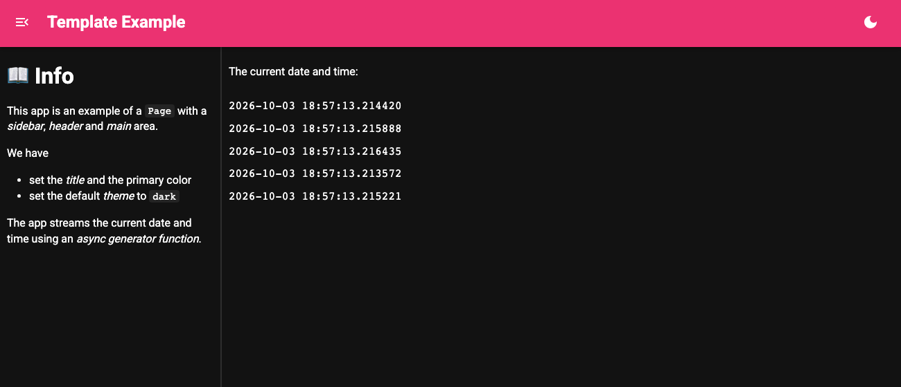

# Organize and Style with Templates

Streamlit always uses the same *template* with a *main* and *sidebar* area to layout and style your app.

With Panel you get the same structure from `pn.ui.Page`, which has a *header*, a collapsible *sidebar*, a *main* area and a light/dark theme toggle. You can either construct the `Page` explicitly or set it as the global template and add components to its areas with `.servable(target=...)`.

---

## Migration Steps

Set `pn.extension(template="page")` and mark each component `.servable(target="sidebar")` or `.servable()` (for the main area). Set the title, theme and colors on `pn.state.template`.

If you need full control over the HTML, you can instead declare a [custom template](../../how_to/templates/template_custom) using Jinja2 syntax.

## Example

```python
from asyncio import sleep
from datetime import datetime

import panel as pn

pn.extension(sizing_mode="stretch_width", template="page", theme="dark")

pn.ui.Markdown("""
# 📖 Info

This app is an example of a `Page` with a *sidebar*, *header* and *main* area.

We have

- set the *title* and the primary color
- set the default *theme* to `dark`

The app streams the current date and time using an *async generator function*.
""").servable(target="sidebar")

async def stream():
    for i in range(0, 100):
        await sleep(0.25)
        yield datetime.now()

pn.ui.Column(
    "The current date and time:", *(pn.ui.Str(stream) for i in range(5))
).servable()

pn.state.template.param.update(
    title="Template Example",
    theme_config={"palette": {"primary": {"main": "#E91E63"}}},
)
```


