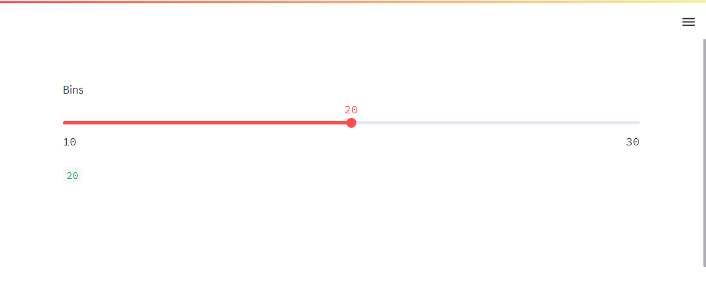
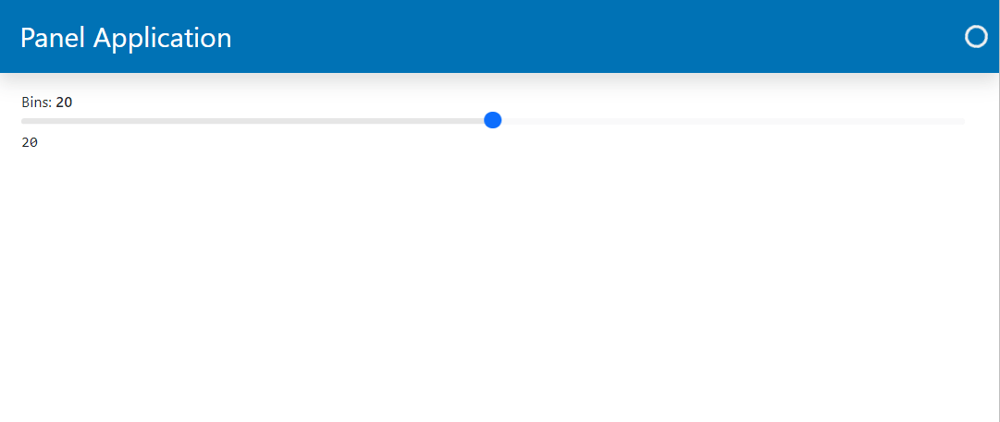

# Accepting User Inputs with Widgets

In Panel the objects that can accept user inputs are called *widgets*.

Panel provides widgets similar to the ones you know from Streamlit and some unique ones in addition.

---

## Migration Steps

To migrate your app's input widgets to Panel:

- Replace your Streamlit `st.some_widget` function with the corresponding Panel
`pn.widgets.SomeWidget` class.

You can identify the corresponding widget via the [Widgets Section](../../reference/index#widgets) of the [Component Gallery](../../reference/index.md).

## Example

### Integer Slider Example

Lets try to migrate an app using integer slider.

#### Streamlit Integer Slider Example

```python
import streamlit as st

bins = st.slider(value=20, min_value=10, max_value=30, step=1, label="Bins")

st.write(bins)
```



#### Panel Integer Slider Example

You will find Panels input *widgets* in `pn.widgets` module.

```python
import panel as pn

pn.extension(sizing_mode="stretch_width", template="bootstrap")

bins = pn.widgets.IntSlider(value=20, start=10, end=30, step=1, name="Bins")

pn.Column(bins, pn.pane.Str(bins)).servable()
```



Please note that in Panel `bins` is an instance of `IntSlider` and not an integer value. To access the value of `bins` in Panel, you would need to call `bins.value`.

Check out the [`IntSlider` Guide](../../reference/widgets/IntSlider.md) if you want to learn more about it.
