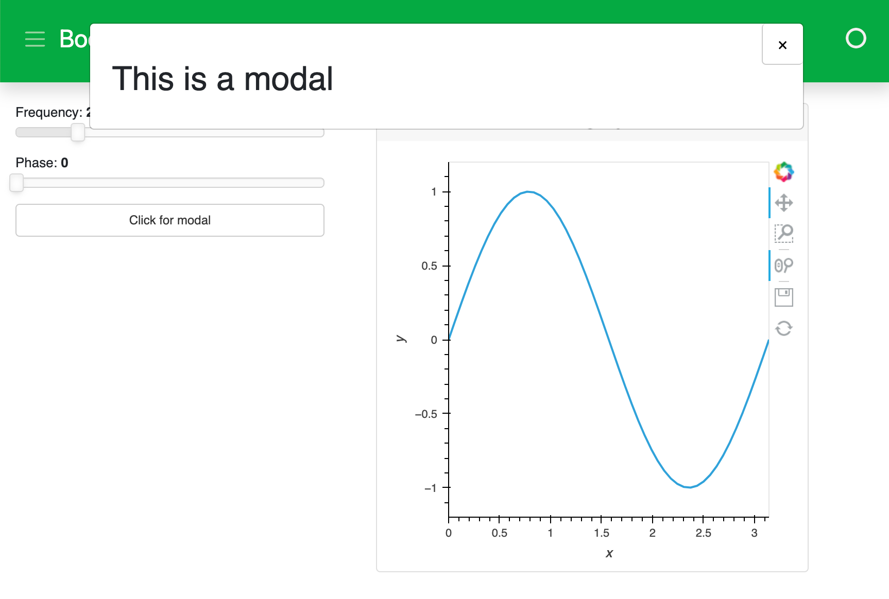

# Arrange Components in a Template

This guide addresses how to arrange components in a template layout.

The default templates that are provided with Panel define four content areas on the page, which can be populated as desired: `header`, `sidebar`, `main`, and `modal` (a dialog box/popup window).

Let's first create a simple app and place components in the `header`, `sidebar`, and `main` areas. We'll save this script below into a file called `app.py`.

:::{card} app.py

```python
import panel as pn
import numpy as np
import holoviews as hv

# Explicitly set template and add some text to the header area
bootstrap = pn.template.BootstrapTemplate(title='Bootstrap Template')

# Data and Widgets
xs = np.linspace(0, np.pi)
freq = pn.widgets.FloatSlider(name="Frequency", start=0, end=10, value=2)
phase = pn.widgets.FloatSlider(name="Phase", start=0, end=np.pi)

# Plotting function bound to widgets
@pn.depends(freq=freq, phase=phase)
def sine(freq, phase):
    return hv.Curve((xs, np.sin(xs*freq+phase))).opts(
        height=400, width=400)

# Add components to the sidebar, main, and header
bootstrap.sidebar.extend([freq, phase])
bootstrap.main.append(pn.Card(hv.DynamicMap(sine), title='Sine'))
bootstrap.header.append('## Header')

# Add some content to the modal area
bootstrap.modal.append("## This is a modal")

# Create a button
modal_btn = pn.widgets.Button(name="Click for modal")

# Callback that will open the modal when the button is clicked
def about_callback(event):
    bootstrap.open_modal()

# Link the button to the callback and append it to the sidebar
modal_btn.on_click(about_callback)
bootstrap.sidebar.append(modal_btn)

bootstrap.servable()
```
:::

Now we can activate this app on the command line:

``` bash
panel serve app.py --show --autoreload
```


:::{card} app.py


Now, let's add a button to our script that activates the modal:

:::{card} app.py
---
emphasize-lines: 25-37
---
```python
import panel as pn
import numpy as np
import holoviews as hv

# Explicitly set template and add some text to the header area
bootstrap = pn.template.BootstrapTemplate(title='Bootstrap Template')

# Data and Widgets
xs = np.linspace(0, np.pi)
freq = pn.widgets.FloatSlider(name="Frequency", start=0, end=10, value=2)
phase = pn.widgets.FloatSlider(name="Phase", start=0, end=np.pi)

# Plotting function bound to widgets
@pn.depends(freq=freq, phase=phase)
def sine(freq, phase):
    return hv.Curve((xs, np.sin(xs*freq+phase))).opts(
        height=400, width=400)

# Add components to the sidebar, main, and header
bootstrap.sidebar.extend([freq, phase])
bootstrap.main.append(pn.Card(hv.DynamicMap(sine), title='Sine'))
bootstrap.header.append('## Header')

# Add some content to the modal area
bootstrap.modal.append("## This is a modal")

# Create a button
modal_btn = pn.widgets.Button(name="Click for modal")

# Callback that will open the modal when the button is clicked
def about_callback(event):
    bootstrap.open_modal()

# Link the button to the callback and append it to the sidebar
modal_btn.on_click(about_callback)
bootstrap.sidebar.append(modal_btn)

bootstrap.servable()
```
:::

If we look back at our app and click the new button, we'll see the modal pop-up:




## Related Resources

- See [How-to > Apply Templates > Set a Template](./template_set.md) for alternate approaches to set a template.
- See [How-to > Apply Templates > Toggle Modal](./template_modal.md) for a dedicated guide to toggling the modal.
- Read [Background > Templates](../../background/templates/templates_overview.md) for explanation.
