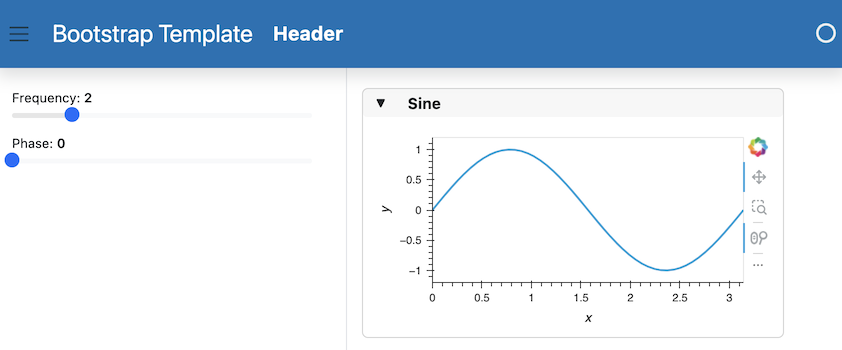

# Arrange Components in a Template

This guide addresses how to arrange components in a template layout.

```{admonition} Prerequisites
1. The [How to > Set a Template](./template_set) guide demonstrates how to set a template for a deployable app.
```

---

The default templates that are provided with Panel define four content areas on the page, which can be populated as desired: `header`, `sidebar`, `main`, and `modal` (a dialog box/popup window).

Let's create a simple app and place components in the `header`, `sidebar`, and `main` areas (see the dedicated guide on the [`modal`](./template_modal)). We'll first save this script below into a file called `app.py`:

:::{card} app.py
``` {code-block} python
:emphasize-lines: 19-22

import hvplot.pandas
import numpy as np
import pandas as pd
import panel as pn

# Data and Widgets
xs = np.linspace(0, np.pi)
freq = pn.widgets.FloatSlider(name="Frequency", start=0, end=10, value=2)
phase = pn.widgets.FloatSlider(name="Phase", start=0, end=np.pi)

# Interactive data pipeline
def sine(freq, phase):
    return pd.DataFrame(dict(y=np.sin(xs*freq+phase)), index=xs)

dfi_sine = hvplot.bind(sine, freq, phase).interactive()

# Explicitly set template and add some text to the header area
template = pn.template.BootstrapTemplate(title='BootstrapTemplate')
# Add components to the sidebar, main, and header
template.sidebar.extend([freq, phase])
template.main.append(
    pn.Card(dfi_sine.hvplot(min_height=400).output(), title='Sine')
)
template.header.append('## Header')

template.servable();
```
:::

Now, we can activate this app on the command line:

``` bash
panel serve app.py --show --dev
```



## Related Resources

- See [How-to > Apply Templates > Toggle Modal](./template_modal) for a dedicated guide to toggling the modal.
- See [How-to > Apply Templates > Set a Template](./template_set) for alternate approaches to set a template.
- Read [Explanation > Templates](../../explanation/styling/templates_overview) for explanation.
