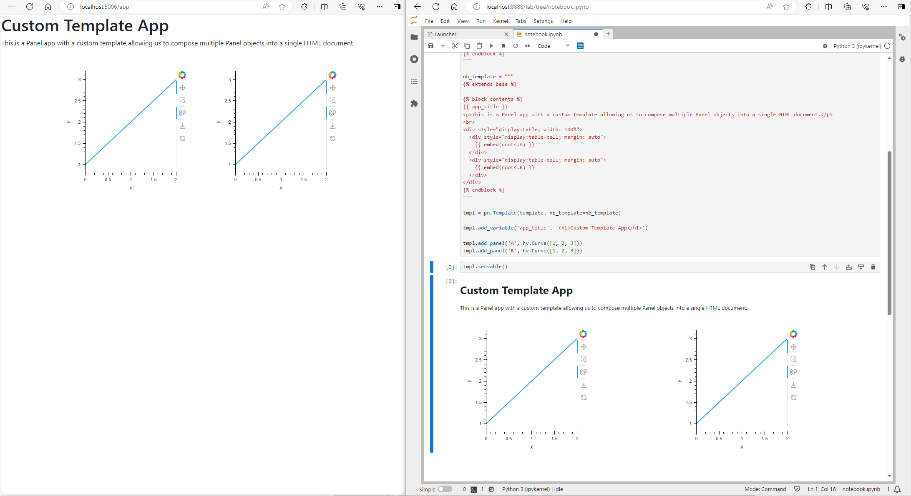

# Build a Custom Template

This guide addresses how to build a custom template. A custom template gives you full control of the look and feel of your Panel app.

```{admonition} Prerequisites
1. The [How to > Set a Template](./template_set.md) guide demonstrates how to set a template for a deployable app.
2. The [How to > Customize Template Theme](./template_theme.md) guide addresses how to customize the theme of a template, which may be sufficient in many cases.
```

## Building a Template in a Single File

### The Foundation: Panel's Base Template

Diving into custom templates means extending Panel's default [Jinja2](https://palletsprojects.com/p/jinja/) template. To start, let's examine the [default template utilized by Panel](https://github.com/holoviz/panel/blob/main/panel/_templates/base.html):

```html

<!DOCTYPE html>
<html lang="en" {{ html_attrs | default("", true) }}>
  
  <head>
  
    <meta charset="utf-8">
    <title>{{ title | e if title else "Panel App" }}</title>
    <link rel="apple-touch-icon" sizes="180x180" href="{{ dist_url }}images/apple-touch-icon.png">
     <link rel="icon" type="image/png" sizes="32x32" href="{{ dist_url }}images/favicon.ico"> 
    <link rel="manifest" href="{{ manifest_url }}">
    <style>html { background-color: #121212 }</style>
  
  
    <style>
      html, body {
        display: flow-root;
        box-sizing: border-box;
        height: 100%;
        margin: 0;
        padding: 0;
      }
    </style>
  
    {{- bokeh_css if bokeh_css }}
  
  
    {{  bokeh_js if bokeh_js }}
  
  
  
  
  </head>
  
  
  <body>
  
  
  
  {{        embed(doc) if doc.elementid }}
  
  
  {{            embed(root) }}
  
  
  
  
  {{ plot_script | indent(4) }}
  
  </body>
  
</html>
```

If you're versed in [Jinja2](https://palletsprojects.com/p/jinja/) templating or similar technologies, you'll notice how this template is designed for easy extension by overriding its `` definitions. Though entirely custom templates are an option, extending existing blocks often proves to be the most straightforward path.

### Enhancing the Base Template

Let's enrich the base template by incorporating additional resources within the postamble block of the header and redefining the layout of components within the contents block. We'll introduce bootstrap.css in the preamble, leveraging the Bootstrap grid system for a polished layout.

```python
template = """


<!-- Addition to head -->

<link rel="stylesheet" href="https://stackpath.bootstrapcdn.com/bootstrap/4.3.1/css/bootstrap.min.css">


<!-- Addition to body -->

{{ app_title }}
<p>This is a Panel app with a custom template allowing us to compose multiple Panel objects into a single HTML document.</p>
<br>
<div class="container">
  <div class="row">
    <div class="col-sm">
      {{ embed(roots.A) }}
    </div>
    <div class="col-sm">
      {{ embed(roots.B) }}
    </div>
  </div>
</div>

"""
```

In this snippet, we utilize the `embed` macro to define two distinct roots in the template. To render this custom template, we first construct a `pn.Template` object with our HTML template and then populate it with the necessary roots, 'A' and 'B', using the `add_panel` method. Additionally, we introduce a new `app_title` variable, which we populate using the `add_variable` method:

```python
import panel as pn
import holoviews as hv

tmpl = pn.Template(template)

tmpl.add_variable('app_title', '<h1>Custom Template App</h1>')

tmpl.add_panel('A', hv.Curve([1, 2, 3]))
tmpl.add_panel('B', hv.Curve([1, 2, 3]))
```

### Crafting a Notebook-Specific Template

Integrating certain CSS frameworks, such as Bootstrap, directly into a notebook can cause unintended layout changes. To circumvent this, Panel allows for the specification of a separate `nb_template` for notebook rendering:

```python
nb_template = """



{{ app_title }}
<p>This is a Panel app with a custom template allowing us to compose multiple Panel objects into a single HTML document.</p>
<br>
<div style="display:table; width: 100%">
  <div style="display:table-cell; margin: auto">
    {{ embed(roots.A) }}
  </div>
  <div style="display:table-cell; margin: auto">
    {{ embed(roots.B) }}
  </div>
</div>

"""

tmpl = pn.Template(template, nb_template=nb_template)
```

### Bringing It All Together

Here's how you can assemble all the pieces into a cohesive application:

```python
import panel as pn
import holoviews as hv

pn.extension()

template = """


<!-- goes in head -->

<link rel="stylesheet" href="https://stackpath.bootstrapcdn.com/bootstrap/4.3.1/css/bootstrap.min.css">


<!-- goes in body -->

{{ app_title }}
<p>This is a Panel app with a custom template allowing us to compose multiple Panel objects into a single HTML document.</p>
<br>
<div class="container">
  <div class="row">
    <div class="col-sm">
      {{ embed(roots.A) }}
    </div>
    <div class="col-sm">
      {{ embed(roots.B) }}
    </div>
  </div>
</div>

"""

nb_template = """



{{ app_title }}
<p>This is a Panel app with a custom template allowing us to compose multiple Panel objects into a single HTML document.</p>
<br>
<div style="display:table; width: 100%">
  <div style="display:table-cell; margin: auto">
    {{ embed(roots.A) }}
  </div>
  <div style="display:table-cell; margin: auto">
    {{ embed(roots.B) }}
  </div>
</div>

"""

tmpl = pn.Template(template, nb_template=nb_template)

tmpl.add_variable('app_title', '<h1>Custom Template App</h1>')

tmpl.add_panel('A', hv.Curve([1, 2, 3]))
tmpl.add_panel('B', hv.Curve([1, 2, 3]))

tmpl.servable()
```

Serve your app with `panel serve app.py` or use the code in a notebook to see your custom template in action:



## Managing Complex Templates

For more intricate templates, maintaining them in a separate file promotes cleanliness and modularity. You can either import them as a string or utilize Jinja2's official loading mechanism, which involves setting up an `Environment` along with a `loader`:

```python
from jinja2 import Environment, FileSystemLoader

env = Environment(loader=FileSystemLoader('.'))
jinja_template = env.get_template('sample_template.html')

tmpl = pn.Template(jinja_template)

tmpl.add_panel('A', hv.Curve([1, 2, 3]))
tmpl.add_panel('B', hv.Curve([1, 2, 3]))
tmpl.servable()
```

## Related Resources

- See [How-to > Apply Templates > Customize Template Theme](./template_theme.md) to just use a custom theme.
- See [How-to > Apply Templates > Set a Template](./template_set.md) for alternate approaches to set a template.
- Read [Explanation > Templates](../../explanation/templates/templates_overview.md) for explanation.
